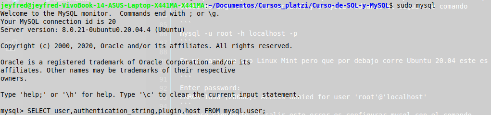
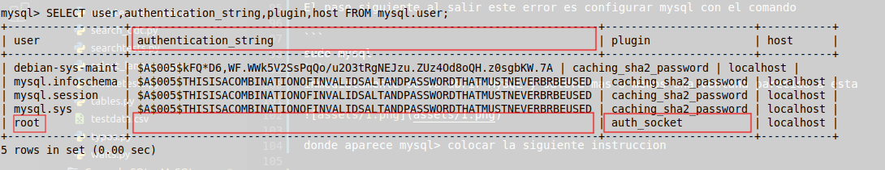
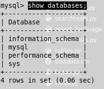
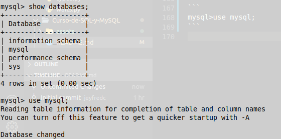
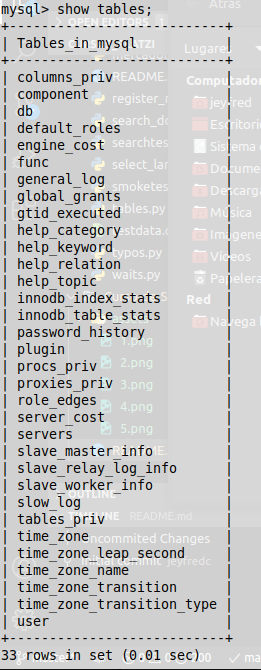
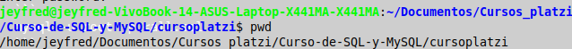
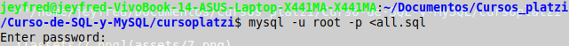
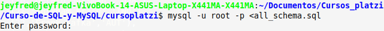

# Curso de SQL y MsQL realizado en Platzi

## Tabla de contenido

[Clase 1 Bienvenida al curso](#Clase-1-Bienvenida-al-curso)

[Clase 2 Instalación de MySQL](#Clase-2-Instalación-de-MySQL)

[Clase 3 La Consola de MySQL](#Clase-3-La-Consola-de-MySQL)

[Clase 4 ¿Qué es una base de datos?](#Clase-4-¿Qué-es-una-base-de-datos?)

[Clase 5 Comando CREATE](#Clase-5-Comando-CREATE)

[Clase 6 Tipos de columnas / Creación de la tabla books](#Clase-6-Tipos-de-columnas-/-Creación-de-la-tabla-books)

[Clase 7 Tipos de columnas / Creación de la tabla authors](#Clase-7-Tipos-de-columnas-/-Creación-de-la-tabla-authors)

[Clase 8 Tipos de columnas usando / Creación de la tabla clientes](#Clase-8-Tipos-de-columnas-usando-/-Creación-de-la-tabla-clientes)

[Clase 9 Comando INSERT](#Clase-9-Comando-INSERT)

[Clase 10 Comando on duplicate key](#Clase-10-Comando-on-duplicate-key)

[Clase 11 Inserción de datos usando queries anidados](#Clase-11-Inserción-de-datos-usando-queries-anidados)

[Clase 12 Bash y archivos SQL](#Clase-12-Bash-y-archivos-SQL)

[Clase 13 Su majestad el SELECT](#Clase-13-Su-majestad-el-SELECT)

[Clase 14 Comando JOIN](#Clase-14-Comando-JOIN)

[Clase 15 Left JOIN](#Clase-15-Left-JOIN)

[Clase 16 Tipos de JOIN](#Clase-16-Tipos-de-JOIN)

[Clase 17 5 casos de negocio](#Clase-17-5-casos-de-negocio)

[Clase 18 Continuación de casos de negocio](#Clase-18-Continuación-de-casos-de-negocio)

[Clase 19 Comandos UPDATE Y DELETE](#Clase-19-Comandos-UPDATE-Y-DELETE)

[Clase 20 Super Querys](#Clase-20-Super-Querys)

[Clase 21 Comando mysqldump](#Clase-21-Comando-mysqldump)

[]()

## Clase 1 Bienvenida al curso

El curso se basara sobre un proyecto directamente con la base de datos, se tratara de una librería donde se pueda comprar o rentar un libro y se ira creando paso a paso, es importante investigar con la documentación que ofrecen los programas SQL y MySQL. No es un proyecto de programación y se va a realizar el curso desde la consola

<div align="right">
  <small><a href="#tabla-de-contenido">🡡 volver al inicio</a></small>
</div>

## Clase 2 Instalación de MySQL

Para realizar la instalación de MySQL en tu pc lo primero que debes tener en cuenta es que debes hacer la verificación de la versión que quieres instalar y la distribución para tu sistema operativo. En este enlace encuentras el listado de las plataformas soportadas. https://www.mysql.com/support/supportedplatforms/database.html

**Instalación en Windows**

Si estas trabajando con Windows puedes hacer la descarga ingresando en el siguiente enlace: https://dev.mysql.com/downloads/installer/. Este es el sitio oficial de MySQL por lo que puedes confiar en la descarga.

El instalador para Windows es muy similar a los que ya conocemos, nos pide algunas verificaciones y nos permite navegar a través de diferentes ventanas.

Inicialmente el instalador nos va a solicitar que aceptemos los términos y acuerdos de la licencia. Revisalos y si estas de acuerdo continua.

En seguida te va a solicitar información relacionada con el tipo de instalación que vas a realizar, puedes elegir entre Developer Default, Client Only y Full. Cualquiera que sea la opción que elijas esto no implica que luego puedas actualizarla.

Si instalas la versión Full vas a tener acceso a todas las características y productos que MySQL ofrece.

Verifica que tengas disponibles todos los requerimientos que el instalador te presenta. En caso de no contar con ellos debes descargar e instalar el software solicitado.

Continua con la instalación de acuerdo a lo que te indica el ayudante.

**Instalación en Mac**

En nuestro caso vamos a estar trabajando con MySQL en Mac por lo que haremos la instalación en este sistema operativo.

Para instalar MySQL usando el instalador del paquete:

Descarga el archivo de imagen del disco ( .dmg ) ( Link de descarga ) que contiene el instalador del paquete MySQL. No es necesario tener una cuenta en Oracle para realizar la instalación pero es recomendable hacerlo.

Haz doble clic sobre el archivo para montar la imagen y ver su contenido.

Esto te va a mostrar el asistente de instalación de MySQL. El SO puede preguntarte si confías en el origen de este programa, puedes darle continuar hasta que llegues al installation type puedes hacer clic en Instalar para ejecutar el asistente de instalación utilizando todos los valores predeterminados, o puedes hacer clic en Personalizar para modificar qué componentes instalar (servidor MySQL, Prueba de MySQL, Panel de preferencias, Soporte inicializado; todas las pruebas excepto MySQL están habilitadas por defecto). En este caso esta bien que instalemos con los valores por defecto.

Selecciona el tipo de cifrado de contraseñas que vas a usar para tu base de datos.

Ingresa una contraseña que no se te vaya a perder u olvidar, porque es la contraseña de tu usuario root para la base de datos.

En este punto ya tienes instalado tu servidor de MySQL y puedes continuar con el curso.

**Instalaciones en Linux Mint, basados en Ubuntu o Debian**

Seguir instrucciones del repositorio

https://www.digitalocean.com/community/tutorials/como-instalar-mysql-en-ubuntu-18-04-es#:~:text=y

<div align="right">
  <small><a href="#tabla-de-contenido">🡡 volver al inicio</a></small>
</div>

## Clase 3 La Consola de MySQL

Para quienes depronto omitieron el paso 3 en Sistemas Operativos Linux lo que primero se hace en la clase es ingresar a la terminal y a MySQL mediante el siguiente comando

```
mysql -u root -h localhost -p
```

En mi caso que uso Linux Mint pero que por debajo corre Ubuntu 20.04 este es el error que salio

```
Enter password: 
ERROR 1698 (28000): Access denied for user 'root'@'localhost'
```
El paso siguiente al salir este error es configurar mysql con el comando

```
sudo mysql
```
inmediatamente se va abrir MySQL y saldra mas o menos una ventana parecida a esta



donde aparece mysql> colocar la siguiente instruccion

```
SELECT user,authentication_string,plugin,host FROM mysql.user;
```
posteriormente va a salir un cuadro y se deben fijar en la fila donde esta root, esta puede aparecer al principio o al final de la tabla y verificar que la columna donde dice authentication_string este vacia y la columna donde dice plugin esta como **auth_socket** , esto se usa para autenticarse usando la contraseña



la siguiente sentencia que se debe ejecutar en mysql es la siguiente, y donde dice **password**, se cambia por la contraseña que se quiera elegir

```
mysql>ALTER USER 'root'@'localhost' IDENTIFIED WITH mysql_native_password BY 'password';
```

después de presionar la tecla ENTER saldrá una sentencia parecida a esta

```
Query OK, 0 rows affected (0.25 sec)
```

si no aparece se puede ejecutar el comando

```
mysql> FLUSH PRIVILEGES;
```

después nuevamente colocar la sentencia

```
SELECT user,authentication_string,plugin,host FROM mysql.user;
```
En esta va aparecer nuevamente el cuadro pero ya van aparecer los campos de authentication_string y plugin diferentes


después de esto podemos salir de mysql mediante la sentencia 

```
mysql>exit
```

y ahora si nuevamente se ingresa la sentencia en la terminal 

```
mysql -u root -h localhost -p
```

solicita el ingreso del password y ya en este caso se coloca el que se haya asignado en los pasos anteriores y ya queda configurado para continuar con las clases del curso.

Mas adelante la recomendación es que todas las sentencias que se colocan en mysql a exepcion de 2 finalizan con un **;**

Mediante la sentencia

```
mysql>show databases;
```
tenemos una vista de las bases de datos con las que cuenta en ese momento el computador



para poder acceder a la base datos se hace mediante el comando

```
mysql>use mysql;
```


para limpiar la terminal con Ctrl + l, en estos casos ya hay que conocer un poco de los comandos que se manejan en la terminal

con la sentencia

```
mysql>show tables;
```

muestra las tablas que existen en esa base de datos



En el caso de haber limpiado la pantalla con ctrl + l por ejemplo y no saber en que base de datos se encuentra usar la sentencia

```
mysql>select database();
```

y ya para salir de mysql con la sentencia

```
mysql>exit;
```

<div align="right">
  <small><a href="#tabla-de-contenido">🡡 volver al inicio</a></small>
</div>

## Clase 4 ¿Qué es una base de datos?

Existen de diferentes sabores, colores, pero una base de datos es un lugar donde se pueden almacenar datos puntuales de cualquier cantidad de cosas, para después operar sobre esos datos y convertirlos en información y estos a su vez convertilos en operaciones de negocios, en crecimiento, dinero, sabiduría, etc..., antes que todo lo anterior en el diseño de un modelo relacional que es crear tablas donde algunas pueden depender entre si, no necesariamente entre todas. Lo importante es saber que se pueden crear relaciones por ejemplo como las de un libro, un libro puede contener diferentes autores o viceversa un autor puede contener muchos libros.

Una base de datos permite almacenar datos y relaciones que se pueden convertir en información. 

<div align="right">
  <small><a href="#tabla-de-contenido">🡡 volver al inicio</a></small>
</div>

## Clase 5 Comando CREATE

Lo primero que se va a realizar es crear las diferentes tablas que se requieren para iniciar con el proyecto con base al diagrama se ira creando la tabla y cada columna se ira creando de un tipo de dato diferente donde se usaran los mas prácticos o comunes.

En general existen diferentes tipos de tablas, pero se va a hablar de los 2 principales tablas **InnoDB** y **MyISAM** que provee MySQL por defecto

**InnoDB**

Es una base de datos mas nueva, robusta y recuperable en caso de que exista un fallo en el disco duro pero es mas lenta

**MyISAM**

Es una tabla directa, sencilla y rapida. Las operaciones y transacciones son 1 a 1 por tal razon la velocidad de lectura y escritura es mayor.

Esto afecta la estrategia, existen 2 tipos de tablas o arquitectura que se van a usar que es una **tabla de catalogo** y una **tabla de operacion**, la diferencia es que la tabla de catalogo crecerá en un orden lento por tal razón se utilizara **InnoDb**, las tablas que crecen y se utilizan mucho acceso al disco duro sera en **MyISAM** para darle mayor agilidad al sistema

<div align="right">
  <small><a href="#tabla-de-contenido">🡡 volver al inicio</a></small>
</div>

## Clase 6 Tipos de columnas / Creación de la tabla books

Primer comando a utilizar en la terminal de mysql

```
mysql> CREATE database platzi_operation;
Query OK, 1 row affected (1.25 sec)
```
tambien crea la base con una pregunta condicional pero no se crea otra asi diga OK porque ya esta creada

```
mysql> CREATE DATABASE IF NOT EXISTS platzi_operation;
Query OK, 1 row affected, 1 warning (0.03 sec)
```

pero al colocar SHOW warnings indica que no se puede crear esa tabla de datos porque ya existe

```
mysql> SHOW warnings;
+-------+------+-----------------------------------------------------------+
| Level | Code | Message                                                   |
+-------+------+-----------------------------------------------------------+
| Note  | 1007 | Can't create database 'platzi_operation'; database exists |
+-------+------+-----------------------------------------------------------+
1 row in set (0.01 sec)

```

si nuevamente se coloca 

```
mysql> CREATE database platzi_operation;
ERROR 1007 (HY000): Can't create database 'platzi_operation'; database exists
```
saca directamente un error donde ya no aparece **Query OK**, en la sentencia anterior se indica que si no puede suceder se muestra como **warning**, pero si depende del flujo el error es diferente

con show databases se muestran las tablas que estan creadas en mysql

```
mysql> show databases;
+--------------------+
| Database           |
+--------------------+
| information_schema |
| mysql              |
| performance_schema |
| platzi_operation   |
| sys                |
+--------------------+
5 rows in set (0.09 sec)
```
para usar la tabla creada

```
mysql> use platzi_operation;
Database changed
```
la sentencia indica que el puntero de la consola ahora se encuentra en la tabla

si se ejecuta el siguiente comando

```
mysql> show tables;
Empty set (0.01 sec)
```
sale **Empty set**, esta sentencia es cuando se hace un query a cualquier elemento de la base de datos y no trae algun tipo de informacion

para empezar a crear la tabla se puede coger un documento vacio y especificar la siguiente instruccion, no ejecutar ni pegar en la terminal hasta que se indique en la siguiente clase.

**Creacion de la libreria**
```
CREATE TABLE IF NOT EXISTS books (
    book_id INTEGER UNSIGNED PRIMARY KEY AUTO_INCREMENT, 
    author_id INTEGER UNSIGNED,
    title VARCHAR(100) NOT NULL,
    year INTEGER UNSIGNED NOT NULL DEFAULT 1900,
    language VARCHAR(2) NOT NULL DEFAULT 'es' COMMENT 'ISO 639-1 Language',
    cover_url VARCHAR(500),
    price DOUBLE(6,2) NOT NULL DEFAULT 10.0,
    sellable TINYINT(1) DEFAULT 1,
    copies INTEGER NOT NULL DEFAULT 1,
    description TEXT
);
```
- Es una buena practica que cada tabla se llame en el plural del sustantivo que se va a guardar y es una practica o convención muy usada que le permite a otras personas identificar como se esta trabajando

- MySQL permite mayusculas y minusculas tanto en columnas y filas. 

- Es buena practica que todos los nombres de columnas y tablas vayan en minusculas y todas las palabras reservadas del lenguaje vayan en mayusculas

- **IF NOT EXISTS** es una sentencia para evitar crear posiblemente una tabla con el mismo nombre

- Toda tabla necesita un Id que lo que hace es poder ubicar a una tupla de una manera única y para eso se debe usar un entero **(book_id INTEGER UNSIGNED PRIMARY KEY AUTO_INCREMENT)** que sera auto incremental como lo indica la sentencia **AUTO_INCREMENT**, el primer tipo de datos usado en las tablas es el entero **INTEGER** y como característica tiene que es un **PRIMARY KEY**.

- La tabla al ser auto incremental indica que por ejemplo al ir agregando un dato ejemplo.

    Pedro

    Maria

    Gonzalo

    estos van a identificarse en orden:

    1 Pedro

    2 Maria

    3 Gonzalo
    
    pero en el caso que se elimine cualquiera de estos por ejemplo el 3 que es Gonzalo, e ingresar un 4 dato(Julio), así no exista el 3 dato, la secuencia va continuar

    1 Pedro

    2 Maria

    4 Julio

- la sentencia **UNSIGNED** sirve para que el numero no muestre un valor de negativo o positivo, se podría llamar como absoluto para que no diferencie entre los 2

- Existen otra sentencias para los enteros como lo son:

    **TINYINT**: Es un número entero con o sin signo. Con signo el rango de valores válidos va desde -128 a 127. Sin signo, el rango de valores es de 0 a 255

    **BIGINT**: Número entero con o sin signo. Con signo el rango de valores va desde -9.223.372.036.854.775.808 a 9.223.372.036.854.775.807. Sin signo el rango va desde 0 a 18.446.744.073.709.551.615.

    **INTEGER**: Número entero con o sin signo. Con signo el rango de valores va desde -2147483648 a 2147483647. Sin signo el rango va desde 0 a 429.4967.295

    Estos ademas también tienen que ver con el tamaño en uso de memoria

- seguido va otra columna para el autor **author_id INTEGER UNSIGNED** la cual se le hará una referencia numérica para trabajar como relación con la tabla que se crea en la siguiente clase

- Seguido va otra columna para el titulo **title VARCHAR(100) NOT NULL**, donde el tipo de dato VARCHAR permite guardar una cadena de caracteres y lo que va entre paréntesis es la capacidad de caracteres que va a almacenar el titulo, **NOT NULL**, significa que no se permite vació. Esto refiere a que **NULL** como tal es un elemento vació pero en el momento que existen **""** o **''** significa que asi no exista nada ya no es un elemento vació

- Seguido va otra columna para el año **year INTEGER UNSIGNED NOT NULL DEFAULT 1900**, el **DEFAULT** se indica como un ejemplo para este caso que el año viene predeterminado con 1900

- Seguido va otra columna para el lenguaje **language VARCHAR(2) NOT NULL DEFAULT 'es' COMMENT 'ISO 639-1 Language**, donde se coloca 2 como maximo de caracteres permitidos que seria la abreviación internacional para los idiomas y **COMMENT** es un comentario que se coloca en la tabla, pero que solamente puede ser visto por alguien que este usando la misma estructura de tabla en el Backend.

- Seguido va otra columna para la imagen **cover_url VARCHAR(500)**, la cual se recomienda no insertar en forma de imagen si no la Url para redirigir el acceso a una imagen

- Seguido va otra columna para el precio **price DOUBLE(6,2) NOT NULL DEFAULT 10.0** donde se indica que se va a colocar un decimal de 4 numeros + 2 decimales que van despues de la coma **0000.00**

- Seguido va otra columna para indicar si se puede vender o no **price DOUBLE(6,2) NOT NULL DEFAULT 10.0,**, el parámetro recibe solo 0 o 1, es decir falso o verdadero y por default viene que si es vendible

- Seguido va otra columna que indica que por default esos libros tienen una copia **copies INTEGER NOT NULL DEFAULT 1**

- Por ultimo viene la descripción **description TEXT** donde el tipo de dato es **TEXT** y este puede almacenar cualquier cantidad de caracteres

<div align="right">
  <small><a href="#tabla-de-contenido">🡡 volver al inicio</a></small>
</div>

## Clase 7 Tipos de columnas / Creación de la tabla authors

Se crea la tabla para el autor que es la que tiene que relacionarse con la segunda columna de la primera tabla y para que se la relacion entre las mismas estas deben tener el mismo tipo de datos

```
CREATE TABLE IF NOT EXISTS authors(
    author_id INTEGER UNSIGNED PRIMARY KEY AUTO_INCREMENT,
    name VARCHAR(100) NOT NULL,
    nationality VARCHAR(3)
);
```

a continuacion pegar en la consola la primer tabla y posteriormente la segunda tabla

```
mysql> CREATE TABLE IF NOT EXISTS books (
    ->     book_id INTEGER UNSIGNED PRIMARY KEY AUTO_INCREMENT, 
    ->     author_id INTEGER UNSIGNED,
    ->     title VARCHAR(100) NOT NULL,
    ->     year INTEGER UNSIGNED NOT NULL DEFAULT 1900,
    ->     language VARCHAR(2) NOT NULL DEFAULT 'es' COMMENT 'ISO 639-1 Language',
    ->     cover_url VARCHAR(500),
    ->     price DOUBLE(6,2) NOT NULL DEFAULT 10.0,
    ->     sellable TINYINT(1) DEFAULT 1,
    ->     copies INTEGER NOT NULL DEFAULT 1,
    ->     description TEXT
    -> );
Query OK, 0 rows affected, 2 warnings (2.16 sec)

mysql> CREATE TABLE IF NOT EXISTS authors(
    ->     author_id INTEGER UNSIGNED PRIMARY KEY AUTO_INCREMENT,
    ->     name VARCHAR(100) NOT NULL,
    ->     nationality VARCHAR(3)
    -> );
Query OK, 0 rows affected (0.37 sec)

mysql> show tables;
+----------------------------+
| Tables_in_platzi_operation |
+----------------------------+
| authors                    |
| books                      |
+----------------------------+
2 rows in set (0.00 sec)

```

los 3 warnings que en mi caso salieron informan que la especificacion de tipos de datos de punto flotante esta obsoleta y se eliminara en una version futura, y que la tabla books ya esta creada

```
mysql> show warnings
    -> ;
+---------+------+------------------------------------------------------------------------------------------------------------------+
| Level   | Code | Message                                                                                                          |
+---------+------+------------------------------------------------------------------------------------------------------------------+
| Warning | 1681 | Specifying number of digits for floating point data types is deprecated and will be removed in a future release. |
| Warning | 1681 | Integer display width is deprecated and will be removed in a future release.                                     |
| Note    | 1050 | Table 'books' already exists                                                                                     |
+---------+------+------------------------------------------------------------------------------------------------------------------+
3 rows in set (0.00 sec)

```

para mirar si hay contenido dentro de las tablas se usa la siguiente sentencia

 ```
mysql> select * from books;
Empty set (0.00 sec)

mysql> select * from authors;
Empty set (0.00 sec)

 ```

 para borrar una tabla se usa la sentencia **DROP**, pero es recomendable que antes de hacer cualquier cosa observarla y estar segur(@) de lo que se esta haciendo, la sentencia sirve para eliminar una base de datos, contenido o tabla

 ```
mysql> DROP table authors;
Query OK, 0 rows affected (0.36 sec)

mysql> show tables;
+----------------------------+
| Tables_in_platzi_operation |
+----------------------------+
| books                      |
+----------------------------+
1 row in set (0.00 sec)
 ```

 en este caso se borra como ejemplo, porque no tiene datos y la estructura ya esta definida, entonces se vuelve a crear 

 ```
mysql> CREATE TABLE IF NOT EXISTS authors(     author_id INTEGER UNSIGNED PRIMARY KEY AUTO_INCREMENT,     name VARCHAR(100) NOT NULL,     nationality VARCHAR(3) );
Query OK, 0 rows affected (1.04 sec)

mysql> show tables;
+----------------------------+
| Tables_in_platzi_operation |
+----------------------------+
| authors                    |
| books                      |
+----------------------------+
2 rows in set (0.01 sec)

mysql> 

 ```

 la sentencia **describe** y **desc**, indica que columnas existen en cada una de las tablas

 ```
mysql> describe authors;
+-------------+--------------+------+-----+---------+----------------+
| Field       | Type         | Null | Key | Default | Extra          |
+-------------+--------------+------+-----+---------+----------------+
| author_id   | int unsigned | NO   | PRI | NULL    | auto_increment |
| name        | varchar(100) | NO   |     | NULL    |                |
| nationality | varchar(3)   | YES  |     | NULL    |                |
+-------------+--------------+------+-----+---------+----------------+
3 rows in set (0.12 sec)

mysql> desc books;
+-------------+--------------+------+-----+---------+----------------+
| Field       | Type         | Null | Key | Default | Extra          |
+-------------+--------------+------+-----+---------+----------------+
| book_id     | int unsigned | NO   | PRI | NULL    | auto_increment |
| author_id   | int unsigned | YES  |     | NULL    |                |
| title       | varchar(100) | NO   |     | NULL    |                |
| year        | int unsigned | NO   |     | 1900    |                |
| language    | varchar(2)   | NO   |     | es      |                |
| cover_url   | varchar(500) | YES  |     | NULL    |                |
| price       | double(6,2)  | NO   |     | 10.00   |                |
| sellable    | tinyint(1)   | YES  |     | 1       |                |
| copies      | int          | NO   |     | 1       |                |
| description | text         | YES  |     | NULL    |                |
+-------------+--------------+------+-----+---------+----------------+
10 rows in set (0.01 sec)

 ```

 si se requiere ver el comentario que quedo en language anteriormente se puede utilizar la sentencia **show full columns rom books**

 ```
mysql> show full columns from books;
+-------------+--------------+--------------------+------+-----+---------+----------------+---------------------------------+--------------------+
| Field       | Type         | Collation          | Null | Key | Default | Extra          | Privileges                      | Comment            |
+-------------+--------------+--------------------+------+-----+---------+----------------+---------------------------------+--------------------+
| book_id     | int unsigned | NULL               | NO   | PRI | NULL    | auto_increment | select,insert,update,references |                    |
| author_id   | int unsigned | NULL               | YES  |     | NULL    |                | select,insert,update,references |                    |
| title       | varchar(100) | utf8mb4_0900_ai_ci | NO   |     | NULL    |                | select,insert,update,references |                    |
| year        | int unsigned | NULL               | NO   |     | 1900    |                | select,insert,update,references |                    |
| language    | varchar(2)   | utf8mb4_0900_ai_ci | NO   |     | es      |                | select,insert,update,references | ISO 639-1 Language |
| cover_url   | varchar(500) | utf8mb4_0900_ai_ci | YES  |     | NULL    |                | select,insert,update,references |                    |
| price       | double(6,2)  | NULL               | NO   |     | 10.00   |                | select,insert,update,references |                    |
| sellable    | tinyint(1)   | NULL               | YES  |     | 1       |                | select,insert,update,references |                    |
| copies      | int          | NULL               | NO   |     | 1       |                | select,insert,update,references |                    |
| description | text         | utf8mb4_0900_ai_ci | YES  |     | NULL    |                | select,insert,update,references |                    |
+-------------+--------------+--------------------+------+-----+---------+----------------+---------------------------------+--------------------+
10 rows in set (0.03 sec)

 ```
 la palabra **year** es una palabra reservada del lenguaje al igual que **language**, para que el lenguaje diferencie que es una palabra no reservada de su mismo lenguaje, se pueden colocar comillas sencillas invertidas entre ellas es decir 
 ```
CREATE TABLE IF NOT EXISTS books (
    book_id INTEGER UNSIGNED PRIMARY KEY AUTO_INCREMENT, 
    author_id INTEGER UNSIGNED,
    title VARCHAR(100) NOT NULL,
    `year` INTEGER UNSIGNED NOT NULL DEFAULT 1900,
    `language` VARCHAR(2) NOT NULL DEFAULT 'es' COMMENT 'ISO 639-1 Language',
    cover_url VARCHAR(500),
    price DOUBLE(6,2) NOT NULL DEFAULT 10.0,
    sellable TINYINT(1) DEFAULT 1,
    copies INTEGER NOT NULL DEFAULT 1,
    `description` TEXT
);

CREATE TABLE IF NOT EXISTS authors(
    author_id INTEGER UNSIGNED PRIMARY KEY AUTO_INCREMENT,
    `name` VARCHAR(100) NOT NULL,
    nationality VARCHAR(3)
);
 ```

 lo que se puede hacer es borrar la tabla hacer la correccion en estos valores y nuevamente crearlas repitiendo los pasos

<div align="right">
  <small><a href="#tabla-de-contenido">🡡 volver al inicio</a></small>
</div>

 ## Clase 8 Tipos de columnas usando / Creación de la tabla clientes

Se crea la tabla para los clientes con la siguiente estructura la cual se van a explicar algunas cosas que tienen distintas de las anteriores

```
CREATE TABLE clients (
    client_id INTEGER UNSIGNED PRIMARY KEY AUTO_INCREMENT,
    `name` VARCHAR(50) NOT NULL,
    email VARCHAR(100) NOT NULL UNIQUE,
    birthdate DATETIME,
    gender ENUM('M', 'F', 'ND') NOT NULL,
    active TINYINT(1) NOT NULL DEFAULT 1,
    created_at TIMESTAMP NOT NULL DEFAULT CURRENT_TIMESTAMP,
    updated_at TIMESTAMP NOT NULL DEFAULT CURRENT_TIMESTAMP ON UPDATE CURRENT_TIMESTAMP
);
```

Como siempre la primer columna va a ser la que lleva el id por tanto queda como **client_id INTEGER UNSIGNED PRIMARY KEY** pero.

**¿Que pasa si no se coloca el AUTO_INCREMENT?**

Lo primero a resaltar es que sigue siendo una llave primaria de tipo entero, que solo acepta positivos o considerado como un valor absoluto, pero hay aplicaciones cuya capa de negocios ajenos a la base de datos determina cual es el id que le corresponde a culquier tupla que se este insertando y esto puede ser bastante util pero en general muchas de las formas de las bases de datos empieza con **AUTO_INCREMENT**, y esto adicional garantiza el no tener inconvenientes mas adelante 

La sentencia **UNIQUE** significa que es un tipo de llave en donde el valor de la columna tiene que ser unico para cada tupla, garantiza tambien la duplicidad de cualquier dato 

La sentencia **DATETIME** es un valor cualquiera de fecha, incluso anterior a la epoca y por ejemplo los cumpleaños deben llevar esta sentencia 

La sentencia **TIMESTAMP** se almacena de la siguiente forma 'yyyy-mm-dd hh:mm:ss', esta sentencia esta basada en el numero epoch, que es el numero de segundos que han pasado desde el 1 de enero de 1970 a la fecha y es asi porque es donde se determina el inicio de las computadoras, esta sentencia no puede hacer todo lo que hace **DATETIME**, pero **DATETIME** si puede hacer lo que hace **TIMESTAMP** pero no es tan eficiente o rapido a la hora de hacer calculos, no guarda segundos y de una forma diferente 

**gender ENUM('M', 'F', 'ND') NOT NULL** ENUM es una enumeracion de datos, esto se usa para decirle a la base de datos cuales son las unicas opciones que se pueden tomar en este caso seria, masculino o femenino o no definido pero no acepta ninguna otra opcion.

Ninguna tupla de una base de datos se borra jamas y es por esta razon que se deja la siguiente sentencia **active TINYINT(1) NOT NULL DEFAULT 1**, es decir si el cliente en fin de cuentas esta activo o no activo y por default va a ser 1 que es activo

**created_at TIMESTAMP NOT NULL DEFAULT CURRENT_TIMESTAMP** la palabra **CURRENT_TIMESTAMP**, significa que cuando se inserte algo en la columna y si no viene de todas formas va a insertar el valor que tiene el computador 

**updated_at TIMESTAMP NOT NULL DEFAULT CURRENT_TIMESTAMP ON UPDATE CURRENT_TIMESTAMP** al agregar **ON UPDATE CURRENT_TIMESTAMP** sirve para tomar la hora que toma del computador en el momento de alguna actualizacion, por ejemplo con **CURRENT_TIMESTAMP** se guarda desde el momento de la fecha de creacion y nunca se va a borrar pero con **ON UPDATE CURRENT_TIMESTAMP** si se realiza una modificacion sobre el cliente va a tomar la fecha y hora en que se actualizo ese cliente 

A continuacion se presenta el reto de la siguiente tabla para crear la cual lleva esta sintaxis y se debe completar

```
CREATE TABLE IF NOT EXISTS operations(
    operation_id ,
    book_id ,
    client_id ,
    type prestado, devuelto, vendido, -- se debe colocar la opcion o el estado en el que se encuentra
    created_at,
    updated_at,
    finished TINYINT(1) NOT NULL -- esta ultima se coloca en caso que el libro este vendido
);
```

<div align="right">
  <small><a href="#tabla-de-contenido">🡡 volver al inicio</a></small>
</div>

## Clase 9 Comando INSERT

La manera en la que se ingresan datos a cualquiera de la tabla es mediante la siguiente sintaxis

```
INSERT INTO TABLE --nombre de la tabla(parametros definidos)
VALUES --(parametros a ingresar);
```
en este caso se va a insertar informacion a la tabla de libros **books**

para hacerlo lo primero que hay que hacer es ver como esta construida

```
mysql> desc authors;
+-------------+--------------+------+-----+---------+----------------+
| Field       | Type         | Null | Key | Default | Extra          |
+-------------+--------------+------+-----+---------+----------------+
| author_id   | int unsigned | NO   | PRI | NULL    | auto_increment |
| name        | varchar(100) | NO   |     | NULL    |                |
| nationality | varchar(3)   | YES  |     | NULL    |                |
+-------------+--------------+------+-----+---------+----------------+
3 rows in set (0.16 sec)

```

posteriormente se procede a ingresar la informacion, pero existen 3 formas:

1. Para la version en que esta hecha la clase ya no se acepta el primer valor vacio entre comillas por tanto se cambia a 1
    ```
    mysql> INSERT INTO authors(author_id, name, nationality)
    -> VALUES (1, 'Juan Rulfo', 'MEX');
    Query OK, 1 row affected (0.23 sec)

    ```

2. La segunda forma no pasa la asignacion de numero por lo que es autoincrementable

    ```
    mysql> INSERT INTO authors(name, nationality)
    -> VALUES('Gabriel Garcia Marquez', 'COL');
    Query OK, 1 row affected (0.13 sec)
    ```

3. La tercer forma se pasan todos los parametros pero sin indicar los parametros definidos pero si los que se van a ingresar 

    ```
    mysql> INSERT INTO authors
    -> VALUES(3, 'Juan Gabriel Vazquez', 'COL');
    Query OK, 1 row affected (0.32 sec)

    ```

para mirar los datos ingresados en la tabla

```
mysql> select * from authors;
+-----------+------------------------+-------------+
| author_id | name                   | nationality |
+-----------+------------------------+-------------+
|         1 | Juan Rulfo             | MEX         |
|         2 | Gabriel Garcia Marquez | COL         |
|         3 | Juan Gabriel Vazquez   | COL         |
+-----------+------------------------+-------------+
3 rows in set (0.02 sec)

```

4. La cuarta forma es ingresar datos masivamente teniendo en cuenta que son tuplas separadas por "," y al final no se van a ingresar hasta no finalizar con un ";", tambien se debe tener en cuenta que por regla general la insercion de datos es una buena idea que se ingresen por tuplas de 50 datos

    ```
    mysql> INSERT INTO authors(name, nationality)
        -> VALUES('Julio Cortazar', 'ARG'),
        -> ('Isabel Allende', 'CHI'),
        -> ('Octavio Paz', 'MEX'),
        -> ('Juan Carlos Onetti', 'URU')
        -> 
        -> 
        -> ;
    Query OK, 4 rows affected (0.10 sec)
    Records: 4  Duplicates: 0  Warnings: 0

    mysql> select * from authors;
    +-----------+------------------------+-------------+
    | author_id | name                   | nationality |
    +-----------+------------------------+-------------+
    |         1 | Juan Rulfo             | MEX         |
    |         2 | Gabriel Garcia Marquez | COL         |
    |         3 | Juan Gabriel Vazquez   | COL         |
    |         4 | Julio Cortazar         | ARG         |
    |         5 | Isabel Allende         | CHI         |
    |         6 | Octavio Paz            | MEX         |
    |         7 | Juan Carlos Onetti     | URU         |
    +-----------+------------------------+-------------+
    7 rows in set (0.00 sec)

    ```
5. Existe el caso como en el primero que si se asigna un id que no existe la base de datos la va a tomar y asignar a una tupla

    ```
    mysql> INSERT INTO authors(author_id, name)
        -> VALUES (16, 'Pablo Neruda');
    Query OK, 1 row affected (0.06 sec)
    
    mysql> select * from authors;
    +-----------+------------------------+-------------+
    | author_id | name                   | nationality |
    +-----------+------------------------+-------------+
    |         1 | Juan Rulfo             | MEX         |
    |         2 | Gabriel Garcia Marquez | COL         |
    |         3 | Juan Gabriel Vazquez   | COL         |
    |         4 | Julio Cortazar         | ARG         |
    |         5 | Isabel Allende         | CHI         |
    |         6 | Octavio Paz            | MEX         |
    |         7 | Juan Carlos Onetti     | URU         |
    |        16 | Pablo Neruda           | NULL        |
    +-----------+------------------------+-------------+
    8 rows in set (0.00 sec)
    
    ```

<div align="right">
  <small><a href="#tabla-de-contenido">🡡 volver al inicio</a></small>
</div>

## Clase 10 Comando on duplicate key

En esta clase se realiza la creacion de la tabla de clientes, con las siguientes sentencias:

```
INSERT INTO clients(client_id, name,email, birthdate,gender, active) VALUES
(1, 'Maria Dolores Gomez', 'Maria Dolores.9583222J@random.names', '1971-06-06', 'F', 1),
(2, 'Adrian Fernandez', 'Adrian.55818851J@random.names', '1970-04-09', 'M', 1),
(3, 'Maria Luisa marin', 'Maria Luisa.83726282A@random.names', '1957-07-30', 'F', 1),
(4, 'Pedro Sanchez', 'Pedro.78522059J@random.names', '1992-01-31', 'M', 1);
```

la tabla queda creada en base 

```
mysql> INSERT INTO clients(client_id, name,email, birthdate,gender, active) VALUES
    -> (1, 'Maria Dolores Gomez', 'Maria Dolores.9583222J@random.names', '1971-06-06', 'F', 1),
    -> (2, 'Adrian Fernandez', 'Adrian.55818851J@random.names', '1970-04-09', 'M', 1),
    -> (3, 'Maria Luisa marin', 'Maria Luisa.83726282A@random.names', '1957-07-30', 'F', 1),
    -> (4, 'Pedro Sanchez', 'Pedro.78522059J@random.names', '1992-01-31', 'M', 1);
Query OK, 4 rows affected (0.78 sec)
Records: 4  Duplicates: 0  Warnings: 0

mysql> select * from clients;
+-----------+---------------------+-------------------------------------+---------------------+--------+--------+---------------------+---------------------+
| client_id | name                | email                               | birthdate           | gender | active | created_at          | updated_at          |
+-----------+---------------------+-------------------------------------+---------------------+--------+--------+---------------------+---------------------+
|         1 | Maria Dolores Gomez | Maria Dolores.9583222J@random.names | 1971-06-06 00:00:00 | F      |      1 | 2020-09-07 08:34:47 | 2020-09-07 08:34:47 |
|         2 | Adrian Fernandez    | Adrian.55818851J@random.names       | 1970-04-09 00:00:00 | M      |      1 | 2020-09-07 08:34:47 | 2020-09-07 08:34:47 |
|         3 | Maria Luisa marin   | Maria Luisa.83726282A@random.names  | 1957-07-30 00:00:00 | F      |      1 | 2020-09-07 08:34:47 | 2020-09-07 08:34:47 |
|         4 | Pedro Sanchez       | Pedro.78522059J@random.names        | 1992-01-31 00:00:00 | M      |      1 | 2020-09-07 08:34:47 | 2020-09-07 08:34:47 |
+-----------+---------------------+-------------------------------------+---------------------+--------+--------+---------------------+---------------------+
4 rows in set (0.00 sec)

```

Si se realiza una verificacion, hay 2 campos que no se pueden duplicar en esta tabla, el **client_id** y el **email**, por tanto al ejecutar otra sentencia con un dato repetido, mysql lo reconoce y saca el error 1062 Dulicate entry email, el cual indica que no puede estar repetido porque ya existe en la base de datos

```
mysql> INSERT INTO clients(name, email, birthdate,gender, active) VALUES ('Maria Dolores Gomez', 'Maria Dolores.9583222J@random.names', '1971-06-06', 'F', 1);
ERROR 1062 (23000): Duplicate entry 'Maria Dolores.9583222J@random.names' for key 'clients.email'

```

Existe una sentencia en Mysql que es recomendable no usar pero que para efectos de la clase se explica el valor de activo o inactivo `1` o `0` se va cambiar por el contrario segun como se haya creado la tabla, y es usar la sentencia **ON DUPLICATE KEY IGNORE ALL** se podria llegar a usar el mismo comando anterior en mysql y el error que arrojaba anteriormente se omitiria con esta sentencia, queda como apunte, pero no se va a ejecutar, cualquier tipo de error la va a pasar esta sentencia y es importante tener en cuenta que los errores que arroja este programa estan realizados por algo y por tanto hay que tenerlos presentes porque existe un porque por el cual salga un error

```
INSERT INTO clients(name, email, birthdate,gender, active) VALUES ('Maria Dolores Gomez', 'Maria Dolores.9583222J@random.names', '1971-06-06', 'F', 0)
ON DUPLICATE KEY IGNORE ALL
```

La sentencia que si es posible utilizar pero con cuidado es **ON DUPLICATE KEY UPDATE** , en este caso se puede actualizar el cliente e indicar a la tabla que esta inactivo, pero solo a ese cliente

```
INSERT INTO clients(name, email, birthdate,gender, active) VALUES ('Maria Dolores Gomez', 'Maria Dolores.9583222J@random.names', '1971-06-06', 'F', 0)
ON DUPLICATE KEY UPDATE active = VALUES(active)
```
**Antes de ejecutar la sentencia anterior** se puede generar una vista del cliente a revisar 

```
mysql> select * from clients where client_id = 1;
+-----------+---------------------+-------------------------------------+---------------------+--------+--------+---------------------+---------------------+
| client_id | name                | email                               | birthdate           | gender | active | created_at          | updated_at          |
+-----------+---------------------+-------------------------------------+---------------------+--------+--------+---------------------+---------------------+
|         1 | Maria Dolores Gomez | Maria Dolores.9583222J@random.names | 1971-06-06 00:00:00 | F      |      1 | 2020-09-07 08:34:47 | 2020-09-07 08:34:47 |
+-----------+---------------------+-------------------------------------+---------------------+--------+--------+---------------------+---------------------+
1 row in set (0.02 sec)
```
**Pero existe otra forma de ver estos datos** que en vez de cerrar la sentencia anterior con **";"**, se cierra con **\G**

```
mysql> select * from clients where client_id = 1\G
*************************** 1. row ***************************
 client_id: 1
      name: Maria Dolores Gomez
     email: Maria Dolores.9583222J@random.names
 birthdate: 1971-06-06 00:00:00
    gender: F
    active: 1
created_at: 2020-09-07 08:34:47
updated_at: 2020-09-07 08:34:47
1 row in set (0.00 sec)

```
En la informacion presentada anteriormente **Maria Dolores** esta activa representada con un `1` y se quiere dejar inactiva, para realizar la operacion lo que hay que hacer es ejecutar esta sentencia

```
mysql> INSERT INTO clients(name, email, birthdate,gender, active) VALUES ('Maria Dolores Gomez', 'Maria Dolores.9583222J@random.names', '1971-06-06', 'F', 0)
    -> ON DUPLICATE KEY UPDATE active = VALUES(active);
Query OK, 2 rows affected, 1 warning (0.23 sec)

mysql> select * from clients where client_id = 1\G
*************************** 1. row ***************************
 client_id: 1
      name: Maria Dolores Gomez
     email: Maria Dolores.9583222J@random.names
 birthdate: 1971-06-06 00:00:00
    gender: F
    active: 0
created_at: 2020-09-07 08:34:47
updated_at: 2020-09-07 09:05:47
1 row in set (0.00 sec)

mysql> 

```

y como se observa **maria Dolores** queda inactiva en la tabla

<div align="right">
  <small><a href="#tabla-de-contenido">🡡 volver al inicio</a></small>
</div>

## Clase 11 Inserción de datos usando queries anidados

En esta clase se van a insertar 2 libros con el mismo autor, el cual sera **Octavio Paz**, el cual le corresponde el id es el **numero 6**. 

Lo primero que se hace es consultar la base de autores

```
mysql> select * from authors;
+-----------+------------------------+-------------+
| author_id | name                   | nationality |
+-----------+------------------------+-------------+
|         1 | Juan Rulfo             | MEX         |
|         2 | Gabriel Garcia Marquez | COL         |
|         3 | Juan Gabriel Vazquez   | COL         |
|         4 | Julio Cortazar         | ARG         |
|         5 | Isabel Allende         | CHI         |
|         6 | Octavio Paz            | MEX         |
|         7 | Juan Carlos Onetti     | URU         |
|        16 | Pablo Neruda           | NULL        |
+-----------+------------------------+-------------+
8 rows in set (0.00 sec)

```

el libro a introducir en principio es el siguiente

```
-- Crear libro
-- El laberinto de la Soledad, Octavio Paz, 1900
```
Esto se puede hacer porque se esta trabajando con normalizacion y se requiere cruzar informacion de libros con autores 

Existe otra forma de validar que un autor exista con la siguiente sentencia y aqui se esta confirmando nuevamente el valor de su id

```
mysql> select * from authors where name = 'Octavio Paz'
    -> ;
+-----------+-------------+-------------+
| author_id | name        | nationality |
+-----------+-------------+-------------+
|         6 | Octavio Paz | MEX         |
+-----------+-------------+-------------+
1 row in set (0.00 sec)

```
Y ahora a continuacion se insertan los siguientes datos, y asi es como queda creado el primer libro en la tabla de **books**

```
mysql> INSERT INTO books(title, author_id) VALUES
    -> ('El laberinto de la Soledad', 6);
Query OK, 1 row affected (0.10 sec)

mysql> select * from books;
+---------+-----------+----------------------------+------+----------+-----------+-------+----------+--------+-------------+
| book_id | author_id | title                      | year | language | cover_url | price | sellable | copies | description |
+---------+-----------+----------------------------+------+----------+-----------+-------+----------+--------+-------------+
|       1 |         6 | El laberinto de la Soledad | 1900 | es       | NULL      | 10.00 |        1 |      1 | NULL        |
+---------+-----------+----------------------------+------+----------+-----------+-------+----------+--------+-------------+
1 row in set (0.00 sec)
```

**Quedo creado el año 1900 porque es la fecha que se configuro por defecto en la tabla cuando se creo**

Ahora viene la creacion del segundo libro, donde se usara queries anidados

```
-- Crear libro
-- Vuelta al laberinto de la Soledad, Octavio Paz, 1960
```
Se ejecuta la siguiente sentencia donde ya se espicifica el año, y aqui la forma de insertar al libro y autor es distinta porque no se esta buscando por su id si no que se esta utilizando entre parentesis otra sentencia para realizar la busqueda del autor **un subquerie**, la sentencia **LIMIT**, refiere a que solo haga la busqueda de maximo una referencia

```
mysql> INSERT INTO books(title, author_id, `year`) VALUES
    -> ('Vuelta al laberinto de la Soledad', (SELECT author_id FROM authors WHERE name = 'Octavio Paz' LIMIT 1),1960);
Query OK, 1 row affected (0.19 sec)

mysql> select * from books;
+---------+-----------+-----------------------------------+------+----------+-----------+-------+----------+--------+-------------+
| book_id | author_id | title                             | year | language | cover_url | price | sellable | copies | description |
+---------+-----------+-----------------------------------+------+----------+-----------+-------+----------+--------+-------------+
|       1 |         6 | El laberinto de la Soledad        | 1900 | es       | NULL      | 10.00 |        1 |      1 | NULL        |
|       2 |         6 | Vuelta al laberinto de la Soledad | 1960 | es       | NULL      | 10.00 |        1 |      1 | NULL        |
+---------+-----------+-----------------------------------+------+----------+-----------+-------+----------+--------+-------------+
2 rows in set (0.00 sec)

```

<div align="right">
  <small><a href="#tabla-de-contenido">🡡 volver al inicio</a></small>
</div>

## Clase 12 Bash y archivos SQL

en esta clase se crea una base de datos parecida a **plati_operation**, la base de datos se llamara **pruebaplatzi**

Lo primero que se va a hacer es consultar que bases de datos existen en mysql, en mi consola actualmente esto es lo que existe

```
mysql> show databases;
+--------------------+
| Database           |
+--------------------+
| information_schema |
| mysql              |
| performance_schema |
| platzi_operation   |
| sys                |
+--------------------+
5 rows in set (0.04 sec)

```

para efectos del curso quedan los archivos de la nueva base de datos en una carpeta llamada **cursoplatzi** y el archivo de nombre **all.sql**,este archivo contiene la misma informacion que **platzi_operation**,y **all_schema.sql** contiene informacion de clientes, libros, transacciones y las tablas creadas en **all.sql**

solo hay que tener cuidado con esta sentencia que aparece en la primer linea,

```
DROP DATABASE IF EXISTS pruebaplatzi;
```

la cual despues de ser ejecutada para tener seguridad lo mejor es comentarla con **--**

para crear la nueva base de datos en la terminal, se abre la terminal y en vez de ingresar con la sentencia **mysql -u root -h localhost -p** se ingresa lo siguiente

```
mysql -u root -p <all.sql
```

**se debe tener en cuenta que debe estar en la carpeta curso platzi para ejecutar en la terminal y asi crear la base de datos** en el caso de mi PC esta es mi ruta la cual se puede ejecutar con pwd

**/home/jeyfred/Documentos/Cursos_platzi/Curso-de-SQL-y-MySQL/cursoplatzi**



despues de esto si se puede ejecutar la creacion de la nueva tabla 



Es importante comentar la primer linea del archivo **all.sql** para asegurar que despues no se borre la base de datos

```
--DROP DATABASE IF EXISTS pruebaplatzi;
```

ahora si se puede comprobar que exista la base de datos **pruebaplatzi**

```
mysql> show databases;
+--------------------+
| Database           |
+--------------------+
| information_schema |
| mysql              |
| performance_schema |
| platzi_operation   |
| pruebaplatzi       |
| sys                |
+--------------------+
6 rows in set (0.00 sec)
```

y a continuacion migrar o traer la informacion de clientes, libros, autores y transacciones, dentro de la misma carpeta **cursoplatzi** en la terminal con el otro archivo **all_schema.sql**

```
mysql -u root -p <all_schema.sql
```


y luego consultar la informacion que tienen las tablas de la nueva base de datos

```
mysql> use pruebaplatzi;
Reading table information for completion of table and column names
You can turn off this feature to get a quicker startup with -A

Database changed
mysql> show tables;
+------------------------+
| Tables_in_pruebaplatzi |
+------------------------+
| authors                |
| books                  |
| clients                |
| transactions           |
+------------------------+
4 rows in set (0.00 sec)

```

a partir de esto tambien se puede consultar la informacion en cada uno con las sentencias

```
mysql> select * from authors;
```
```
mysql> select * from books;
```
```
mysql> select * from clients;
```
```
mysql> select * from transactions;
```

<div align="right">
  <small><a href="#tabla-de-contenido">🡡 volver al inicio</a></small>
</div>

## Clase 13 Su majestad el SELECT

Para empezar lo primero que se trae es por ejemplo la tabla de clientes 

```
mysql> select * from clients
    -> ;
+-----------+-------------------------+---------------------------------------+------------+--------+--------+---------------------+
| client_id | name                    | email                                 | birthdate  | gender | active | created_at          |
+-----------+-------------------------+---------------------------------------+------------+--------+--------+---------------------+
|         1 | Maria Dolores Gomez     | Maria Dolores.95983222J@random.names  | 1971-06-06 | F      |      1 | 2018-04-09 16:51:30 |
|         2 | Adrian Fernandez        | Adrian.55818851J@random.names         | 1970-04-09 | M      |      1 | 2018-04-09 16:51:30 |
|         3 | Maria Luisa Marin       | Maria Luisa.83726282A@random.names    | 1957-07-30 | F      |      1 | 2018-04-09 16:51:30 |
|         4 | Pedro Sanchez           | Pedro.78522059J@random.names          | 1992-01-31 | M      |      1 | 2018-04-09 16:51:30 |
|         5 | Pablo Saavedra          | Pablo.93733268B@random.names          | 1960-07-21 | M      |      1 | 2018-04-09 16:51:30 |
|         6 | Marta Carrillo          | Marta.55741882W@random.names          | 1981-06-15 | F      |      1 | 2018-04-09 16:51:30 |
|         7 | Javier Barrio           | Javier.54966248C@random.names         | 1971-04-24 | M      |      1 | 2018-04-09 16:51:30 |
|         8 | Milagros Garcia         | Milagros.90074144A@random.names       | 1964-12-05 | F      |      1 | 2018-04-09 16:51:30 |
|         9 | Carlos Quiros           | Carlos.63291957M@random.names         | 1954-08-28 | M      |      1 | 2018-04-09 16:51:30 |
|        10 | Carmen De la Torre      | Carmen.57408761W@random.names         | 1966-05-14 | F      |      1 | 2018-04-09 16:51:30 |
|        11 | Laura Moron             | Laura.57774589S@random.names          | 1954-03-02 | F      |      1 | 2018-04-09 16:51:30 |
|        12 | Maria Dolores Larrea    | Maria Dolores.71788005Z@random.names  | 1990-09-04 | F      |      1 | 2018-04-09 16:51:30 |
|        13 | Maria Dolores Sanz      | Maria Dolores.30948169J@random.names  | 2001-08-30 | F      |      1 | 2018-04-09 16:51:30 |
|        14 | Jose Maria Bermudez     | Jose Maria.24963969E@random.names     | 1998-05-23 | M      |      1 | 2018-04-09 16:51:30 |
|        15 | Carlos Blanco           | Carlos.94783133H@random.names         | 1952-08-07 | M      |      1 | 2018-04-09 16:51:30 |
|        16 | Juan Carlos Jurado      | Juan Carlos.71650477A@random.names    | 1990-12-12 | M      |      1 | 2018-04-09 16:51:30 |
|        17 | David Gonzalez          | David.54332034P@random.names          | 1976-05-03 | M      |      1 | 2018-04-09 16:51:30 |
|        18 | Antonia Aranda          | Antonia.91560262E@random.names        | 1979-10-25 | F      |      1 | 2018-04-09 16:51:30 |
|        19 | Maria Moreno            | Maria.58935447V@random.names          | 1997-01-12 | F      |      1 | 2018-04-09 16:51:30 |
|        20 | David Casals            | David.06746883V@random.names          | 1999-07-13 | M      |      1 | 2018-04-09 16:51:30 |
|        21 | Mario Romero            | Mario.46091382A@random.names          | 1985-03-29 | M      |      1 | 2018-04-09 16:51:30 |
|        22 | Maria angeles Alba      | Maria angeles.91808919A@random.names  | 1959-09-14 | F      |      1 | 2018-04-09 16:51:30 |
|        23 | Rafael Espinola         | Rafael.67605541P@random.names         | 1998-10-11 | M      |      1 | 2018-04-09 16:51:30 |
|        24 | Montserrat alvarez      | Montserrat.31114289G@random.names     | 1994-11-06 | F      |      1 | 2018-04-09 16:51:30 |
|        25 | Maria Carmen Gomez      | Maria Carmen.64351051H@random.names   | 1968-06-30 | F      |      1 | 2018-04-09 16:51:30 |
|        26 | Maria Cruz Morillas     | Maria Cruz.81385695B@random.names     | 1978-10-29 | F      |      1 | 2018-04-09 16:51:30 |
|        27 | Josefa Roldan           | Josefa.51417560W@random.names         | 1993-08-09 | F      |      1 | 2018-04-09 16:51:30 |
|        28 | Monica Pla              | Monica.18992324M@random.names         | 1972-06-08 | F      |      1 | 2018-04-09 16:51:30 |
|        29 | Juana Maria Lopez       | Juana Maria.51072683X@random.names    | 1990-07-15 | F      |      1 | 2018-04-09 16:51:30 |
|        30 | Maria Carmen Ponce      | Maria Carmen.41619980P@random.names   | 1984-07-26 | F      |      1 | 2018-04-09 16:51:30 |
|        31 | Juan Carlos Rios        | Juan Carlos.45673504N@random.names    | 1967-05-04 | M      |      1 | 2018-04-09 16:51:30 |
|        32 | Isabel Alfaro           | Isabel.77316882J@random.names         | 1980-07-25 | F      |      1 | 2018-04-09 16:51:30 |
|        33 | Maria Isabel Armas      | Maria Isabel.42010289F@random.names   | 1950-11-21 | F      |      1 | 2018-04-09 16:51:30 |
|        34 | Maria Teresa Castillo   | Maria Teresa.91228389Q@random.names   | 2002-11-08 | F      |      1 | 2018-04-09 16:51:30 |
|        35 | Andres Planells         | Andres.09981449R@random.names         | 1992-06-19 | M      |      1 | 2018-04-09 16:51:30 |
|        36 | Silvia Perez            | Silvia.91812407H@random.names         | 1969-02-15 | F      |      1 | 2018-04-09 16:51:30 |
|        37 | Pablo Gonzalez          | Pablo.11605676Z@random.names          | 2000-10-11 | M      |      1 | 2018-04-09 16:51:30 |
|        38 | Maria Antonia Jimenez   | Maria Antonia.98071058R@random.names  | 1998-06-23 | F      |      1 | 2018-04-09 16:51:31 |
|        39 | Jesus Rodriguez         | Jesus.86679475L@random.names          | 1961-01-17 | M      |      1 | 2018-04-09 16:51:31 |
|        40 | Carmen Rodriguez        | Carmen.81799536J@random.names         | 1973-02-17 | F      |      1 | 2018-04-09 16:51:31 |
|        41 | Maria Dolores Rodriguez | Maria Dolores.75444599E@random.names  | 1962-08-14 | F      |      1 | 2018-04-09 16:51:31 |
|        42 | Jordi Campos            | Jordi.76000917Q@random.names          | 1956-09-23 | M      |      1 | 2018-04-09 16:51:31 |
|        43 | Carlos Caceres          | Carlos.97628163V@random.names         | 1993-05-16 | M      |      1 | 2018-04-09 16:51:31 |
|        44 | Carmen Robles           | Carmen.29258188A@random.names         | 1955-06-19 | F      |      1 | 2018-04-09 16:51:31 |
|        45 | Sara Rodriguez          | Sara.16181250Z@random.names           | 2001-06-07 | F      |      1 | 2018-04-09 16:51:31 |
|        46 | Maria Carmen Rivera     | Maria Carmen.59955426S@random.names   | 2000-05-27 | F      |      1 | 2018-04-09 16:51:31 |
|        47 | Alberto Cabanas         | Alberto.40633755T@random.names        | 1991-10-27 | M      |      1 | 2018-04-09 16:51:31 |
|        48 | Jose Sanchez            | Jose.52243847Z@random.names           | 1976-12-06 | M      |      1 | 2018-04-09 16:51:31 |
|        49 | Isabel Martinez         | Isabel.90843261T@random.names         | 1962-07-01 | F      |      1 | 2018-04-09 16:51:31 |
|        50 | David Sanchez           | David.14910073R@random.names          | 1975-05-18 | M      |      1 | 2018-04-09 16:51:31 |
|        51 | Sergio Sebastian        | Sergio.09345984A@random.names         | 1959-08-30 | M      |      1 | 2018-04-09 16:51:31 |
|        52 | Manuel Cabrera          | Manuel.38738750B@random.names         | 1993-08-23 | M      |      1 | 2018-04-09 16:51:31 |
|        53 | Marina Gabaldon         | Marina.12101665P@random.names         | 1959-03-25 | F      |      1 | 2018-04-09 16:51:31 |
|        54 | Rafael Galvez           | Rafael.87947175M@random.names         | 1988-09-02 | M      |      1 | 2018-04-09 16:51:31 |
|        55 | Francisco Villar        | Francisco.13922268T@random.names      | 1952-04-25 | M      |      1 | 2018-04-09 16:51:31 |
|        56 | Francisco Garcia        | Francisco.34242509V@random.names      | 1989-01-22 | M      |      1 | 2018-04-09 16:51:31 |
|        57 | Esther Pina             | Esther.36300729J@random.names         | 1977-11-07 | F      |      1 | 2018-04-09 16:51:31 |
|        58 | Maria Jesus Noya        | Maria Jesus.95839533M@random.names    | 1996-08-07 | F      |      1 | 2018-04-09 16:51:31 |
|        59 | Paula Ropero            | Paula.53630073F@random.names          | 1998-09-04 | F      |      1 | 2018-04-09 16:51:31 |
|        60 | Maria Carmen Iglesias   | Maria Carmen.24044144J@random.names   | 1977-06-12 | F      |      1 | 2018-04-09 16:51:31 |
|        61 | Albert Galvez           | Albert.10067957Y@random.names         | 1971-05-17 | M      |      1 | 2018-04-09 16:51:31 |
|        62 | Carmen Lopez            | Carmen.09399409E@random.names         | 1987-03-07 | F      |      1 | 2018-04-09 16:51:31 |
|        63 | Francisco Jose Leon     | Francisco Jose.07598657D@random.names | 1965-12-11 | M      |      1 | 2018-04-09 16:51:31 |
|        64 | Francisca Gonzalez      | Francisca.19675393C@random.names      | 1957-12-23 | F      |      1 | 2018-04-09 16:51:31 |
|        65 | Daniel Garcia           | Daniel.01386486T@random.names         | 1979-05-29 | M      |      1 | 2018-04-09 16:51:31 |
|        66 | Ana Maria Martinez      | Ana Maria.91340418N@random.names      | 1980-09-14 | F      |      1 | 2018-04-09 16:51:31 |
|        67 | Maria Aguilar           | Maria.41749884P@random.names          | 2000-07-31 | F      |      1 | 2018-04-09 16:51:31 |
|        68 | oscar Penas             | oscar.31681177B@random.names          | 1981-10-02 | M      |      1 | 2018-04-09 16:51:31 |
|        69 | Adrian Vela             | Adrian.66561884E@random.names         | 1978-12-10 | M      |      1 | 2018-04-09 16:51:31 |
|        70 | Francisco Alcalde       | Francisco.52899588W@random.names      | 1967-03-11 | M      |      1 | 2018-04-09 16:51:31 |
|        71 | Maria Dolores Perez     | Maria Dolores.47800073R@random.names  | 2003-11-10 | F      |      1 | 2018-04-09 16:51:31 |
|        72 | Juan Jose Tejada        | Juan Jose.30429668R@random.names      | 1990-06-15 | M      |      1 | 2018-04-09 16:51:31 |
|        73 | Cristobal Nogues        | Cristobal.01001763K@random.names      | 2003-10-01 | M      |      1 | 2018-04-09 16:51:31 |
|        74 | Maria Luisa Sanchez     | Maria Luisa.91748033K@random.names    | 2000-02-03 | F      |      1 | 2018-04-09 16:51:31 |
|        75 | Adrian Orta             | Adrian.11458937S@random.names         | 1952-03-20 | M      |      1 | 2018-04-09 16:51:31 |
|        76 | Maria Pilar Martin      | Maria Pilar.93607154Y@random.names    | 1996-08-29 | F      |      1 | 2018-04-09 16:51:31 |
|        77 | Jesus Perez             | Jesus.91931655B@random.names          | 1954-06-01 | M      |      1 | 2018-04-09 16:51:31 |
|        78 | Jesus Perez             | Jesus.15757299E@random.names          | 1956-08-29 | M      |      1 | 2018-04-09 16:51:31 |
|        79 | Esther Capdevila        | Esther.96440550D@random.names         | 1970-10-12 | F      |      1 | 2018-04-09 16:51:31 |
|        80 | David Nieves            | David.40697907M@random.names          | 1965-04-02 | M      |      1 | 2018-04-09 16:51:31 |
|        81 | Antonia Giron           | Antonia.32080105G@random.names        | 1983-01-22 | F      |      1 | 2018-04-09 16:51:31 |
|        82 | Juan Casero             | Juan.94063877H@random.names           | 1974-06-29 | M      |      1 | 2018-04-09 16:51:31 |
|        83 | Manuel De Pablo         | Manuel.01279669H@random.names         | 1973-03-23 | M      |      1 | 2018-04-09 16:51:31 |
|        84 | angel Palomo            | angel.28890315S@random.names          | 1991-07-04 | M      |      1 | 2018-04-09 16:51:31 |
|        85 | Laura Herrera           | Laura.98555932N@random.names          | 1966-12-12 | F      |      1 | 2018-04-09 16:51:31 |
|        86 | Maria Josefa Benitez    | Maria Josefa.36743977M@random.names   | 1987-04-17 | F      |      1 | 2018-04-09 16:51:31 |
|        87 | Luis Saez               | Luis.08103734Y@random.names           | 1983-03-28 | M      |      1 | 2018-04-09 16:51:31 |
|        88 | Susana Nevado           | Susana.09442372K@random.names         | 1961-12-26 | F      |      1 | 2018-04-09 16:51:31 |
|        89 | Miguel Gomez            | Miguel.01631964E@random.names         | 1965-05-16 | M      |      1 | 2018-04-09 16:51:31 |
|        90 | Julio Mayordomo         | Julio.77582185B@random.names          | 1968-06-05 | M      |      1 | 2018-04-09 16:51:31 |
|        91 | Sonia Mari              | Sonia.06246888L@random.names          | 1994-10-13 | F      |      1 | 2018-04-09 16:51:31 |
|        92 | Antonia Beltran         | Antonia.96371304Q@random.names        | 1967-11-17 | F      |      1 | 2018-04-09 16:51:31 |
|        93 | Mercedes Perez          | Mercedes.80944345P@random.names       | 1958-11-05 | F      |      1 | 2018-04-09 16:51:31 |
|        94 | Concepcion Velez        | Concepcion.56896097P@random.names     | 1964-04-05 | F      |      1 | 2018-04-09 16:51:31 |
|        95 | Diego Correa            | Diego.44862413Q@random.names          | 1999-09-15 | M      |      1 | 2018-04-09 16:51:31 |
|        96 | Juan Antonio Galan      | Juan Antonio.95710220K@random.names   | 1982-11-20 | M      |      1 | 2018-04-09 16:51:31 |
|        97 | Manuel Cerezo           | Manuel.25853412D@random.names         | 1991-03-12 | M      |      1 | 2018-04-09 16:51:31 |
|        98 | Rosa Maria Singh        | Rosa Maria.41642169W@random.names     | 1956-12-31 | F      |      1 | 2018-04-09 16:51:31 |
|        99 | angeles Mena            | angeles.88859550Q@random.names        | 1987-09-22 | F      |      1 | 2018-04-09 16:51:31 |
|       100 | Jose Hidalgo            | Jose.05903641R@random.names           | 1973-08-13 | M      |      1 | 2018-04-09 16:51:31 |
+-----------+-------------------------+---------------------------------------+------------+--------+--------+---------------------+
100 rows in set (0.01 sec)

```

si se requiere observar cuales son los datos resumidos con la sentencia

```
mysql> desc clients;
+------------+---------------+------+-----+-------------------+-------------------+
| Field      | Type          | Null | Key | Default           | Extra             |
+------------+---------------+------+-----+-------------------+-------------------+
| client_id  | int unsigned  | NO   | PRI | NULL              | auto_increment    |
| name       | varchar(50)   | YES  |     | NULL              |                   |
| email      | varchar(100)  | NO   | UNI | NULL              |                   |
| birthdate  | date          | YES  |     | NULL              |                   |
| gender     | enum('M','F') | YES  |     | NULL              |                   |
| active     | tinyint(1)    | NO   |     | 1                 |                   |
| created_at | timestamp     | NO   |     | CURRENT_TIMESTAMP | DEFAULT_GENERATED |
+------------+---------------+------+-----+-------------------+-------------------+
7 rows in set (0.17 sec)

```

Cuando se usan bases datos se empiza a ver es necesario traer datos especificos, por ejemplo aqui solo se van a traer los nombres de la tabla de clientes con la sentencia **SELECT name FROM clients**

```
mysql> SELECT name FROM clients;
+-------------------------+
| name                    |
+-------------------------+
| Maria Dolores Gomez     |
| Adrian Fernandez        |
| Maria Luisa Marin       |
| Pedro Sanchez           |
| Pablo Saavedra          |
| Marta Carrillo          |
| Javier Barrio           |
| Milagros Garcia         |
| Carlos Quiros           |
| Carmen De la Torre      |
| Laura Moron             |
| Maria Dolores Larrea    |
| Maria Dolores Sanz      |
| Jose Maria Bermudez     |
| Carlos Blanco           |
| Juan Carlos Jurado      |
| David Gonzalez          |
| Antonia Aranda          |
| Maria Moreno            |
| David Casals            |
| Mario Romero            |
| Maria angeles Alba      |
| Rafael Espinola         |
| Montserrat alvarez      |
| Maria Carmen Gomez      |
| Maria Cruz Morillas     |
| Josefa Roldan           |
| Monica Pla              |
| Juana Maria Lopez       |
| Maria Carmen Ponce      |
| Juan Carlos Rios        |
| Isabel Alfaro           |
| Maria Isabel Armas      |
| Maria Teresa Castillo   |
| Andres Planells         |
| Silvia Perez            |
| Pablo Gonzalez          |
| Maria Antonia Jimenez   |
| Jesus Rodriguez         |
| Carmen Rodriguez        |
| Maria Dolores Rodriguez |
| Jordi Campos            |
| Carlos Caceres          |
| Carmen Robles           |
| Sara Rodriguez          |
| Maria Carmen Rivera     |
| Alberto Cabanas         |
| Jose Sanchez            |
| Isabel Martinez         |
| David Sanchez           |
| Sergio Sebastian        |
| Manuel Cabrera          |
| Marina Gabaldon         |
| Rafael Galvez           |
| Francisco Villar        |
| Francisco Garcia        |
| Esther Pina             |
| Maria Jesus Noya        |
| Paula Ropero            |
| Maria Carmen Iglesias   |
| Albert Galvez           |
| Carmen Lopez            |
| Francisco Jose Leon     |
| Francisca Gonzalez      |
| Daniel Garcia           |
| Ana Maria Martinez      |
| Maria Aguilar           |
| oscar Penas             |
| Adrian Vela             |
| Francisco Alcalde       |
| Maria Dolores Perez     |
| Juan Jose Tejada        |
| Cristobal Nogues        |
| Maria Luisa Sanchez     |
| Adrian Orta             |
| Maria Pilar Martin      |
| Jesus Perez             |
| Jesus Perez             |
| Esther Capdevila        |
| David Nieves            |
| Antonia Giron           |
| Juan Casero             |
| Manuel De Pablo         |
| angel Palomo            |
| Laura Herrera           |
| Maria Josefa Benitez    |
| Luis Saez               |
| Susana Nevado           |
| Miguel Gomez            |
| Julio Mayordomo         |
| Sonia Mari              |
| Antonia Beltran         |
| Mercedes Perez          |
| Concepcion Velez        |
| Diego Correa            |
| Juan Antonio Galan      |
| Manuel Cerezo           |
| Rosa Maria Singh        |
| angeles Mena            |
| Jose Hidalgo            |
+-------------------------+
100 rows in set (0.00 sec)

```
tambien se puede hacer con distintas columnas con la misma sentencia añadiendo una coma "," , de esta forma se traen mas datos **SELECT name, email, gender FROM clients**

```
mysql> SELECT name, email, gender FROM clients;
+-------------------------+---------------------------------------+--------+
| name                    | email                                 | gender |
+-------------------------+---------------------------------------+--------+
| Maria Dolores Gomez     | Maria Dolores.95983222J@random.names  | F      |
| Adrian Fernandez        | Adrian.55818851J@random.names         | M      |
| Maria Luisa Marin       | Maria Luisa.83726282A@random.names    | F      |
| Pedro Sanchez           | Pedro.78522059J@random.names          | M      |
| Pablo Saavedra          | Pablo.93733268B@random.names          | M      |
| Marta Carrillo          | Marta.55741882W@random.names          | F      |
| Javier Barrio           | Javier.54966248C@random.names         | M      |
| Milagros Garcia         | Milagros.90074144A@random.names       | F      |
| Carlos Quiros           | Carlos.63291957M@random.names         | M      |
| Carmen De la Torre      | Carmen.57408761W@random.names         | F      |
| Laura Moron             | Laura.57774589S@random.names          | F      |
| Maria Dolores Larrea    | Maria Dolores.71788005Z@random.names  | F      |
| Maria Dolores Sanz      | Maria Dolores.30948169J@random.names  | F      |
| Jose Maria Bermudez     | Jose Maria.24963969E@random.names     | M      |
| Carlos Blanco           | Carlos.94783133H@random.names         | M      |
| Juan Carlos Jurado      | Juan Carlos.71650477A@random.names    | M      |
| David Gonzalez          | David.54332034P@random.names          | M      |
| Antonia Aranda          | Antonia.91560262E@random.names        | F      |
| Maria Moreno            | Maria.58935447V@random.names          | F      |
| David Casals            | David.06746883V@random.names          | M      |
| Mario Romero            | Mario.46091382A@random.names          | M      |
| Maria angeles Alba      | Maria angeles.91808919A@random.names  | F      |
| Rafael Espinola         | Rafael.67605541P@random.names         | M      |
| Montserrat alvarez      | Montserrat.31114289G@random.names     | F      |
| Maria Carmen Gomez      | Maria Carmen.64351051H@random.names   | F      |
| Maria Cruz Morillas     | Maria Cruz.81385695B@random.names     | F      |
| Josefa Roldan           | Josefa.51417560W@random.names         | F      |
| Monica Pla              | Monica.18992324M@random.names         | F      |
| Juana Maria Lopez       | Juana Maria.51072683X@random.names    | F      |
| Maria Carmen Ponce      | Maria Carmen.41619980P@random.names   | F      |
| Juan Carlos Rios        | Juan Carlos.45673504N@random.names    | M      |
| Isabel Alfaro           | Isabel.77316882J@random.names         | F      |
| Maria Isabel Armas      | Maria Isabel.42010289F@random.names   | F      |
| Maria Teresa Castillo   | Maria Teresa.91228389Q@random.names   | F      |
| Andres Planells         | Andres.09981449R@random.names         | M      |
| Silvia Perez            | Silvia.91812407H@random.names         | F      |
| Pablo Gonzalez          | Pablo.11605676Z@random.names          | M      |
| Maria Antonia Jimenez   | Maria Antonia.98071058R@random.names  | F      |
| Jesus Rodriguez         | Jesus.86679475L@random.names          | M      |
| Carmen Rodriguez        | Carmen.81799536J@random.names         | F      |
| Maria Dolores Rodriguez | Maria Dolores.75444599E@random.names  | F      |
| Jordi Campos            | Jordi.76000917Q@random.names          | M      |
| Carlos Caceres          | Carlos.97628163V@random.names         | M      |
| Carmen Robles           | Carmen.29258188A@random.names         | F      |
| Sara Rodriguez          | Sara.16181250Z@random.names           | F      |
| Maria Carmen Rivera     | Maria Carmen.59955426S@random.names   | F      |
| Alberto Cabanas         | Alberto.40633755T@random.names        | M      |
| Jose Sanchez            | Jose.52243847Z@random.names           | M      |
| Isabel Martinez         | Isabel.90843261T@random.names         | F      |
| David Sanchez           | David.14910073R@random.names          | M      |
| Sergio Sebastian        | Sergio.09345984A@random.names         | M      |
| Manuel Cabrera          | Manuel.38738750B@random.names         | M      |
| Marina Gabaldon         | Marina.12101665P@random.names         | F      |
| Rafael Galvez           | Rafael.87947175M@random.names         | M      |
| Francisco Villar        | Francisco.13922268T@random.names      | M      |
| Francisco Garcia        | Francisco.34242509V@random.names      | M      |
| Esther Pina             | Esther.36300729J@random.names         | F      |
| Maria Jesus Noya        | Maria Jesus.95839533M@random.names    | F      |
| Paula Ropero            | Paula.53630073F@random.names          | F      |
| Maria Carmen Iglesias   | Maria Carmen.24044144J@random.names   | F      |
| Albert Galvez           | Albert.10067957Y@random.names         | M      |
| Carmen Lopez            | Carmen.09399409E@random.names         | F      |
| Francisco Jose Leon     | Francisco Jose.07598657D@random.names | M      |
| Francisca Gonzalez      | Francisca.19675393C@random.names      | F      |
| Daniel Garcia           | Daniel.01386486T@random.names         | M      |
| Ana Maria Martinez      | Ana Maria.91340418N@random.names      | F      |
| Maria Aguilar           | Maria.41749884P@random.names          | F      |
| oscar Penas             | oscar.31681177B@random.names          | M      |
| Adrian Vela             | Adrian.66561884E@random.names         | M      |
| Francisco Alcalde       | Francisco.52899588W@random.names      | M      |
| Maria Dolores Perez     | Maria Dolores.47800073R@random.names  | F      |
| Juan Jose Tejada        | Juan Jose.30429668R@random.names      | M      |
| Cristobal Nogues        | Cristobal.01001763K@random.names      | M      |
| Maria Luisa Sanchez     | Maria Luisa.91748033K@random.names    | F      |
| Adrian Orta             | Adrian.11458937S@random.names         | M      |
| Maria Pilar Martin      | Maria Pilar.93607154Y@random.names    | F      |
| Jesus Perez             | Jesus.91931655B@random.names          | M      |
| Jesus Perez             | Jesus.15757299E@random.names          | M      |
| Esther Capdevila        | Esther.96440550D@random.names         | F      |
| David Nieves            | David.40697907M@random.names          | M      |
| Antonia Giron           | Antonia.32080105G@random.names        | F      |
| Juan Casero             | Juan.94063877H@random.names           | M      |
| Manuel De Pablo         | Manuel.01279669H@random.names         | M      |
| angel Palomo            | angel.28890315S@random.names          | M      |
| Laura Herrera           | Laura.98555932N@random.names          | F      |
| Maria Josefa Benitez    | Maria Josefa.36743977M@random.names   | F      |
| Luis Saez               | Luis.08103734Y@random.names           | M      |
| Susana Nevado           | Susana.09442372K@random.names         | F      |
| Miguel Gomez            | Miguel.01631964E@random.names         | M      |
| Julio Mayordomo         | Julio.77582185B@random.names          | M      |
| Sonia Mari              | Sonia.06246888L@random.names          | F      |
| Antonia Beltran         | Antonia.96371304Q@random.names        | F      |
| Mercedes Perez          | Mercedes.80944345P@random.names       | F      |
| Concepcion Velez        | Concepcion.56896097P@random.names     | F      |
| Diego Correa            | Diego.44862413Q@random.names          | M      |
| Juan Antonio Galan      | Juan Antonio.95710220K@random.names   | M      |
| Manuel Cerezo           | Manuel.25853412D@random.names         | M      |
| Rosa Maria Singh        | Rosa Maria.41642169W@random.names     | F      |
| angeles Mena            | angeles.88859550Q@random.names        | F      |
| Jose Hidalgo            | Jose.05903641R@random.names           | M      |
+-------------------------+---------------------------------------+--------+
100 rows in set (0.00 sec)

```

si se requiere traer una cierta cantidad de datos se puede condicionar para que no salga todo lo que existe en la tabla con la sentencia **LIMIT** y el numero de datos que se requiere traer, en este caso se va a usar **SELECT name, email, gender FROM clients LIMIT 10**, esta tabla se va a mostrar en desorden, porque no se esta pidiendo que venga de alguna forma en especifico

```
mysql> SELECT name, email, gender FROM clients LIMIT 10;
+---------------------+--------------------------------------+--------+
| name                | email                                | gender |
+---------------------+--------------------------------------+--------+
| Maria Dolores Gomez | Maria Dolores.95983222J@random.names | F      |
| Adrian Fernandez    | Adrian.55818851J@random.names        | M      |
| Maria Luisa Marin   | Maria Luisa.83726282A@random.names   | F      |
| Pedro Sanchez       | Pedro.78522059J@random.names         | M      |
| Pablo Saavedra      | Pablo.93733268B@random.names         | M      |
| Marta Carrillo      | Marta.55741882W@random.names         | F      |
| Javier Barrio       | Javier.54966248C@random.names        | M      |
| Milagros Garcia     | Milagros.90074144A@random.names      | F      |
| Carlos Quiros       | Carlos.63291957M@random.names        | M      |
| Carmen De la Torre  | Carmen.57408761W@random.names        | F      |
+---------------------+--------------------------------------+--------+
10 rows in set (0.00 sec)

```

A continuacion se hace lo mismo pero solo para que traiga al genero masculino con la sentencia **WHERE** y se usa asi **SELECT name, email, gender FROM clients WHERE gender='M'**

```
mysql> SELECT name, email, gender FROM clients WHERE gender='M';
+---------------------+---------------------------------------+--------+
| name                | email                                 | gender |
+---------------------+---------------------------------------+--------+
| Adrian Fernandez    | Adrian.55818851J@random.names         | M      |
| Pedro Sanchez       | Pedro.78522059J@random.names          | M      |
| Pablo Saavedra      | Pablo.93733268B@random.names          | M      |
| Javier Barrio       | Javier.54966248C@random.names         | M      |
| Carlos Quiros       | Carlos.63291957M@random.names         | M      |
| Jose Maria Bermudez | Jose Maria.24963969E@random.names     | M      |
| Carlos Blanco       | Carlos.94783133H@random.names         | M      |
| Juan Carlos Jurado  | Juan Carlos.71650477A@random.names    | M      |
| David Gonzalez      | David.54332034P@random.names          | M      |
| David Casals        | David.06746883V@random.names          | M      |
| Mario Romero        | Mario.46091382A@random.names          | M      |
| Rafael Espinola     | Rafael.67605541P@random.names         | M      |
| Juan Carlos Rios    | Juan Carlos.45673504N@random.names    | M      |
| Andres Planells     | Andres.09981449R@random.names         | M      |
| Pablo Gonzalez      | Pablo.11605676Z@random.names          | M      |
| Jesus Rodriguez     | Jesus.86679475L@random.names          | M      |
| Jordi Campos        | Jordi.76000917Q@random.names          | M      |
| Carlos Caceres      | Carlos.97628163V@random.names         | M      |
| Alberto Cabanas     | Alberto.40633755T@random.names        | M      |
| Jose Sanchez        | Jose.52243847Z@random.names           | M      |
| David Sanchez       | David.14910073R@random.names          | M      |
| Sergio Sebastian    | Sergio.09345984A@random.names         | M      |
| Manuel Cabrera      | Manuel.38738750B@random.names         | M      |
| Rafael Galvez       | Rafael.87947175M@random.names         | M      |
| Francisco Villar    | Francisco.13922268T@random.names      | M      |
| Francisco Garcia    | Francisco.34242509V@random.names      | M      |
| Albert Galvez       | Albert.10067957Y@random.names         | M      |
| Francisco Jose Leon | Francisco Jose.07598657D@random.names | M      |
| Daniel Garcia       | Daniel.01386486T@random.names         | M      |
| oscar Penas         | oscar.31681177B@random.names          | M      |
| Adrian Vela         | Adrian.66561884E@random.names         | M      |
| Francisco Alcalde   | Francisco.52899588W@random.names      | M      |
| Juan Jose Tejada    | Juan Jose.30429668R@random.names      | M      |
| Cristobal Nogues    | Cristobal.01001763K@random.names      | M      |
| Adrian Orta         | Adrian.11458937S@random.names         | M      |
| Jesus Perez         | Jesus.91931655B@random.names          | M      |
| Jesus Perez         | Jesus.15757299E@random.names          | M      |
| David Nieves        | David.40697907M@random.names          | M      |
| Juan Casero         | Juan.94063877H@random.names           | M      |
| Manuel De Pablo     | Manuel.01279669H@random.names         | M      |
| angel Palomo        | angel.28890315S@random.names          | M      |
| Luis Saez           | Luis.08103734Y@random.names           | M      |
| Miguel Gomez        | Miguel.01631964E@random.names         | M      |
| Julio Mayordomo     | Julio.77582185B@random.names          | M      |
| Diego Correa        | Diego.44862413Q@random.names          | M      |
| Juan Antonio Galan  | Juan Antonio.95710220K@random.names   | M      |
| Manuel Cerezo       | Manuel.25853412D@random.names         | M      |
| Jose Hidalgo        | Jose.05903641R@random.names           | M      |
+---------------------+---------------------------------------+--------+
48 rows in set (0.00 sec)

```

en mysql se pueden realizar busquedas de cualquier tipo por ejemplo traer solo las fechas de cumpleaños asi

```
mysql> select birthdate from clients;
+------------+
| birthdate  |
+------------+
| 1971-06-06 |
| 1970-04-09 |
| 1957-07-30 |
| 1992-01-31 |
| 1960-07-21 |
| 1981-06-15 |
| 1971-04-24 |
| 1964-12-05 |
| 1954-08-28 |
| 1966-05-14 |
| 1954-03-02 |
| 1990-09-04 |
| 2001-08-30 |
| 1998-05-23 |
| 1952-08-07 |
| 1990-12-12 |
| 1976-05-03 |
| 1979-10-25 |
| 1997-01-12 |
| 1999-07-13 |
| 1985-03-29 |
| 1959-09-14 |
| 1998-10-11 |
| 1994-11-06 |
| 1968-06-30 |
| 1978-10-29 |
| 1993-08-09 |
| 1972-06-08 |
| 1990-07-15 |
| 1984-07-26 |
| 1967-05-04 |
| 1980-07-25 |
| 1950-11-21 |
| 2002-11-08 |
| 1992-06-19 |
| 1969-02-15 |
| 2000-10-11 |
| 1998-06-23 |
| 1961-01-17 |
| 1973-02-17 |
| 1962-08-14 |
| 1956-09-23 |
| 1993-05-16 |
| 1955-06-19 |
| 2001-06-07 |
| 2000-05-27 |
| 1991-10-27 |
| 1976-12-06 |
| 1962-07-01 |
| 1975-05-18 |
| 1959-08-30 |
| 1993-08-23 |
| 1959-03-25 |
| 1988-09-02 |
| 1952-04-25 |
| 1989-01-22 |
| 1977-11-07 |
| 1996-08-07 |
| 1998-09-04 |
| 1977-06-12 |
| 1971-05-17 |
| 1987-03-07 |
| 1965-12-11 |
| 1957-12-23 |
| 1979-05-29 |
| 1980-09-14 |
| 2000-07-31 |
| 1981-10-02 |
| 1978-12-10 |
| 1967-03-11 |
| 2003-11-10 |
| 1990-06-15 |
| 2003-10-01 |
| 2000-02-03 |
| 1952-03-20 |
| 1996-08-29 |
| 1954-06-01 |
| 1956-08-29 |
| 1970-10-12 |
| 1965-04-02 |
| 1983-01-22 |
| 1974-06-29 |
| 1973-03-23 |
| 1991-07-04 |
| 1966-12-12 |
| 1987-04-17 |
| 1983-03-28 |
| 1961-12-26 |
| 1965-05-16 |
| 1968-06-05 |
| 1994-10-13 |
| 1967-11-17 |
| 1958-11-05 |
| 1964-04-05 |
| 1999-09-15 |
| 1982-11-20 |
| 1991-03-12 |
| 1956-12-31 |
| 1987-09-22 |
| 1973-08-13 |
+------------+
100 rows in set (0.00 sec)

```
pero tambien si se requiere con funciones en este caso por ejemplo se puede traer tan solo el año en que nacio cada persona, si se requiere de alguna consulta que se pueda hacer, se pueden buscar dichas funciones en la documentacion

```
mysql> select year(birthdate) from clients;
+-----------------+
| year(birthdate) |
+-----------------+
|            1971 |
|            1970 |
|            1957 |
|            1992 |
|            1960 |
|            1981 |
|            1971 |
|            1964 |
|            1954 |
|            1966 |
|            1954 |
|            1990 |
|            2001 |
|            1998 |
|            1952 |
|            1990 |
|            1976 |
|            1979 |
|            1997 |
|            1999 |
|            1985 |
|            1959 |
|            1998 |
|            1994 |
|            1968 |
|            1978 |
|            1993 |
|            1972 |
|            1990 |
|            1984 |
|            1967 |
|            1980 |
|            1950 |
|            2002 |
|            1992 |
|            1969 |
|            2000 |
|            1998 |
|            1961 |
|            1973 |
|            1962 |
|            1956 |
|            1993 |
|            1955 |
|            2001 |
|            2000 |
|            1991 |
|            1976 |
|            1962 |
|            1975 |
|            1959 |
|            1993 |
|            1959 |
|            1988 |
|            1952 |
|            1989 |
|            1977 |
|            1996 |
|            1998 |
|            1977 |
|            1971 |
|            1987 |
|            1965 |
|            1957 |
|            1979 |
|            1980 |
|            2000 |
|            1981 |
|            1978 |
|            1967 |
|            2003 |
|            1990 |
|            2003 |
|            2000 |
|            1952 |
|            1996 |
|            1954 |
|            1956 |
|            1970 |
|            1965 |
|            1983 |
|            1974 |
|            1973 |
|            1991 |
|            1966 |
|            1987 |
|            1983 |
|            1961 |
|            1965 |
|            1968 |
|            1994 |
|            1967 |
|            1958 |
|            1964 |
|            1999 |
|            1982 |
|            1991 |
|            1956 |
|            1987 |
|            1973 |
+-----------------+
100 rows in set (0.01 sec)

```

incluso existen funciones para consultar la fecha y hora de hoy, la funcion es **NOW** y se ejecuta en mysql asi

```
mysql> select NOW();
+---------------------+
| NOW()               |
+---------------------+
| 2020-09-07 11:37:07 |
+---------------------+
1 row in set (0.00 sec)

```

o tambien el año presente

```
mysql> SELECT YEAR(NOW());
+-------------+
| YEAR(NOW()) |
+-------------+
|        2020 |
+-------------+
1 row in set (0.00 sec)
```

Con esta sentencia por ejemplo se trae la edad de cada una de las personas con respecto al año registrado de cumpleaños y el año presente, el cual es 2020 **SELECT YEAR(NOW()) - YEAR(birthdate) FROM clients**

```
mysql> SELECT YEAR(NOW()) - YEAR(birthdate) FROM clients;
+-------------------------------+
| YEAR(NOW()) - YEAR(birthdate) |
+-------------------------------+
|                            49 |
|                            50 |
|                            63 |
|                            28 |
|                            60 |
|                            39 |
|                            49 |
|                            56 |
|                            66 |
|                            54 |
|                            66 |
|                            30 |
|                            19 |
|                            22 |
|                            68 |
|                            30 |
|                            44 |
|                            41 |
|                            23 |
|                            21 |
|                            35 |
|                            61 |
|                            22 |
|                            26 |
|                            52 |
|                            42 |
|                            27 |
|                            48 |
|                            30 |
|                            36 |
|                            53 |
|                            40 |
|                            70 |
|                            18 |
|                            28 |
|                            51 |
|                            20 |
|                            22 |
|                            59 |
|                            47 |
|                            58 |
|                            64 |
|                            27 |
|                            65 |
|                            19 |
|                            20 |
|                            29 |
|                            44 |
|                            58 |
|                            45 |
|                            61 |
|                            27 |
|                            61 |
|                            32 |
|                            68 |
|                            31 |
|                            43 |
|                            24 |
|                            22 |
|                            43 |
|                            49 |
|                            33 |
|                            55 |
|                            63 |
|                            41 |
|                            40 |
|                            20 |
|                            39 |
|                            42 |
|                            53 |
|                            17 |
|                            30 |
|                            17 |
|                            20 |
|                            68 |
|                            24 |
|                            66 |
|                            64 |
|                            50 |
|                            55 |
|                            37 |
|                            46 |
|                            47 |
|                            29 |
|                            54 |
|                            33 |
|                            37 |
|                            59 |
|                            55 |
|                            52 |
|                            26 |
|                            53 |
|                            62 |
|                            56 |
|                            21 |
|                            38 |
|                            29 |
|                            64 |
|                            33 |
|                            47 |
+-------------------------------+
100 rows in set (0.04 sec)

```
y tambien establecer limites

```
mysql> SELECT YEAR(NOW()) - YEAR(birthdate) FROM clients LIMIT 10;
+-------------------------------+
| YEAR(NOW()) - YEAR(birthdate) |
+-------------------------------+
|                            49 |
|                            50 |
|                            63 |
|                            28 |
|                            60 |
|                            39 |
|                            49 |
|                            56 |
|                            66 |
|                            54 |
+-------------------------------+
10 rows in set (0.01 sec)

```

Ahora lo que se hace es traer mas informacion para consultar por ejemplo la edad de esas personas porque el dato por si solo no esta indicando nada y aqui despues del **SELECT** se agrega name, entonces ya se que personas tienen esa edad al dia de hoy

```
mysql> SELECT name, YEAR(NOW()) - YEAR(birthdate) FROM clients LIMIT 10;
+---------------------+-------------------------------+
| name                | YEAR(NOW()) - YEAR(birthdate) |
+---------------------+-------------------------------+
| Maria Dolores Gomez |                            49 |
| Adrian Fernandez    |                            50 |
| Maria Luisa Marin   |                            63 |
| Pedro Sanchez       |                            28 |
| Pablo Saavedra      |                            60 |
| Marta Carrillo      |                            39 |
| Javier Barrio       |                            49 |
| Milagros Garcia     |                            56 |
| Carlos Quiros       |                            66 |
| Carmen De la Torre  |                            54 |
+---------------------+-------------------------------+
10 rows in set (0.00 sec)

```

Ahora por ejemplo en la tabla de clientes se requiere consultar la edad de las personas que tengan el apellido Dolores primero se pide toda la columna de clientes con **"*"** y con la sentencia **LIKE**, la cual es una funcion de cercanica de texto y por ejemplo con el simbolo de **"%"** indico que no importa que exista antes ni despues

```
mysql> SELECT * FROM clients WHERE name LIKE '%Dolor%';
+-----------+-------------------------+--------------------------------------+------------+--------+--------+---------------------+
| client_id | name                    | email                                | birthdate  | gender | active | created_at          |
+-----------+-------------------------+--------------------------------------+------------+--------+--------+---------------------+
|         1 | Maria Dolores Gomez     | Maria Dolores.95983222J@random.names | 1971-06-06 | F      |      1 | 2018-04-09 16:51:30 |
|        12 | Maria Dolores Larrea    | Maria Dolores.71788005Z@random.names | 1990-09-04 | F      |      1 | 2018-04-09 16:51:30 |
|        13 | Maria Dolores Sanz      | Maria Dolores.30948169J@random.names | 2001-08-30 | F      |      1 | 2018-04-09 16:51:30 |
|        41 | Maria Dolores Rodriguez | Maria Dolores.75444599E@random.names | 1962-08-14 | F      |      1 | 2018-04-09 16:51:31 |
|        71 | Maria Dolores Perez     | Maria Dolores.47800073R@random.names | 2003-11-10 | F      |      1 | 2018-04-09 16:51:31 |
+-----------+-------------------------+--------------------------------------+------------+--------+--------+---------------------+
5 rows in set (0.00 sec)

```
y ahora traer el nombre, email, genero y la edad que esas personas tienen en la actualidad

```
mysql> SELECT name, email, YEAR(NOW()) - YEAR(birthdate), gender FROM clients WHERE name LIKE '%Dolor%';
+-------------------------+--------------------------------------+-------------------------------+--------+
| name                    | email                                | YEAR(NOW()) - YEAR(birthdate) | gender |
+-------------------------+--------------------------------------+-------------------------------+--------+
| Maria Dolores Gomez     | Maria Dolores.95983222J@random.names |                            49 | F      |
| Maria Dolores Larrea    | Maria Dolores.71788005Z@random.names |                            30 | F      |
| Maria Dolores Sanz      | Maria Dolores.30948169J@random.names |                            19 | F      |
| Maria Dolores Rodriguez | Maria Dolores.75444599E@random.names |                            58 | F      |
| Maria Dolores Perez     | Maria Dolores.47800073R@random.names |                            17 | F      |
+-------------------------+--------------------------------------+-------------------------------+--------+
5 rows in set (0.00 sec)

```

como ejemplo del curso esta la siguiente sentencia para buscar nombre, email, edad y genero de las personas que en su nombre contengan **'%lop%'** y en esta para que no aparezca **YEAR(NOW()) - YEAR(birthdate)** se utiliza la sentencia **AS** para reemplazar el nombre por **edad_actual** y la sentencia finalmente queda asi

```
mysql> SELECT name, email, YEAR(NOW()) - YEAR(birthdate) AS edad_actual, gender
    -> FROM clients
    -> WHERE gender = 'F'
    -> AND `name` LIKE '%Lop%';
+-------------------+------------------------------------+-------------+--------+
| name              | email                              | Edad_Actual | gender |
+-------------------+------------------------------------+-------------+--------+
| Juana Maria Lopez | Juana Maria.51072683X@random.names |          30 | F      |
| Carmen Lopez      | Carmen.09399409E@random.names      |          33 | F      |
+-------------------+------------------------------------+-------------+--------+
2 rows in set (0.00 sec)

```

y de esta forma se empiezan a realizar consultas en bases de datos con pequeñas sentencias

<div align="right">
  <small><a href="#tabla-de-contenido">🡡 volver al inicio</a></small>
</div>

## Clase 14 Comando JOIN

para trabajar con JOIN se va a realizar un cruce de informacion ademas de visualizar algunas cosas que no se han visto

Empezando por consultar cuantos autores y libros existen en base de datos teniendo en cuenta que un autor puede tener varios libros

```
mysql>  SELECT count(*) FROM authors;
+----------+
| count(*) |
+----------+
|      132 |
+----------+
1 row in set (0.01 sec)

mysql>  SELECT count(*) FROM books;
+----------+
| count(*) |
+----------+
|      197 |
+----------+
1 row in set (0.10 sec)

```

A continuacion existen 2 formas de consultar los primneros 5 autores de la base de datos con la sentencia a continuacion la cual es una condicional

```
mysql> SELECT * FROM authors WHERE author_id > 0 and author_id <=5;
+-----------+--------------------+-------------+
| author_id | name               | nationality |
+-----------+--------------------+-------------+
|         1 | Sam Altman         | USA         |
|         2 | Freddy Vega        | COL         |
|         3 | Arthur Conan Doyle | GBR         |
|         4 | Chuck Palahniuk    | USA         |
|         5 | Juan Rulfo         | MEX         |
+-----------+--------------------+-------------+
5 rows in set (0.02 sec)
```
Ahora se va a consultar los libros que contienen los 5 autores, la sentencia **BETWEEN** refiere entre 1 y 5

```
mysql> SELECT * FROM books WHERE author_id BETWEEN 1 AND 5;
+---------+-----------+---------------------------------------+------+----------+-----------+-------+----------+--------+-----------------------------------------------+
| book_id | author_id | title                                 | year | language | cover_url | price | sellable | copies | description                                   |
+---------+-----------+---------------------------------------+------+----------+-----------+-------+----------+--------+-----------------------------------------------+
|       1 |         1 | The Startup Playbook                  | 2013 | en       | NULL      | 10.00 |        1 |      5 | Advice from the experts                       |
|       2 |         1 | The Startup Playbook                  | 2014 | es       | NULL      | 10.00 |        1 |      5 | Consejo de los expertos, traducido por Platzi |
|       3 |         3 | Estudio en escarlata                  | 1887 | es       | NULL      |  5.00 |        1 |     10 | La primera novela de Sherlock Holmes          |
|      12 |         5 | El llano en llamas                    | 1953 | es       | NULL      | 10.00 |        0 |      1 | Cuentos mexicanos                             |
|      41 |         3 | The - Vol I Complete Sherlock Holmes  | 1900 | en       | NULL      |  NULL |        1 |      4 | NULL                                          |
|      42 |         3 | The - Vol II Complete Sherlock Holmes | 1900 | en       | NULL      |  NULL |        1 |      4 | NULL                                          |
+---------+-----------+---------------------------------------+------+----------+-----------+-------+----------+--------+-----------------------------------------------+
6 rows in set (0.00 sec)

```
 ahora solo se traeran datos especificos

 ```
 mysql> SELECT book_id, author_id, title FROM books WHERE author_id BETWEEN 1 AND 5;
+---------+-----------+---------------------------------------+
| book_id | author_id | title                                 |
+---------+-----------+---------------------------------------+
|       1 |         1 | The Startup Playbook                  |
|       2 |         1 | The Startup Playbook                  |
|       3 |         3 | Estudio en escarlata                  |
|      12 |         5 | El llano en llamas                    |
|      41 |         3 | The - Vol I Complete Sherlock Holmes  |
|      42 |         3 | The - Vol II Complete Sherlock Holmes |
+---------+-----------+---------------------------------------+
6 rows in set (0.00 sec)

 ```

 pero lo que se quiere hacer es traer los nombres de esos autores y para eso se van a usar los **JOINS** con la siguiente sentencia

 ```
mysql> SELECT b.book_id, a.name, b.title
    -> FROM books AS b
    -> JOIN authors AS a
    -> ON a.author_id = b.author_id
    -> WHERE a.author_id BETWEEN 1 AND 5;
+---------+--------------------+---------------------------------------+
| book_id | name               | title                                 |
+---------+--------------------+---------------------------------------+
|       1 | Sam Altman         | The Startup Playbook                  |
|       2 | Sam Altman         | The Startup Playbook                  |
|       3 | Arthur Conan Doyle | Estudio en escarlata                  |
|      12 | Juan Rulfo         | El llano en llamas                    |
|      41 | Arthur Conan Doyle | The - Vol I Complete Sherlock Holmes  |
|      42 | Arthur Conan Doyle | The - Vol II Complete Sherlock Holmes |
+---------+--------------------+---------------------------------------+
6 rows in set (0.00 sec)
 ```

 - Primer sentencia **SELECT b.book_id, a.name, b.title**, traer libro, nombre del autor y el titulo del libro

 - Segunda sentencia **FROM books AS b**, books en vez de llamar completamente books cambiarlo por una b como abreviacion

 - Tercer sentencia **JOIN authors AS a** indica de dónde se deben traer los datos y puede ayudar a hacer sentencias y filtros complejos cuando se quieren unir tablas, en este caso se esta indicando que se una con autores y se authors se cambie por una a como abreviacion

 - Cuarta sentencia **ON a.author_id = b.author_id** lo que se esta haciendo es reemplazar los datos de la tabla 1 que es donde estan los nombres de los autores en la tabla 2 donde antes solo se tenia el id como un numero

 - Quinta sentencia **WHERE a.author_id BETWEEN 1 AND 5;** especifica que solo traiga los valores entre los primeros 5 autores

 El otro campo que se puede traer es el de el numero del autor para poderlo identificar tan solo añadiendo a la sentencia anterior **a.author_id**

 ```
mysql> SELECT b.book_id, a.name, a.author_id, b.title
    -> FROM books AS b
    -> JOIN authors AS a
    -> ON a.author_id = b.author_id
    -> WHERE a.author_id BETWEEN 1 AND 5;
+---------+--------------------+-----------+---------------------------------------+
| book_id | name               | author_id | title                                 |
+---------+--------------------+-----------+---------------------------------------+
|       1 | Sam Altman         |         1 | The Startup Playbook                  |
|       2 | Sam Altman         |         1 | The Startup Playbook                  |
|       3 | Arthur Conan Doyle |         3 | Estudio en escarlata                  |
|      12 | Juan Rulfo         |         5 | El llano en llamas                    |
|      41 | Arthur Conan Doyle |         3 | The - Vol I Complete Sherlock Holmes  |
|      42 | Arthur Conan Doyle |         3 | The - Vol II Complete Sherlock Holmes |
+---------+--------------------+-----------+---------------------------------------+
6 rows in set (0.00 sec)


 ```
 En el caso del autor No. 4 el cual no aparece se puede consultar, pero este autor no tiene ningun libro escrito y por tanto no aparece

 ```
mysql> select name from authors where author_id = 4;
+-----------------+
| name            |
+-----------------+
| Chuck Palahniuk |
+-----------------+
1 row in set (0.00 sec)
 ```

 Ahora lo que se va a hacer es introducir informacion a la tabla de transacciones y luego esta informacion es necesaria traducirla

 ```
INSERT INTO transactions(transaction_id, book_id, client_id, `type`, `finished`) 
VALUES(1, 12, 34, 'sell', 1),
(2, 54, 87, 'lend', 0),
(3, 3, 14, 'sell', 1),
(4, 1, 54, 'sell', 1),
(5, 12, 81, 'lend', 1),
(6, 12, 81, 'return', 1),
(7, 87, 29, 'sell', 1);
 ```

Es posible que se genere un error porque en la tabla transactions en el archivo **all.sql** no quedo creado el valor return tal y como se muestra a continuacion

 ```
CREATE TABLE `transactions` (
  `transaction_id` int(10) unsigned NOT NULL AUTO_INCREMENT,
  `book_id` int(10) unsigned NOT NULL,
  `client_id` int(10) unsigned NOT NULL,
  `type` enum('lend','sell') NOT NULL,
  `created_at` timestamp NOT NULL DEFAULT CURRENT_TIMESTAMP,
  `modified_at` timestamp NOT NULL DEFAULT CURRENT_TIMESTAMP ON UPDATE CURRENT_TIMESTAMP,
  `finished` tinyint(1) NOT NULL DEFAULT '0',
  PRIMARY KEY (`transaction_id`)
) ENGINE=InnoDB DEFAULT CHARSET=utf8;
 ```

 para actualizar o agregar el valor **return** se usa la sentencia **ALTER TABLE** y se modifica la columna con **MODIFY COLUMN**

 ```
mysql> ALTER TABLE  transactions 
    -> MODIFY COLUMN  `type` enum(
    -> 'sell', 'lend', 'return') 
    -> NOT NULL AFTER client_id; 
Query OK, 0 rows affected (2.92 sec)
Records: 0  Duplicates: 0  Warnings: 0

 ```
despues de esta sentencia si se puede agregar la informacion a la tabla de transacciones

```
mysql> INSERT INTO transactions(transaction_id, book_id, client_id, `type`, `finished`) 
    -> VALUES(1, 12, 34, 'sell', 1),
    -> (2, 54, 87, 'lend', 0),
    -> (3, 3, 14, 'sell', 1),
    -> (4, 1, 54, 'sell', 1),
    -> (5, 12, 81, 'lend', 1),
    -> (6, 12, 81, 'return', 1),
    -> (7, 87, 29, 'sell', 1);
Query OK, 7 rows affected (0.09 sec)
Records: 7  Duplicates: 0  Warnings: 0
```
luego se consulta la informacion de la base de datos de transacciones y posteriormente lo que se va a realizar es traducir esa informacion de tal manera que se pueda leer de otra forma

```
mysql> select * from transactions;
+----------------+---------+-----------+--------+---------------------+---------------------+----------+
| transaction_id | book_id | client_id | type   | created_at          | modified_at         | finished |
+----------------+---------+-----------+--------+---------------------+---------------------+----------+
|              1 |      12 |        34 | sell   | 2020-09-07 14:05:09 | 2020-09-07 14:05:09 |        1 |
|              2 |      54 |        87 | lend   | 2020-09-07 14:05:09 | 2020-09-07 14:05:09 |        0 |
|              3 |       3 |        14 | sell   | 2020-09-07 14:05:09 | 2020-09-07 14:05:09 |        1 |
|              4 |       1 |        54 | sell   | 2020-09-07 14:05:09 | 2020-09-07 14:05:09 |        1 |
|              5 |      12 |        81 | lend   | 2020-09-07 14:05:09 | 2020-09-07 14:05:09 |        1 |
|              6 |      12 |        81 | return | 2020-09-07 14:05:09 | 2020-09-07 14:05:09 |        1 |
|              7 |      87 |        29 | sell   | 2020-09-07 14:05:09 | 2020-09-07 14:05:09 |        1 |
+----------------+---------+-----------+--------+---------------------+---------------------+----------+
7 rows in set (0.00 sec)
```

**observacion** primero es mejor pensar que es lo que se quiere traer, en este caso es el nombre del cliente, el libro y el estado de este, lo primero que se hace es la siguiente sentencia

```
SELECT
FROM transactions AS t
JOIN books AS b
ON t.book_id = b.book_id
JOIN clients AS c
On t.client_id = c.client_id
```

cuando ya se quiere traer la informacion en el SELECT agrego el restante que es el nombre del cliente, el libro y el estado

```
SELECT c.name, b.title, t.type
FROM transactions AS t
JOIN books AS b
ON t.book_id = b.book_id
JOIN clients AS c
ON t.client_id = c.client_id;
```

y se ejecuta en mysql, esta sentencia traera toda la informacion porque no existe ninguna condicion

```
mysql> SELECT c.name, b.title, t.type
    -> FROM transactions AS t
    -> JOIN books AS b
    -> ON t.book_id = b.book_id
    -> JOIN clients AS c
    -> ON t.client_id = c.client_id;
+-----------------------+--------------------------------------+--------+
| name                  | title                                | type   |
+-----------------------+--------------------------------------+--------+
| Maria Teresa Castillo | El llano en llamas                   | sell   |
| Luis Saez             | Tales of Mystery and Imagination     | lend   |
| Jose Maria Bermudez   | Estudio en escarlata                 | sell   |
| Rafael Galvez         | The Startup Playbook                 | sell   |
| Antonia Giron         | El llano en llamas                   | lend   |
| Antonia Giron         | El llano en llamas                   | return |
| Juana Maria Lopez     | Vol 39 No. 1 Social Choice & Welfare | sell   |
+-----------------------+--------------------------------------+--------+
7 rows in set (0.01 sec)

```

Ahora con condiciones, donde se trae la informacion de todos los libros que se vendieron a una mujer, el nombre y el titulo del libro

```
mysql> SELECT c.name, b.title, t.type
    -> FROM transactions AS t
    -> JOIN books AS b
    -> ON t.book_id = b.book_id
    -> JOIN clients AS c
    -> ON t.client_id = c.client_id
    -> WHERE c.gender = 'F'
    -> AND t.TYPE = 'sell';
+-----------------------+--------------------------------------+------+
| name                  | title                                | type |
+-----------------------+--------------------------------------+------+
| Maria Teresa Castillo | El llano en llamas                   | sell |
| Juana Maria Lopez     | Vol 39 No. 1 Social Choice & Welfare | sell |
+-----------------------+--------------------------------------+------+
2 rows in set (0.00 sec)
```

En este se trae al autor agregando otro **JOIN** para los autores 

```
mysql> SELECT c.name AS client, b.title, a.name AS author, t.type 
    -> FROM transactions AS t
    -> JOIN books AS b
    -> ON t.book_id = b.book_id
    -> JOIN clients AS c
    -> ON t.client_id = c.client_id
    -> JOIN authors AS a
    -> ON b.author_id = a.author_id
    -> WHERE c.gender = 'F'
    -> AND t.TYPE = 'sell';
+-----------------------+--------------------------------------+------------+------+
| client                | title                                | author     | type |
+-----------------------+--------------------------------------+------------+------+
| Maria Teresa Castillo | El llano en llamas                   | Juan Rulfo | sell |
| Juana Maria Lopez     | Vol 39 No. 1 Social Choice & Welfare | Various    | sell |
+-----------------------+--------------------------------------+------------+------+
2 rows in set (0.00 sec)

```
y en este caso se utliza la sentencia **IN** para indicar que tome mas opciones a parte de **sell** y se cambia **gender** por **'M'**

```
mysql> SELECT c.name AS client, b.title , a.name AS author, t.type 
    -> FROM transactions AS t
    -> JOIN books AS b
    -> ON t.book_id = b.book_id
    -> JOIN clients AS c
    -> ON t.client_id = c.client_id
    -> JOIN authors AS a
    -> ON b.author_id = a.author_id
    -> WHERE c.gender = 'M'
    -> AND t.TYPE IN ('sell', 'lend');
+---------------------+----------------------------------+--------------------+------+
| client              | title                            | author             | type |
+---------------------+----------------------------------+--------------------+------+
| Luis Saez           | Tales of Mystery and Imagination | Edgar Allen Poe    | lend |
| Jose Maria Bermudez | Estudio en escarlata             | Arthur Conan Doyle | sell |
| Rafael Galvez       | The Startup Playbook             | Sam Altman         | sell |
+---------------------+----------------------------------+--------------------+------+
3 rows in set (0.00 sec)
```

<div align="right">
  <small><a href="#tabla-de-contenido">🡡 volver al inicio</a></small>
</div>

## Clase 15 Left JOIN

A continuacion se traen los libros y autor que existe por cada libro donde se hace un tipo de **JOIN** implicito, en el primer ejemplo se trae toda la informacion de la base de datos. En el segundo ejemplo se traen tan solo 10 dato condicionando con limites, pero tambien existe el JOIN explicito, el cual se trabajo durante la clase anterior y esta propiamente trae los nombres **INNER JOIN** y **JOIN** los cuales son la misma sentencia y traen la misma informacion que el JOIN implicito que se vera en el tercer ejemplo

**Ejemplo 1**

```
mysql> SELECT b.title, a.name
    -> FROM authors AS a, books AS b
    -> WHERE a.author_id = b.author_id;
+--------------------------------------------------------+-----------------------+
| title                                                  | name                  |
+--------------------------------------------------------+-----------------------+
| The Startup Playbook                                   | Sam Altman            |
| The Startup Playbook                                   | Sam Altman            |
| Estudio en escarlata                                   | Arthur Conan Doyle    |
| Wallander: Asesinos sin rostro                         | Henning Mankel        |
| Wallander: Los perros de Riga                          | Henning Mankel        |
| Wallander: La leona blanca                             | Henning Mankel        |
| Wallander: El hombre sonriente                         | Henning Mankel        |
| Wallander: La falsa pista                              | Henning Mankel        |
| Wallander: La quinta mujer                             | Henning Mankel        |
| Wallander: Pisando los talones                         | Henning Mankel        |
| Wallander: Cortafuegos                                 | Henning Mankel        |
| El llano en llamas                                     | Juan Rulfo            |
| Fundamentals of Wavelets                               | Jaideva Goswami       |
| Data Smart                                             | John Foreman          |
| God Created the Integers                               | Stephen Hawking       |
| Superfreakonomics                                      | Stephen Dubner        |
| Orientalism                                            | Edward Said           |
| The Nature of Statistical Learning Theory              | Vladimir Vapnik       |
| Integration of the Indian States                       | V P Menon             |
| The Drunkard's Walk                                    | Leonard Mlodinow      |
| Image Processing & Mathematical Morphology             | Frank Shih            |
| How to Think Like Sherlock Holmes                      | Maria Konnikova       |
| Data Scientists at Work                                | Sebastian Gutierrez   |
| Slaughterhouse Five                                    | Kurt Vonnegut         |
| Birth of a Theorem                                     | Cedric Villani        |
| Structure & Interpretation of Computer Programs        | Gerald Sussman        |
| The Age of Wrath                                       | Abraham Eraly         |
| The Trial                                              | Frank Kafka           |
| Statistical Decision Theory                            | John Pratt            |
| Data Mining Handbook                                   | Robert Nisbet         |
| The New Machiavelli                                    | H. G. Wells           |
| Physics & Philosophy                                   | Werner Heisenberg     |
| Making Software                                        | Andy Oram             |
| Vol I Analysis                                         | Terence Tao           |
| Machine Learning for Hackers                           | Drew Conway           |
| The Signal and the Noise                               | Nate Silver           |
| Python for Data Analysis                               | Wes McKinney          |
| Introduction to Algorithms                             | Thomas Cormen         |
| The Beautiful and the Damned                           | Siddhartha Deb        |
| The Outsider                                           | Albert Camus          |
| The - Vol I Complete Sherlock Holmes                   | Arthur Conan Doyle    |
| The - Vol II Complete Sherlock Holmes                  | Arthur Conan Doyle    |
| The Wealth of Nations                                  | Adam Smith            |
| The Pillars of the Earth                               | Ken Follett           |
| The Tao of Physics                                     | Fritjof Capra         |
| Surely You's re Joking Mr Feynman                      | Richard Feynman       |
| A Farewell to Arms                                     | Ernest Hemingway      |
| The Veteran                                            | Frederick Forsyth     |
| False Impressions                                      | Jeffery Archer        |
| The Last Lecture                                       | Randy Pausch          |
| Return of the Primitive                                | Ayn Rand              |
| Jurassic Park                                          | Michael Crichton      |
| A Russian Journal                                      | John Steinbeck        |
| Tales of Mystery and Imagination                       | Edgar Allen Poe       |
| Freakonomics                                           | Stephen Dubner        |
| The Hidden Connections                                 | Fritjof Capra         |
| The Story of Philosophy                                | Will Durant           |
| Asami Asami                                            | P L Deshpande         |
| Journal of a Novel                                     | John Steinbeck        |
| Once There Was a War                                   | John Steinbeck        |
| The Moon is Down                                       | John Steinbeck        |
| The Brethren                                           | John Grisham          |
| In a Free State                                        | V. S. Naipaul         |
| Catch 22                                               | Joseph Heller         |
| The Complete Mastermind                                | BBC                   |
| Dylan on Dylan                                         | Bob Dylan             |
| Soft Computing & Intelligent Systems                   | Madan Gupta           |
| Textbook of Economic Theory                            | Alfred Stonier        |
| Econometric Analysis                                   | W. H. Greene          |
| Learning OpenCV                                        | Gary Bradsky          |
| Data Structures Using C & C++                          | Andrew Tanenbaum      |
| A Modern Approach Computer Vision                      | David Forsyth         |
| Principles of Communication Systems                    | Schilling Taub        |
| Let Us C                                               | Yashwant Kanetkar     |
| The Amulet of Samarkand                                | Jonathan Stroud       |
| Crime and Punishment                                   | Fyodor Dostoevsky     |
| Angels & Demons                                        | Dan Brown             |
| The Argumentative Indian                               | Amartya Sen           |
| Sea of Poppies                                         | Amitav Ghosh          |
| The Idea of Justice                                    | Amartya Sen           |
| A Raisin in the Sun                                    | Lorraine Hansberry    |
| All the President's Men                                | Bob Woodward          |
| A Prisoner of Birth                                    | Jeffery Archer        |
| Scoop!                                                 | Kuldip Nayar          |
| Ahe Manohar Tari                                       | Sunita Deshpande      |
| The Last Mughal                                        | William Dalrymple     |
| Vol 39 No. 1 Social Choice & Welfare                   | Various               |
| Radiowaril Bhashane & Shrutika                         | P L Deshpande         |
| Gun Gayin Awadi                                        | P L Deshpande         |
| Aghal Paghal                                           | P L Deshpande         |
| Maqta-e-Ghalib                                         | Sanjay Garg           |
| Manasa                                                 | V P Kale              |
| India from Midnight to Milennium                       | Shashi Tharoor        |
| The Great Indian Novel                                 | Shashi Tharoor        |
| O Jerusalem!                                           | Dominique Lapierre    |
| The City of Joy                                        | Dominique Lapierre    |
| Freedom at Midnight                                    | Dominique Lapierre    |
| The Winter of Our Discontent                           | John Steinbeck        |
| On Education                                           | Bertrand Russell      |
| Free Will                                              | Sam Harris            |
| Bookless in Baghdad                                    | Shashi Tharoor        |
| The Case of the Lame Canary                            | Earle Stanley Gardner |
| The Theory of Everything                               | Stephen Hawking       |
| New Markets & Other Essays                             | Peter Drucker         |
| Electric Universe                                      | David Bodanis         |
| The Hunchback of Notre Dame                            | Victor Hugo           |
| Burning Bright                                         | John Steinbeck        |
| The Age of Discontuinity                               | Peter Drucker         |
| Doctor in the Nude                                     | Richard Gordon        |
| Down and Out in Paris & London                         | George Orwell         |
| Identity & Violence                                    | Amartya Sen           |
| Beyond the Three Seas                                  | William Dalrymple     |
| Talking Straight                                       | Lee Iacoca            |
| Vol 3 Maugham's Collected Short Stories                | William S Maugham     |
| The Phantom of Manhattan                               | Frederick Forsyth     |
| Ashenden of The British Agent                          | William S Maugham     |
| Zen & The Art of Motorcycle Maintenance                | Robert Pirsig         |
| The Great War for Civilization                         | Robert Fisk           |
| We the Living                                          | Ayn Rand              |
| The Artist and the Mathematician                       | Amir Aczel            |
| History of Western Philosophy                          | Bertrand Russell      |
| Rationality & Freedom                                  | Amartya Sen           |
| Clash of Civilizations and Remaking of the World Order | Samuel Huntington     |
| Uncommon Wisdom                                        | Fritjof Capra         |
| One                                                    | Richard Bach          |
| To Sir With Love                                       | Braithwaite           |
| Half A Life                                            | V S Naipaul           |
| The Discovery of India                                 | Jawaharlal Nehru      |
| Apulki                                                 | P L Deshpande         |
| Unpopular Essays                                       | Bertrand Russell      |
| The Deceiver                                           | Frederick Forsyth     |
| Veil: Secret Wars of the CIA                           | Bob Woodward          |
| Char Shabda                                            | P L Deshpande         |
| Rosy is My Relative                                    | Gerald Durrell        |
| The Moon and Sixpence                                  | William S Maugham     |
| The Trembling of a Leaf                                | William S Maugham     |
| Doctor on the Brain                                    | Richard Gordon        |
| Simpsons & Their Mathematical Secrets                  | Simon Singh           |
| Pattern Classification                                 | Hart Duda             |
| From Beirut to Jerusalem                               | Thomas Friedman       |
| The Code Book                                          | Simon Singh           |
| The Age of the Warrior                                 | Robert Fisk           |
| The Numbers Behind Numb3rs                             | Keith Devlin          |
| A Life in Letters                                      | John Steinbeck        |
| The Information                                        | James Gleick          |
| Elements of Information Theory                         | Joy Thomas            |
| Power Electronics - Rashid                             | Muhammad Rashid       |
| Power Electronics - Mohan                              | Ned Mohan             |
| Neural Networks                                        | Simon Haykin          |
| The Grapes of Wrath                                    | John Steinbeck        |
| Vyakti ani Valli                                       | P L Deshpande         |
| Statistical Learning Theory                            | Vladimir Vapnik       |
| Empire of the Mughal - The Tainted Throne              | Alex Rutherford       |
| Empire of the Mughal - Brothers at War                 | Alex Rutherford       |
| Empire of the Mughal - Ruler of the World              | Alex Rutherford       |
| Empire of the Mughal - The Serpent's Tooth             | Alex Rutherford       |
| Empire of the Mughal - Raiders from the North          | Alex Rutherford       |
| Mossad                                                 | Michael Baz-Zohar     |
| Jim Corbett Omnibus                                    | Jim Corbett           |
| 20000 Leagues Under the Sea                            | Jules Verne           |
| Batatyachi Chal                                        | Deshpande P L         |
| Hafasavnuk                                             | Deshpande P L         |
| Urlasurla                                              | Deshpande P L         |
| Pointers in C                                          | Yashwant Kanetkar     |
| The Cathedral and the Bazaar                           | Eric Raymond          |
| Design with OpAmps                                     | Sergio Franco         |
| Think Complexity                                       | Allen Downey          |
| The Devil's Advocate                                   | Morris West           |
| Ayn Rand Answers                                       | Ayn Rand              |
| Philosophy: Who Needs It                               | Ayn Rand              |
| Data Analysis with Open Source Tools                   | Phillip Janert        |
| Broca's Brain                                          | Carl Sagan            |
| Men of Mathematics                                     | E T Bell              |
| Oxford book of Modern Science Writing                  | Richard Dawkins       |
| Judiciary and Democracy Justice                        | Sudhanshu Ranjan      |
| The Arthashastra                                       | Kautiyla              |
| We the People                                          | Palkhivala            |
| We the Nation                                          | Palkhivala            |
| The Courtroom Genius                                   | Sorabjee              |
| Dongri to Dubai                                        | Hussain Zaidi         |
| Foundation History of England                          | Peter Ackroyd         |
| City of Djinns                                         | William Dalrymple     |
| India's Legal System                                   | Nariman               |
| More Tears to Cry                                      | Jean Sassoon          |
| The Ropemaker                                          | Peter Dickinson       |
| The Prince                                             | Machiavelli           |
| Eyeless in Gaza                                        | Aldous Huxley         |
| Tales of Beedle the Bard                               | J K Rowling           |
| Girl with the Dragon Tattoo                            | Steig Larsson         |
| Girl who kicked the Hornet's Nest                      | Steig Larsson         |
| Girl who played with Fire                              | Steig Larsson         |
| Structure and Randomness                               | Terence Tao           |
| Image Processing with MATLAB                           | Steve Eddins          |
| Animal Farm                                            | George Orwell         |
| The Idiot                                              | Fyodor Dostoevsky     |
| A Christmas Carol                                      | Charles Dickens       |
+--------------------------------------------------------+-----------------------+
196 rows in set (0.00 sec)
```

**Ejemplo 2**

Ahora solo se traeran 10 datos

```
mysql> SELECT b.title, a.name
    -> FROM authors AS a, books AS b
    -> WHERE a.author_id = b.author_id
    -> LIMIT 10;
+--------------------------------+--------------------+
| title                          | name               |
+--------------------------------+--------------------+
| The Startup Playbook           | Sam Altman         |
| The Startup Playbook           | Sam Altman         |
| Estudio en escarlata           | Arthur Conan Doyle |
| Wallander: Asesinos sin rostro | Henning Mankel     |
| Wallander: Los perros de Riga  | Henning Mankel     |
| Wallander: La leona blanca     | Henning Mankel     |
| Wallander: El hombre sonriente | Henning Mankel     |
| Wallander: La falsa pista      | Henning Mankel     |
| Wallander: La quinta mujer     | Henning Mankel     |
| Wallander: Pisando los talones | Henning Mankel     |
+------------------------
```


**Ejemplo 3**

se traen los mismos 10 datos de la anterior tabla pero con **INNER JOIN** y **JOIN**

```
mysql> SELECT b.title, a.name
    -> FROM books AS b
    -> INNER JOIN authors AS a
    -> ON a.author_id = b.author_id
    -> LIMIT 10;
+--------------------------------+--------------------+
| title                          | name               |
+--------------------------------+--------------------+
| The Startup Playbook           | Sam Altman         |
| The Startup Playbook           | Sam Altman         |
| Estudio en escarlata           | Arthur Conan Doyle |
| Wallander: Asesinos sin rostro | Henning Mankel     |
| Wallander: Los perros de Riga  | Henning Mankel     |
| Wallander: La leona blanca     | Henning Mankel     |
| Wallander: El hombre sonriente | Henning Mankel     |
| Wallander: La falsa pista      | Henning Mankel     |
| Wallander: La quinta mujer     | Henning Mankel     |
| Wallander: Pisando los talones | Henning Mankel     |
+--------------------------------+--------------------+
10 rows in set (0.00 sec)

mysql> SELECT b.title, a.name FROM books AS b JOIN authors AS a ON a.author_id = b.author_id LIMIT 10;
+--------------------------------+--------------------+
| title                          | name               |
+--------------------------------+--------------------+
| The Startup Playbook           | Sam Altman         |
| The Startup Playbook           | Sam Altman         |
| Estudio en escarlata           | Arthur Conan Doyle |
| Wallander: Asesinos sin rostro | Henning Mankel     |
| Wallander: Los perros de Riga  | Henning Mankel     |
| Wallander: La leona blanca     | Henning Mankel     |
| Wallander: El hombre sonriente | Henning Mankel     |
| Wallander: La falsa pista      | Henning Mankel     |
| Wallander: La quinta mujer     | Henning Mankel     |
| Wallander: Pisando los talones | Henning Mankel     |
+--------------------------------+--------------------+
10 rows in set (0.00 sec)

```

Existe diferencias entre usar un **INNER JOIN o JOIN** y **LEFT JOIN**, en el primer caso trae los datos que entre autores y libros comparten entre si en este caso sin ningun orden en especifico 

```
mysql> SELECT a.author_id, a.name, a.nationality, b.title FROM authors AS a JOIN books AS b ON b.author_id = a.author_id WHERE a.author_id BETWEEN 1 AND 5;
+-----------+--------------------+-------------+---------------------------------------+
| author_id | name               | nationality | title                                 |
+-----------+--------------------+-------------+---------------------------------------+
|         1 | Sam Altman         | USA         | The Startup Playbook                  |
|         1 | Sam Altman         | USA         | The Startup Playbook                  |
|         3 | Arthur Conan Doyle | GBR         | Estudio en escarlata                  |
|         5 | Juan Rulfo         | MEX         | El llano en llamas                    |
|         3 | Arthur Conan Doyle | GBR         | The - Vol I Complete Sherlock Holmes  |
|         3 | Arthur Conan Doyle | GBR         | The - Vol II Complete Sherlock Holmes |
+-----------+--------------------+-------------+---------------------------------------+
6 rows in set (0.00 sec)

```

con el decorador **ORDER BY** se puede ordenar la columna de menor a mayor, pero por defecto esta viene en orden ascendente y no se indica, si se quisiera indicar se puede colocar la sentencia **ASC** o **DESC**

```
mysql> SELECT a.author_id, a.name, a.nationality, b.title
    -> FROM authors AS a
    -> JOIN books AS b
    -> ON b.author_id = a.author_id
    -> WHERE a.author_id BETWEEN 1 AND 5
    -> ORDER BY a.author_id;
+-----------+--------------------+-------------+---------------------------------------+
| author_id | name               | nationality | title                                 |
+-----------+--------------------+-------------+---------------------------------------+
|         1 | Sam Altman         | USA         | The Startup Playbook                  |
|         1 | Sam Altman         | USA         | The Startup Playbook                  |
|         3 | Arthur Conan Doyle | GBR         | Estudio en escarlata                  |
|         3 | Arthur Conan Doyle | GBR         | The - Vol I Complete Sherlock Holmes  |
|         3 | Arthur Conan Doyle | GBR         | The - Vol II Complete Sherlock Holmes |
|         5 | Juan Rulfo         | MEX         | El llano en llamas                    |
+-----------+--------------------+-------------+---------------------------------------+
6 rows in set (0.00 sec)
```

En esta se indica que va de forma ascendente por nombre de autor

```
mysql> SELECT a.author_id, a.name, a.nationality, b.title
    -> FROM authors AS a
    -> JOIN books AS b
    -> ON b.author_id = a.author_id
    -> WHERE a.author_id BETWEEN 1 AND 5
    -> ORDER BY a.name ASC;
+-----------+--------------------+-------------+---------------------------------------+
| author_id | name               | nationality | title                                 |
+-----------+--------------------+-------------+---------------------------------------+
|         3 | Arthur Conan Doyle | GBR         | Estudio en escarlata                  |
|         3 | Arthur Conan Doyle | GBR         | The - Vol I Complete Sherlock Holmes  |
|         3 | Arthur Conan Doyle | GBR         | The - Vol II Complete Sherlock Holmes |
|         5 | Juan Rulfo         | MEX         | El llano en llamas                    |
|         1 | Sam Altman         | USA         | The Startup Playbook                  |
|         1 | Sam Altman         | USA         | The Startup Playbook                  |
+-----------+--------------------+-------------+---------------------------------------+
6 rows in set (0.00 sec)
```

y como se habia visto antes el autor No. 4 no tiene asignado ningun libro por tanto no aparece en la tabla, para incluirlo se debe usar **LEFT JOIN**, a parte se va a establecer que vaya en forma descendente por numero de id de autor, y tambien se ve que aparece Freddy Vega sin libro, en este caso fue util saber que dos de los primeros 5 autores no escribieron algun libro o simplemente no continen informacion

```
mysql> SELECT a.author_id, a.name, a.nationality, b.title
    -> FROM authors AS a
    -> LEFT JOIN books AS b
    -> ON b.author_id = a.author_id
    -> WHERE a.author_id BETWEEN 1 AND 5
    -> ORDER BY a.author_id DESC;
+-----------+--------------------+-------------+---------------------------------------+
| author_id | name               | nationality | title                                 |
+-----------+--------------------+-------------+---------------------------------------+
|         5 | Juan Rulfo         | MEX         | El llano en llamas                    |
|         4 | Chuck Palahniuk    | USA         | NULL                                  |
|         3 | Arthur Conan Doyle | GBR         | The - Vol II Complete Sherlock Holmes |
|         3 | Arthur Conan Doyle | GBR         | The - Vol I Complete Sherlock Holmes  |
|         3 | Arthur Conan Doyle | GBR         | Estudio en escarlata                  |
|         2 | Freddy Vega        | COL         | NULL                                  |
|         1 | Sam Altman         | USA         | The Startup Playbook                  |
|         1 | Sam Altman         | USA         | The Startup Playbook                  |
+-----------+--------------------+-------------+---------------------------------------+
8 rows in set (0.01 sec)

```

Existe otra sentencia para agrupar datos **GROUP BY** , por ejemplo esta es util para agrupar y contar con la funcion **COUNT** cuantos libros escribio cada autor.

**Ejemplo**

```
mysql> SELECT a.author_id, a.name, a.nationality, COUNT(b.book_id)
    -> FROM authors AS a
    -> LEFT JOIN books AS b
    -> ON b.author_id = a.author_id
    -> WHERE a.author_id BETWEEN 1 AND 5
    -> GROUP BY a.author_id
    -> ORDER BY a.author_id;
+-----------+--------------------+-------------+------------------+
| author_id | name               | nationality | COUNT(b.book_id) |
+-----------+--------------------+-------------+------------------+
|         1 | Sam Altman         | USA         |                2 |
|         2 | Freddy Vega        | COL         |                0 |
|         3 | Arthur Conan Doyle | GBR         |                3 |
|         4 | Chuck Palahniuk    | USA         |                0 |
|         5 | Juan Rulfo         | MEX         |                1 |
+-----------+--------------------+-------------+------------------+
5 rows in set (0.04 sec)

```

utilizando **INNER JOIN** solo va a mostrar los datos que estan completos y no nulos

```
mysql> SELECT a.author_id, a.name, a.nationality, COUNT(b.book_id)
    -> FROM authors AS a
    -> INNER JOIN books AS b
    -> ON b.author_id = a.author_id
    -> WHERE a.author_id BETWEEN 1 AND 5
    -> GROUP BY a.author_id
    -> ORDER BY a.author_id;
+-----------+--------------------+-------------+------------------+
| author_id | name               | nationality | COUNT(b.book_id) |
+-----------+--------------------+-------------+------------------+
|         1 | Sam Altman         | USA         |                2 |
|         3 | Arthur Conan Doyle | GBR         |                3 |
|         5 | Juan Rulfo         | MEX         |                1 |
+-----------+--------------------+-------------+------------------+
3 rows in set (0.00 sec)

```

<div align="right">
  <small><a href="#tabla-de-contenido">🡡 volver al inicio</a></small>
</div>

## Clase 16 Tipos de JOIN

En la clase anterior estuvimos hablando de dos tipos de joins que podemos usar cuando estemos trabajando con consultas a nuestras bases de datos.

Existen diferentes formas en las que se pueden unir las tablas en nuestras consultas y de acuerdo con esta unión se va a mostrar información, y es importante siempre tener clara esta relación. En esta clase te voy a mostrar gráficamente 7 diferentes tipos de uniones que puedes realizar.

Usar correctamente estas uniones puede reducir el tiempo de ejecución de tus consultas y mejorar el rendimiento de tus aplicaciones.

Como yo lo veo cuando hacemos uniones en las consultas para seleccionar información, estamos trabajando con tablas, estas tablas podemos verlas como conjuntos de información, de forma que podemos asimilar los joins entre tablas como uniones e intersecciones entre conjuntos.

Supongamos que contamos con dos conjuntos, el conjunto A y el conjunto B, o, la tabla A y la tabla B. Sobre estos conjuntos veamos cuál es el resultado si aplicamos diferentes tipos de join.

1. Inner Join

Esta es la forma mas fácil de seleccionar información de diferentes tablas, es tal vez la que mas usas a diario en tu trabajo con bases de datos. Esta union retorna todas las filas de la tabla A que coinciden en la tabla B. Es decir aquellas que están en la tabla A Y en la tabla B, si lo vemos en conjuntos la intersección entre la tabla A y la B.


Esto lo podemos implementar de esta forma cuando estemos escribiendo las consultas:


```
SELECT <columna_1> , <columna_2>,  <columna_3> ... <columna_n> 
FROM Tabla_A A
INNER JOIN Tabla_B B
ON A.pk = B.pk
```

2. Left Join

Esta consulta retorna todas las filas que están en la tabla A y ademas si hay coincidencias de filas en la tabla B también va a traer esas filas.


Esto lo podemos implementar de esta forma cuando estemos escribiendo las consultas:

```
SELECT <columna_1> , <columna_2>,  <columna_3> ... <columna_n> 
FROM Tabla_A A
LEFT JOIN Tabla_B B
ON A.pk = B.pk
```

3. Right Join

Esta consulta retorna todas las filas de la tabla B y ademas si hay filas en la tabla A que coinciden también va a traer estas filas de la tabla A.


Esto lo podemos implementar de esta forma cuando estemos escribiendo las consultas:

```
SELECT <columna_1> , <columna_2>,  <columna_3> ... <columna_n>
FROM Tabla_A A
RIGHT JOIN Tabla_B B
ON A.pk = B.pk
```

4. Outer Join

Este join retorna TODAS las filas de las dos tablas. Hace la union entre las filas que coinciden entre la tabla A y la tabla B.


Esto lo podemos implementar de esta forma cuando estemos escribiendo las consultas:

```
SELECT <columna_1> , <columna_2>,  <columna_3> ... <columna_n>
FROM Tabla_A A
FULL OUTER JOIN Tabla_B B
ON A.pk = B.pk
```

5. Left excluding join

Esta consulta retorna todas las filas de la tabla de la izquierda, es decir la tabla A que no tienen ninguna coincidencia con la tabla de la derecha, es decir la tabla B.


Esto lo podemos implementar de esta forma cuando estemos escribiendo las consultas:

```
SELECT <columna_1> , <columna_2>,  <columna_3> ... <columna_n>
FROM Tabla_A A
LEFT JOIN Tabla_B B
ON A.pk = B.pk
WHERE B.pk IS NULL
```

6. Right Excluding join

Esta consulta retorna todas las filas de la tabla de la derecha, es decir la tabla B que no tienen coincidencias en la tabla de la izquierda, es decir la tabla A.


Esto lo podemos implementar de esta forma cuando estemos escribiendo las consultas:

```
SELECT <columna_1> , <columna_2>,  <columna_3> ... <columna_n>
FROM Tabla_A A
RIGHT JOIN Tabla_B B
ON A.pk = B.pk
WHERE A.pk IS NULL
```

7. Outer excluding join

Esta consulta retorna todas las filas de la tabla de la izquierda, tabla A, y todas las filas de la tabla de la derecha, tabla B que no coinciden.


Esto lo podemos implementar de esta forma cuando estemos escribiendo las consultas:

```
SELECT <select_list>
FROM Table_A A
FULL OUTER JOIN Table_B B
ON A.Key = B.Key
WHERE A.Key IS NULL OR B.Key IS NULL
```

<div align="right">
  <small><a href="#tabla-de-contenido">🡡 volver al inicio</a></small>
</div>

## Clase 17 5 casos de negocio

Se trata de ver como usar algunas preguntas que nos pueden hacer o nosotros mismos nos podemos hacer para resolver inquietudes 

Aqui algunas preguntas que nos podriamos hacer para el ejercicio de libros

1. ¿Qué nacionalidades hay?

2. ¿Cuántos escritores hay de cada nacionalidad?

3. ¿Cuántos libros hay de cada nacionalidad?

4. ¿Cuál es el promedio/desviación standard del precio de libros?

5. idem, pero por nacionalidad

6. ¿Cuál es el precio máximo/minimo de un libro?

7. ¿Cómo quedaría el reporte de préstamos? 

Entonces empezamos resolviendo la primer pregunta

1. ¿Qué nacionalidades hay?

esta sentencia podria usarse de alguna forma pero no es la mas indicada para el ejercicio
**SELECT nationality FROM authors;**, cada tupla trae un pais diferente y alli algunas se encuentra nulas 

```
mysql> SELECT nationality FROM authors;
+-------------+
| nationality |
+-------------+
| USA         |
| COL         |
| GBR         |
| USA         |
| MEX         |
| SWE         |
| USA         |
| USA         |
| USA         |
| USA         |
| USA         |
| RUS         |
| IND         |
| USA         |
| JAP         |
| RUS         |
| ESP         |
| USA         |
| FRA         |
| USA         |
| IND         |
| AUT         |
| USA         |
| USA         |
| ENG         |
| DEU         |
| NULL        |
| AUS         |
| USA         |
| USA         |
| USA         |
| USA         |
| IND         |
| FRA         |
| ENG         |
| ENG         |
| AUT         |
| USA         |
| USA         |
| ENG         |
| ENG         |
| USA         |
| RUS         |
| USA         |
| USA         |
| USA         |
| NULL        |
| NULL        |
| USA         |
| NULL        |
| NULL        |
| NULL        |
| USA         |
| IND         |
| NULL        |
| NULL        |
| NULL        |
| NULL        |
| NULL        |
| NULL        |
| NULL        |
| NULL        |
| RUS         |
| USA         |
| NULL        |
| NULL        |
| NULL        |
| NULL        |
| NULL        |
| NULL        |
| NULL        |
| NULL        |
| NULL        |
| NULL        |
| IND         |
| NULL        |
| ENG         |
| NULL        |
| NULL        |
| NULL        |
| NULL        |
| FRA         |
| NULL        |
| NULL        |
| USA         |
| NULL        |
| NULL        |
| NULL        |
| NULL        |
| NULL        |
| NULL        |
| NULL        |
| NULL        |
| NULL        |
| NULL        |
| ENG         |
| NULL        |
| NULL        |
| NULL        |
| NULL        |
| NULL        |
| NULL        |
| NULL        |
| NULL        |
| NULL        |
| NULL        |
| NULL        |
| NULL        |
| NULL        |
| NULL        |
| NULL        |
| NULL        |
| NULL        |
| NULL        |
| USA         |
| NULL        |
| NULL        |
| IND         |
| NULL        |
| NULL        |
| NULL        |
| NULL        |
| NULL        |
| NULL        |
| NULL        |
| NULL        |
| NULL        |
| ENG         |
| ENG         |
| SWE         |
| NULL        |
| ENG         |
+-------------+
132 rows in set (0.00 sec)

```

es posible usar la palabra reservada **DISTINCT** para extraer los datos con mayor puntualidad 
**SELECT DISTINCT nationality FROM authors;**, la sentencia incluso trae los datos nulos 

```
mysql> SELECT DISTINCT nationality FROM authors;
+-------------+
| nationality |
+-------------+
| USA         |
| COL         |
| GBR         |
| MEX         |
| SWE         |
| RUS         |
| IND         |
| JAP         |
| ESP         |
| FRA         |
| AUT         |
| ENG         |
| DEU         |
| NULL        |
| AUS         |
+-------------+
15 rows in set (0.01 sec)

```

2. ¿Cuántos escritores hay de cada nacionalidad?

```
mysql> SELECT nationality, COUNT(author_id) AS c_authors
    -> FROM authors
    -> GROUP BY nationality;
+-------------+-----------+
| nationality | c_authors |
+-------------+-----------+
| USA         |        27 |
| COL         |         1 |
| GBR         |         1 |
| MEX         |         1 |
| SWE         |         2 |
| RUS         |         4 |
| IND         |         6 |
| JAP         |         1 |
| ESP         |         1 |
| FRA         |         3 |
| AUT         |         2 |
| ENG         |        10 |
| DEU         |         1 |
| NULL        |        71 |
| AUS         |         1 |
+-------------+-----------+
15 rows in set (0.00 sec)

```
tambien se puede ordenar de manera descendiente 

```
mysql> SELECT nationality, COUNT(author_id) AS c_authors
    -> FROM authors
    -> GROUP BY nationality
    -> ORDER BY c_authors DESC;
+-------------+-----------+
| nationality | c_authors |
+-------------+-----------+
| NULL        |        71 |
| USA         |        27 |
| ENG         |        10 |
| IND         |         6 |
| RUS         |         4 |
| FRA         |         3 |
| SWE         |         2 |
| AUT         |         2 |
| COL         |         1 |
| GBR         |         1 |
| MEX         |         1 |
| JAP         |         1 |
| ESP         |         1 |
| DEU         |         1 |
| AUS         |         1 |
+-------------+-----------+
15 rows in set (0.00 sec)
```

con **ORDER BY** se puede ordenar todas las columnas que existan y se leen de izquierda a derecha segun la instruccion que se coloque, es decir lo primero que va a ordernar en este caso es a la cantidad de autores y luego los nombres de cada pais

```
mysql> SELECT nationality, COUNT(author_id) AS c_authors
    -> FROM authors
    -> GROUP BY nationality
    -> ORDER BY c_authors DESC, nationality ASC;
+-------------+-----------+
| nationality | c_authors |
+-------------+-----------+
| NULL        |        71 |
| USA         |        27 |
| ENG         |        10 |
| IND         |         6 |
| RUS         |         4 |
| FRA         |         3 |
| AUT         |         2 |
| SWE         |         2 |
| AUS         |         1 |
| COL         |         1 |
| DEU         |         1 |
| ESP         |         1 |
| GBR         |         1 |
| JAP         |         1 |
| MEX         |         1 |
+-------------+-----------+
15 rows in set (0.00 sec)

```

ahora lo que se va a hacer es no traer la informacion de los que son NULL, que como la consulta lo indica son 71

```
mysql> SELECT nationality, COUNT(author_id) AS c_authors
    -> FROM authors
    -> WHERE nationality IS NOT NULL
    -> GROUP BY nationality
    -> ORDER BY c_authors DESC, nationality;
+-------------+-----------+
| nationality | c_authors |
+-------------+-----------+
| USA         |        27 |
| ENG         |        10 |
| IND         |         6 |
| RUS         |         4 |
| FRA         |         3 |
| AUT         |         2 |
| SWE         |         2 |
| AUS         |         1 |
| COL         |         1 |
| DEU         |         1 |
| ESP         |         1 |
| GBR         |         1 |
| JAP         |         1 |
| MEX         |         1 |
+-------------+-----------+
14 rows in set (0.02 sec)

```

si se quiere quitar otro pais como por ejemplo rusia 'RUS' se pueden usar 2 sentencias **"<>"** o **NOT IN()**

```
mysql> SELECT nationality, COUNT(author_id) AS c_authors
    -> FROM authors
    -> WHERE nationality IS NOT NULL
    -> AND nationality <> 'RUS'
    -> GROUP BY nationality
    -> ORDER BY c_authors DESC, nationality;
+-------------+-----------+
| nationality | c_authors |
+-------------+-----------+
| USA         |        27 |
| ENG         |        10 |
| IND         |         6 |
| FRA         |         3 |
| AUT         |         2 |
| SWE         |         2 |
| AUS         |         1 |
| COL         |         1 |
| DEU         |         1 |
| ESP         |         1 |
| GBR         |         1 |
| JAP         |         1 |
| MEX         |         1 |
+-------------+-----------+
13 rows in set (0.01 sec)

mysql> 
mysql> SELECT nationality, COUNT(author_id) AS c_authors
    -> FROM authors
    -> WHERE nationality IS NOT NULL
    -> AND nationality NOT IN('RUS')
    -> GROUP BY nationality
    -> ORDER BY c_authors DESC, nationality;
+-------------+-----------+
| nationality | c_authors |
+-------------+-----------+
| USA         |        27 |
| ENG         |        10 |
| IND         |         6 |
| FRA         |         3 |
| AUT         |         2 |
| SWE         |         2 |
| AUS         |         1 |
| COL         |         1 |
| DEU         |         1 |
| ESP         |         1 |
| GBR         |         1 |
| JAP         |         1 |
| MEX         |         1 |
+-------------+-----------+
13 rows in set (0.09 sec)

```

y si se quiere agregar o rechazar otro pais se agrega con una **","**

```
mysql> SELECT nationality, COUNT(author_id) AS c_authors
    -> FROM authors
    -> WHERE nationality IS NOT NULL
    -> AND nationality NOT IN('RUS', 'ENG')
    -> GROUP BY nationality
    -> ORDER BY c_authors DESC, nationality;
+-------------+-----------+
| nationality | c_authors |
+-------------+-----------+
| USA         |        27 |
| IND         |         6 |
| FRA         |         3 |
| AUT         |         2 |
| SWE         |         2 |
| AUS         |         1 |
| COL         |         1 |
| DEU         |         1 |
| ESP         |         1 |
| GBR         |         1 |
| JAP         |         1 |
| MEX         |         1 |
+-------------+-----------+
12 rows in set (0.09 sec)

```

y si solo se quiere traer a rusia e inglaterra 'RUS' 'ENG', se quita **NOT**

```
mysql> SELECT nationality, COUNT(author_id) AS c_authors
    -> FROM authors
    -> WHERE nationality IS NOT NULL
    -> AND nationality IN ('RUS', 'ENG')
    -> GROUP BY nationality
    -> ORDER BY c_authors DESC, nationality;
+-------------+-----------+
| nationality | c_authors |
+-------------+-----------+
| ENG         |        10 |
| RUS         |         4 |
+-------------+-----------+
2 rows in set (0.01 sec)

```

<div align="right">
  <small><a href="#tabla-de-contenido">🡡 volver al inicio</a></small>
</div>

## Clase 18 Continuación de casos de negocio

4. ¿Cuál es el promedio/desviación standard del precio de libros?

Si no se tiene precios de las tablas, lo primero que hay que hacer es consultar si los hay,
se puede hacer mendiante el comando 

```
SELECT title, price FROM books;
```
puede que aparezcan maximo entre 10 a 15 precios pero no esta completo, en caso de que no insertar lo siguiente en Mysql

```
TRUNCATE `books`;

INSERT INTO `books` VALUES (1,1,'The Startup Playbook',2013,'en',NULL,10.00,1,5,'Advice from the experts'),
(2,1,'The Startup Playbook',2014,'es',NULL,10.00,1,5,'Consejo de los expertos, traducido por Platzi'),
(3,3,'Estudio en escarlata',1887,'es',NULL,5.00,1,10,'La primera novela de Sherlock Holmes'),
(4,6,'Wallander: Asesinos sin rostro',1991,'es',NULL,15.00,1,3,''),
(5,6,'Wallander: Los perros de Riga',1992,'es',NULL,15.00,1,3,''),
(6,6,'Wallander: La leona blanca',1993,'es',NULL,15.00,1,3,''),
(7,6,'Wallander: El hombre sonriente',1994,'es',NULL,15.00,1,3,''),
(8,6,'Wallander: La falsa pista',1995,'es',NULL,15.00,1,3,''),
(9,6,'Wallander: La quinta mujer',1996,'es',NULL,15.00,1,3,''),
(10,6,'Wallander: Pisando los talones',1997,'es',NULL,15.00,1,3,''),
(11,6,'Wallander: Cortafuegos',1998,'es',NULL,15.00,1,3,''),
(12,5,'El llano en llamas',1953,'es',NULL,10.00,0,1,'Cuentos mexicanos'),
(13,7,'Fundamentalsof Wavelets',1900,'en',NULL,15.20,1,4,NULL),
(14,8,'Data Smart',1900,'en',NULL,20.5,1,4,NULL),
(15,9,'God Created the Integers',1900,'en',NULL,12.5,1,4,NULL),
(16,10,'Superfreakonomics',1900,'en',NULL,10.5,1,4,NULL),
(17,11,'Orientalism',1900,'en',NULL,21.2,1,4,NULL),
(18,12,'The Nature of Statistical Learning Theory',1900,'en',NULL,15.0,1,4,NULL),
(19,13,'Integrationof the Indian States',1900,'en',NULL,13.5,1,4,NULL),
(20,14,'The Drunkard\'s Walk',1900,'en',NULL,21.2,1,4,NULL),
(21,15,'Image Processing & Mathematical Morphology',1900,'en',NULL,12.3,1,4,NULL),
(22,16,'Howto Think Like Sherlock Holmes',1900,'en',NULL,15.2,1,4,NULL),
(23,17,'Data Scientists at Work',1900,'en',NULL,15.2,1,4,NULL),
(24,18,'Slaughterhouse Five',1900,'en',NULL,15.2,1,4,NULL),
(25,19,'Birthof a Theorem',1900,'en',NULL,10.5,1,4,NULL),
(26,20,'Structure & Interpretation of Computer Programs',1900,'en',NULL,10.5,1,4,NULL),
(27,21,'The Age of Wrath',1900,'en',NULL,10.5,1,4,NULL),
(28,22,'The Trial',1900,'en',NULL,15.5,1,4,NULL),
(29,23,'Statistical Decision Theory',1900,'en',NULL,15.5,1,4,NULL),
(30,24,'Data Mining Handbook',1900,'en',NULL,15.5,1,4,NULL),
(31,25,'TheNew Machiavelli',1900,'en',NULL,15.5,1,4,NULL),
(32,26,'Physics & Philosophy',1900,'en',NULL,10.2,1,4,NULL),
(33,27,'Making Software',1900,'en',NULL,11.2,1,4,NULL),
(34,28,'Vol I Analysis',1900,'en',NULL,15.3,1,4,NULL),
(35,29,'Machine Learning for Hackers',1900,'en',NULL,10.5,1,4,NULL),
(36,30,'TheSignaland the Noise',1900,'en',NULL,12.5,1,4,NULL),
(37,31,'Pythonfor Data Analysis',1900,'en',NULL,10.0,1,4,NULL),
(38,32,'Introductionto Algorithms',1900,'en',NULL,21.5,1,4,NULL),
(39,33,'The Beautiful and the Damned',1900,'en',NULL,20.5,1,4,NULL),
(40,34,'The Outsider',1900,'en',NULL,22.5,1,4,NULL),
(41,3,'The - Vol I Complete Sherlock Holmes',1900,'en',NULL,23.5,1,4,NULL),
(42,3,'The - Vol II Complete Sherlock Holmes',1900,'en',NULL,21.5,1,4,NULL),
(43,37,'The Wealth of Nations',1900,'en',NULL,22.5,1,4,NULL),
(44,38,'The Pillars of the Earth',1900,'en',NULL,24.5,1,4,NULL),
(45,39,'The Tao of Physics',1900,'en',NULL,15.5,1,4,NULL),
(46,40,'Surely You\'s re Joking Mr Feynman',1900,'en',NULL,12.3,1,4,NULL),
(47,41,'A Farewell to Arms',1900,'en',NULL,14.6,1,4,NULL),
(48,42,'The Veteran',1900,'en',NULL,10.6,1,4,NULL),
(49,43,'False Impressions',1900,'en',NULL,12.4,1,4,NULL),
(50,44,'The Last Lecture',1900,'en',NULL,13.6,1,4,NULL),
(51,45,'Returnof the Primitive',1900,'en',NULL,14.3,1,4,NULL),
(52,46,'Jurassic Park',1900,'en',NULL,13.5,1,4,NULL),
(53,47,'A Russian Journal',1900,'en',NULL,17.5,1,4,NULL),
(54,48,'Talesof Mystery and Imagination',1900,'en',NULL,19.5,1,4,NULL),
(55,10,'Freakonomics',1900,'en',NULL,19.99,1,4,NULL),
(56,39,'The Hidden Connections',1900,'en',NULL,15.98,1,4,NULL),
(57,51,'The Story of Philosophy',1900,'en',NULL,14.89,1,4,NULL),
(58,52,'Asami Asami',1900,'en',NULL,15.6,1,4,NULL),
(59,47,'Journalof a Novel',1900,'en',NULL,14.5,1,4,NULL),
(60,47,'Once There Was a War',1900,'en',NULL,14.6,1,4,NULL),
(61,47,'The Moon is Down',1900,'en',NULL,21.5,1,4,NULL),
(62,56,'The Brethren',1900,'en',NULL,22.6,1,4,NULL),
(63,57,'In a Free State',1900,'en',NULL,22.4,1,4,NULL),
(64,58,'Catch22',1900,'en',NULL,20.5,1,4,NULL),
(65,59,'The Complete Mastermind',1900,'en',NULL,14.6,1,4,NULL),
(66,60,'Dylanon Dylan',1900,'en',NULL,13.8,1,4,NULL),
(67,61,'Soft Computing & Intelligent Systems',1900,'en',NULL,17.8,1,4,NULL),
(68,62,'Textbookof Economic Theory',1900,'en',NULL,17.4,1,4,NULL),
(69,63,'Econometric Analysis',1900,'en',NULL,18.9,1,4,NULL),
(70,64,'Learning OpenCV',1900,'en',NULL,18.54,1,4,NULL),
(71,65,'Data Structures Using C & C++',1900,'en',NULL,17.6,1,4,NULL),
(72,66,'A Modern Approach Computer Vision',1900,'en',NULL,13.5,1,4,NULL),
(73,67,'Principlesof Communication Systems',1900,'en',NULL,15.4,1,4,NULL),
(74,68,'Let Us C',1900,'en',NULL,15.6,1,4,NULL),
(75,69,'The Amulet of Samarkand',1900,'en',NULL,14.6,1,4,NULL),
(76,70,'Crimeand Punishment',1900,'en',NULL,17.5,1,4,NULL),
(77,71,'Angels & Demons',1900,'en',NULL,15.3,1,4,NULL),
(78,72,'The Argumentative Indian',1900,'en',NULL,18.9,1,4,NULL),
(79,73,'Seaof Poppies',1900,'en',NULL,24.5,1,4,NULL),
(80,72,'The Idea of Justice',1900,'en',NULL,26.3,1,4,NULL),
(81,75,'A Raisin in the Sun',1900,'en',NULL,27.8,1,4,NULL),
(82,76,'All the President\'s Men',1900,'en',NULL,29.5,1,4,NULL),
(83,43,'A Prisoner of Birth',1900,'en',NULL,28.7,1,4,NULL),
(84,78,'Scoop!',1900,'en',NULL,28.9,1,4,NULL),
(85,79,'Ahe Manohar Tari',1900,'en',NULL,24.1,1,4,NULL),
(86,80,'The Last Mughal',1900,'en',NULL,15.3,1,4,NULL),
(87,81,'Vol39 No. 1 Social Choice & Welfare',1900,'en',NULL,13.6,1,4,NULL),
(88,52,'Radiowaril Bhashane & Shrutika',1900,'en',NULL,18.4,1,4,NULL),
(89,52,'Gun Gayin Awadi',1900,'en',NULL,24.1,1,4,NULL),
(90,52,'Aghal Paghal',1900,'en',NULL,26.68,1,4,NULL),
(91,85,'Maqta-e-Ghalib',1900,'en',NULL,25.3,1,4,NULL),
(92,86,'Manasa',1900,'en',NULL,24.3,1,4,NULL),
(93,87,'India from Midnight to Milennium',1900,'en',NULL,23.6,1,4,NULL),
(94,87,'The Great Indian Novel',1900,'en',NULL,21.0,1,4,NULL),
(95,89,'O Jerusalem!',1900,'en',NULL,20.20,1,4,NULL),
(96,89,'The City of Joy',1900,'en',NULL,20.0,1,4,NULL),
(97,89,'Freedom at Midnight',1900,'en',NULL,19.98,1,4,NULL),
(98,47,'The Winter of Our Discontent',1900,'en',NULL,27.0,1,4,NULL),
(99,93,'On Education',1900,'en',NULL,21.8,1,4,NULL),
(100,94,'Free Will',1900,'en',NULL,11.4,1,4,NULL),
(101,87,'Booklessin Baghdad',1900,'en',NULL,13.6,1,4,NULL),
(102,96,'TheCaseof the Lame Canary',1900,'en',NULL,15.6,1,4,NULL),
(103,9,'The Theory of Everything',1900,'en',NULL,14.6,1,4,NULL),
(104,98,'New Markets & Other Essays',1900,'en',NULL,13.5,1,4,NULL),
(105,99,'Electric Universe',1900,'en',NULL,18.5,1,4,NULL),
(106,100,'The Hunchback of Notre Dame',1900,'en',NULL,17.7,1,4,NULL),
(107,47,'Burning Bright',1900,'en',NULL,17.7,1,4,NULL),
(108,98,'The Age of Discontuinity',1900,'en',NULL,15.5,1,4,NULL),
(109,103,'Doctorin the Nude',1900,'en',NULL,24.1,1,4,NULL),
(110,104,'DownandOutin Paris & London',1900,'en',NULL,13.3,1,4,NULL),
(111,72,'Identity & Violence',1900,'en',NULL,16.65,1,4,NULL),
(112,80,'Beyond the Three Seas',1900,'en',NULL,15.21,1,4,NULL),
(113,107,'Talking Straight',1900,'en',NULL,17.5,1,4,NULL),
(114,108,'Vol3 Maugham\'s Collected Short Stories',1900,'en',NULL,14.4,1,4,NULL),
(115,42,'The Phantom of Manhattan',1900,'en',NULL,14.23,1,4,NULL),
(116,108,'Ashendenof The British Agent',1900,'en',NULL,13.25,1,4,NULL),
(117,111,'Zen & The Art of Motorcycle Maintenance',1900,'en',NULL,17.8,1,4,NULL),
(118,112,'The Great War for Civilization',1900,'en',NULL,17.8,1,4,NULL),
(119,45,'We the Living',1900,'en',NULL,16.5,1,4,NULL),
(120,114,'The Artist and the Mathematician',1900,'en',NULL,12.21,1,4,NULL),
(121,93,'Historyof Western Philosophy',1900,'en',NULL,21.12,1,4,NULL),
(122,72,'Rationality & Freedom',1900,'en',NULL,8.6,1,4,NULL),
(123,117,'Clashof Civilizations and Remaking of the World Order',1900,'en',NULL,12.3,1,4,NULL),
(124,39,'Uncommon Wisdom',1900,'en',NULL,11.20,1,4,NULL),
(125,119,'One',1900,'en',NULL,11.01,1,4,NULL),
(126,120,'To Sir With Love',1900,'en',NULL,18.7,1,4,NULL),
(127,121,'Half A Life',1900,'en',NULL,24.42,1,4,NULL),
(128,122,'The Discovery of India',1900,'en',NULL,23.25,1,4,NULL),
(129,52,'Apulki',1900,'en',NULL,21.09,1,4,NULL),
(130,93,'Unpopular Essays',1900,'en',NULL,12.65,1,4,NULL),
(131,42,'The Deceiver',1900,'en',NULL,13.51,1,4,NULL),
(132,76,'Veil: Secret Wars of the CIA',1900,'en',NULL,41.20,1,4,NULL),
(133,52,'Char Shabda',1900,'en',NULL,14.32,1,4,NULL),
(134,128,'Rosyis My Relative',1900,'en',NULL,42.5,1,4,NULL),
(135,108,'The Moon and Sixpence',1900,'en',NULL,14.30,1,4,NULL),
(136,130,'A Short History of the World',1900,'en',NULL,18.68,1,4,NULL),
(137,108,'The Trembling of a Leaf',1900,'en',NULL,17.21,1,4,NULL),
(138,103,'Doctoron the Brain',1900,'en',NULL,21.10,1,4,NULL),
(139,133,'Simpsons & Their Mathematical Secrets',1900,'en',NULL,21.41,1,4,NULL),
(140,134,'Pattern Classification',1900,'en',NULL,21.4,1,4,NULL),
(141,135,'From Beirut to Jerusalem',1900,'en',NULL,22.32,1,4,NULL),
(142,133,'The Code Book',1900,'en',NULL,24.1,1,4,NULL),
(143,112,'The Age of the Warrior',1900,'en',NULL,10.62,1,4,NULL),
(144,138,'The Numbers Behind Numb3rs',1900,'en',NULL,11.56,1,4,NULL),
(145,47,'A Life in Letters',1900,'en',NULL,14.3,1,4,NULL),
(146,140,'The Information',1900,'en',NULL,16.15,1,4,NULL),
(147,141,'Elementsof Information Theory',1900,'en',NULL,17.52,1,4,NULL),
(148,142,'Power Electronics - Rashid',1900,'en',NULL,14.10,1,4,NULL),
(149,143,'Power Electronics - Mohan',1900,'en',NULL,17.51,1,4,NULL),
(150,144,'Neural Networks',1900,'en',NULL,21.20,1,4,NULL),
(151,47,'The Grapes of Wrath',1900,'en',NULL,10.52,1,4,NULL),
(152,52,'Vyakti ani Valli',1900,'en',NULL,10.10,1,4,NULL),
(153,12,'Statistical Learning Theory',1900,'en',NULL,10.99,1,4,NULL),
(154,148,'Empireof the Mughal - The Tainted Throne',1900,'en',NULL,10.87,1,4,NULL),
(155,148,'Empireof the Mughal - Brothers at War',1900,'en',NULL,14.25,1,4,NULL),
(156,148,'Empireof the Mughal - Ruler of the World',1900,'en',NULL,18.58,1,4,NULL),
(157,148,'Empireof the Mughal - The Serpent\'s Tooth',1900,'en',NULL,14.65,1,4,NULL),
(158,148,'Empireof the Mughal - Raiders from the North',1900,'en',NULL,17.89,1,4,NULL),
(159,153,'Mossad',1900,'en',NULL,14.56,1,4,NULL),
(160,154,'Jim Corbett Omnibus',1900,'en',NULL,14.19,1,4,NULL),
(161,155,'20000 Leagues Under the Sea',1900,'en',NULL,19.41,1,4,NULL),
(162,156,'Batatyachi Chal',1900,'en',NULL,18.57,1,4,NULL),
(163,156,'Hafasavnuk',1900,'en',NULL,24.12,1,4,NULL),
(164,156,'Urlasurla',1900,'en',NULL,12.35,1,4,NULL),
(165,68,'Pointersin C',1900,'en',NULL,45.4,1,4,NULL),
(166,160,'The Cathedral and the Bazaar',1900,'en',NULL,14.25,1,4,NULL),
(167,161,'Designwith OpAmps',1900,'en',NULL,14.21,1,4,NULL),
(168,162,'Think Complexity',1900,'en',NULL,12.63,1,4,NULL),
(169,163,'The Devil\'s Advocate',1900,'en',NULL,14.56,1,4,NULL),
(170,45,'Ayn Rand Answers',1900,'en',NULL,24.24,1,4,NULL),
(171,45,'Philosophy: Who Needs It',1900,'en',NULL,13.52,1,4,NULL),
(172,166,'Data Analysis withOpen Source Tools',1900,'en',NULL,18.9,1,4,NULL),
(173,167,'Broca\'s Brain',1900,'en',NULL,18.98,1,4,NULL),
(174,168,'Menof Mathematics',1900,'en',NULL,17.54,1,4,NULL),
(175,169,'Oxford book of Modern Science Writing',1900,'en',NULL,17.58,1,4,NULL),
(176,170,'Judiciaryand Democracy Justice',1900,'en',NULL,14.89,1,4,NULL),
(177,171,'The Arthashastra',1900,'en',NULL,15.87,1,4,NULL),
(178,172,'We the People',1900,'en',NULL,16.25,1,4,NULL),
(179,172,'We the Nation',1900,'en',NULL,11.145,1,4,NULL),
(180,174,'The Courtroom Genius',1900,'en',NULL,12.25,1,4,NULL),
(181,175,'Dongrito Dubai',1900,'en',NULL,14.00,1,4,NULL),
(182,176,'Foundation History of England',1900,'en',NULL,16.52,1,4,NULL),
(183,80,'Cityof Djinns',1900,'en',NULL,17.52,1,4,NULL),
(184,178,'India\'s Legal System',1900,'en',NULL,13.25,1,4,NULL),
(185,179,'More Tears to Cry',1900,'en',NULL,18.65,1,4,NULL),
(186,180,'The Ropemaker',1900,'en',NULL,17.85,1,4,NULL),
(188,182,'The Prince',1900,'en',NULL,19.52,1,4,NULL),
(189,183,'Eyelessin Gaza',1900,'en',NULL,13.25,1,4,NULL),
(190,184,'Talesof Beedle the Bard',1900,'en',NULL,25.63,1,4,NULL),
(191,185,'Girlwith the Dragon Tattoo',1900,'en',NULL,18.58,1,4,NULL),
(192,185,'Girl who kicked the Hornet\'s Nest',1900,'en',NULL,17.56,1,4,NULL),
(193,185,'Girl who played with Fire',1900,'en',NULL,16.52,1,4,NULL),
(194,28,'Structureand Randomness',1900,'en',NULL,16.34,1,4,NULL),
(195,189,'Image Processing with MATLAB',1900,'en',NULL,13.28,1,4,NULL),
(196,104,'Animal Farm',1900,'en',NULL,24.24,1,4,NULL),
(197,70,'The Idiot',1900,'en',NULL,26.34,1,4,NULL),
(198,192,'A Christmas Carol',1900,'en',NULL,27.17,1,4,NULL);

```

y luego si consultar nuevamente la base de precios de libros con las siguientes sentencias 

**para consultar libros y precios**

```
SELECT title, price FROM books;
```

**para consultar un limite de 10 libros**

```
SELECT title, price FROM books LIMIT 10;
```

**para consultar n limite de 10 ordenando precio de menor a mayor**

```
SELECT title, price FROM books ORDER BY price LIMIT 10;

```

**promedio de los precios**

con la sentencia **AVG** que refiere a average (promedio)

```
mysql> SELECT AVG(price)
    -> FROM books;
+------------+
| AVG(price) |
+------------+
|  17.304264 |
+------------+
1 row in set (0.04 sec)

```

**promedio de los precios + desviacion estandar**

con la sentencia **STDDEV** es una funcion que trae la desviacion estandar

```
mysql> SELECT AVG(price) AS prom, STDDEV(price) AS std 
FROM books;

+-----------+-------------------+
| prom      | std               |
+-----------+-------------------+
| 17.304264 | 5.607365632036196 |
+-----------+-------------------+
1 row in set (0.01 sec)

```

**promedio de precios + desviacion estandar por paises**

Aqui se combina un poco de todo lo que se ha visto hasta el momento

```
mysql> SELECT nationality, AVG(price) AS prom,
    -> STDDEV(price) AS std
    -> FROM books AS b
    -> JOIN authors AS a
    -> ON a.author_id = b.author_id
    -> WHERE nationality IS NOT NULL
    -> GROUP BY nationality
    -> ORDER BY prom DESC;
+-------------+-----------+--------------------+
| nationality | prom      | std                |
+-------------+-----------+--------------------+
| ENG         | 19.316875 |  5.822852306591247 |
| RUS         | 17.065556 |  4.747806771110475 |
| IND         | 16.923750 |  4.226635593175736 |
| FRA         | 16.900000 |  4.931531202375181 |
| GBR         | 16.666667 |  8.289886743630591 |
| AUS         | 15.820000 | 0.5199999999999996 |
| USA         | 15.727500 | 4.2106600003905434 |
| SWE         | 15.696364 | 1.2190254880419302 |
| ESP         | 15.200000 |                  0 |
| AUT         | 14.545000 | 1.9411530078795958 |
| JAP         | 12.300000 |                  0 |
| DEU         | 10.200000 |                  0 |
| MEX         | 10.000000 |                  0 |
+-------------+-----------+--------------------+
13 rows in set (0.01 sec)
```

5. idem, pero por nacionalidad

```
mysql> SELECT nationality,
    -> COUNT(book_id) as books,
    -> AVG(price) AS prom,
    -> STDDEV(price) AS std
    -> FROM books AS b
    -> JOIN authors AS a
    -> ON a.author_id = b.author_id
    -> WHERE nationality IS NOT NULL
    -> GROUP BY nationality
    -> ORDER BY books DESC;
+-------------+-------+-----------+--------------------+
| nationality | books | prom      | std                |
+-------------+-------+-----------+--------------------+
| USA         |    36 | 15.727500 | 4.2106600003905434 |
| ENG         |    16 | 19.316875 |  5.822852306591247 |
| SWE         |    11 | 15.696364 | 1.2190254880419302 |
| RUS         |     9 | 17.065556 |  4.747806771110475 |
| IND         |     8 | 16.923750 |  4.226635593175736 |
| AUT         |     4 | 14.545000 | 1.9411530078795958 |
| GBR         |     3 | 16.666667 |  8.289886743630591 |
| FRA         |     3 | 16.900000 |  4.931531202375181 |
| AUS         |     2 | 15.820000 | 0.5199999999999996 |
| MEX         |     1 | 10.000000 |                  0 |
| JAP         |     1 | 12.300000 |                  0 |
| ESP         |     1 | 15.200000 |                  0 |
| DEU         |     1 | 10.200000 |                  0 |
+-------------+-------+-----------+--------------------+
13 rows in set (0.00 sec)

```

6. Cuál es el precio máximo/mínimo de un libro

Esta pde ser una respuesta posible 

```
mysql> SELECT MAX(price), MIN(price)
    -> FROM books;
+------------+------------+
| MAX(price) | MIN(price) |
+------------+------------+
|      45.40 |       5.00 |
+------------+------------+
1 row in set (0.01 sec)

```

pero no esta indicando por ejemplo cual es el maximo y minimo de cada pais

```
mysql> SELECT nationality, MAX(price), MIN(price)
    -> FROM books AS b
    -> JOIN authors AS a
    -> On a.author_id = b.author_id
    -> WHERE nationality IS NOT NULL
    -> GROUP BY nationality
    -> ORDER BY nationality;
+-------------+------------+------------+
| nationality | MAX(price) | MIN(price) |
+-------------+------------+------------+
| AUS         |      16.34 |      15.30 |
| AUT         |      15.98 |      11.20 |
| DEU         |      10.20 |      10.20 |
| ENG         |      28.70 |      10.60 |
| ESP         |      15.20 |      15.20 |
| FRA         |      22.50 |      10.50 |
| GBR         |      23.50 |       5.00 |
| IND         |      23.60 |      10.50 |
| JAP         |      12.30 |      12.30 |
| MEX         |      10.00 |      10.00 |
| RUS         |      26.34 |      10.99 |
| SWE         |      18.58 |      15.00 |
| USA         |      27.00 |      10.00 |
+-------------+------------+------------+
13 rows in set (0.00 sec)

```

7. ¿Cómo quedaría el reporte de préstamos?

Aqui se puede empezar a presentar informacion de distinta forma

**presentacion cliente, estado del libro, titulo, nombre del autor y su nacionalidad**

```
mysql> SELECT c.name, t.type, b.title, a.name, a.nationality
    -> FROM transactions AS t
    -> LEFT JOIN clients AS c
    -> ON c.client_id = t.client_id
    -> LEFT JOIN books AS b
    -> ON b.book_id = t.book_id
    -> LEFT JOIN authors AS a
    -> ON b.author_id = a.author_id;
+-----------------------+--------+-------------------------------------+--------------------+-------------+
| name                  | type   | title                               | name               | nationality |
+-----------------------+--------+-------------------------------------+--------------------+-------------+
| Maria Teresa Castillo | sell   | El llano en llamas                  | Juan Rulfo         | MEX         |
| Luis Saez             | lend   | Talesof Mystery and Imagination     | Edgar Allen Poe    | USA         |
| Jose Maria Bermudez   | sell   | Estudio en escarlata                | Arthur Conan Doyle | GBR         |
| Rafael Galvez         | sell   | The Startup Playbook                | Sam Altman         | USA         |
| Antonia Giron         | lend   | El llano en llamas                  | Juan Rulfo         | MEX         |
| Antonia Giron         | return | El llano en llamas                  | Juan Rulfo         | MEX         |
| Juana Maria Lopez     | sell   | Vol39 No. 1 Social Choice & Welfare | Various            | NULL        |
+-----------------------+--------+-------------------------------------+--------------------+-------------+
7 rows in set (0.06 sec)
```

**presentacion cliente, estado del libro, titulo, nombre del autor y su nacionalidad concatenado**

Aqui se incluye la funcion **CONCAT** que permite concatenar 2 columnas

```
mysql> SELECT c.name, t.type, b.title,
    -> CONCAT(a.name, " (",a.nationality, ")") AS autor
    -> FROM transactions AS t
    -> LEFT JOIN clients AS c
    -> ON c.client_id = t.client_id
    -> LEFT JOIN books AS b
    -> ON b.book_id = t.book_id
    -> LEFT JOIN authors AS a
    -> ON b.author_id = a.author_id;
+-----------------------+--------+-------------------------------------+--------------------------+
| name                  | type   | title                               | autor                    |
+-----------------------+--------+-------------------------------------+--------------------------+
| Maria Teresa Castillo | sell   | El llano en llamas                  | Juan Rulfo (MEX)         |
| Luis Saez             | lend   | Talesof Mystery and Imagination     | Edgar Allen Poe (USA)    |
| Jose Maria Bermudez   | sell   | Estudio en escarlata                | Arthur Conan Doyle (GBR) |
| Rafael Galvez         | sell   | The Startup Playbook                | Sam Altman (USA)         |
| Antonia Giron         | lend   | El llano en llamas                  | Juan Rulfo (MEX)         |
| Antonia Giron         | return | El llano en llamas                  | Juan Rulfo (MEX)         |
| Juana Maria Lopez     | sell   | Vol39 No. 1 Social Choice & Welfare | NULL                     |
+-----------------------+--------+-------------------------------------+--------------------------+
7 rows in set (0.00 sec)

```

Existe una funcion llamada **TO_DAYS()** la cual recibe como parametro un **TIMESTAMP** o **DATE TIME** o incluso una fecha a secas, esta funcion retorna el numero de dias quehan pasado entre el 1 de enero del año 0 de nuestra epoca hasta el dia de hoy

```
mysql> SELECT TO_DAYS(NOW());
+----------------+
| TO_DAYS(NOW()) |
+----------------+
|         738041 |
+----------------+
1 row in set (0.07 sec)

```
la funcion **NOW** indica la fecha de hoy, entonces quiere decir que entre el 1 de enero del año 0 al dia de hoy 8 de septiembre de 2020 han pasado 738041 dias.

La funcion **TO_DAYS()** es util para hallar el numero de dias que han pasado en algun momento hasta el actual o hacer un recuento de dias segun se indique en la funcion

**saber jhace cuanto se compro, rento, o devolvio un libro**

pero en este caso va a marcar 1 dia porque el dia de ayer fue insertada la informacion a las tablas

```
mysql> SELECT c.name, t.type, b.title,
    -> CONCAT(a.name, " (",a.nationality, ")") AS autor,
    -> TO_DAYS(NOW()) - TO_DAYS(t.created_at) AS ago
    -> FROM transactions AS t
    -> LEFT JOIN clients AS c
    -> ON c.client_id = t.client_id
    -> LEFT JOIN books AS b
    -> ON b.book_id = t.book_id
    -> LEFT JOIN authors AS a
    -> ON b.author_id = a.author_id;
+-----------------------+--------+-------------------------------------+--------------------------+------+
| name                  | type   | title                               | autor                    | ago  |
+-----------------------+--------+-------------------------------------+--------------------------+------+
| Maria Teresa Castillo | sell   | El llano en llamas                  | Juan Rulfo (MEX)         |    1 |
| Luis Saez             | lend   | Talesof Mystery and Imagination     | Edgar Allen Poe (USA)    |    1 |
| Jose Maria Bermudez   | sell   | Estudio en escarlata                | Arthur Conan Doyle (GBR) |    1 |
| Rafael Galvez         | sell   | The Startup Playbook                | Sam Altman (USA)         |    1 |
| Antonia Giron         | lend   | El llano en llamas                  | Juan Rulfo (MEX)         |    1 |
| Antonia Giron         | return | El llano en llamas                  | Juan Rulfo (MEX)         |    1 |
| Juana Maria Lopez     | sell   | Vol39 No. 1 Social Choice & Welfare | NULL                     |    1 |
+-----------------------+--------+-------------------------------------+--------------------------+------+
7 rows in set (0.01 sec)
```

A continuacion se va a insertar una transaccion para ver el ejemplo de una forma mas clara

```
mysql> desc transactions;
+----------------+------------------------------+------+-----+-------------------+-----------------------------------------------+
| Field          | Type                         | Null | Key | Default           | Extra                                         |
+----------------+------------------------------+------+-----+-------------------+-----------------------------------------------+
| transaction_id | int unsigned                 | NO   | PRI | NULL              | auto_increment                                |
| book_id        | int unsigned                 | NO   |     | NULL              |                                               |
| client_id      | int unsigned                 | NO   |     | NULL              |                                               |
| type           | enum('sell','lend','return') | NO   |     | NULL              |                                               |
| created_at     | timestamp                    | NO   |     | CURRENT_TIMESTAMP | DEFAULT_GENERATED                             |
| modified_at    | timestamp                    | NO   |     | CURRENT_TIMESTAMP | DEFAULT_GENERATED on update CURRENT_TIMESTAMP |
| finished       | tinyint(1)                   | NO   |     | 0                 |                                               |
+----------------+------------------------------+------+-----+-------------------+-----------------------------------------------+
7 rows in set (0.00 sec)

mysql> INSERT INTO transactions(book_id, client_id, type, created_at)
    -> VALUES(6, 76, 'sell', '2016-08-09');
Query OK, 1 row affected (0.12 sec)
```

nuevamente se consulta la informacion ingresada 

```
mysql> select * from transactions;
+----------------+---------+-----------+--------+---------------------+---------------------+----------+
| transaction_id | book_id | client_id | type   | created_at          | modified_at         | finished |
+----------------+---------+-----------+--------+---------------------+---------------------+----------+
|              1 |      12 |        34 | sell   | 2020-09-07 14:05:09 | 2020-09-07 14:05:09 |        1 |
|              2 |      54 |        87 | lend   | 2020-09-07 14:05:09 | 2020-09-07 14:05:09 |        0 |
|              3 |       3 |        14 | sell   | 2020-09-07 14:05:09 | 2020-09-07 14:05:09 |        1 |
|              4 |       1 |        54 | sell   | 2020-09-07 14:05:09 | 2020-09-07 14:05:09 |        1 |
|              5 |      12 |        81 | lend   | 2020-09-07 14:05:09 | 2020-09-07 14:05:09 |        1 |
|              6 |      12 |        81 | return | 2020-09-07 14:05:09 | 2020-09-07 14:05:09 |        1 |
|              7 |      87 |        29 | sell   | 2020-09-07 14:05:09 | 2020-09-07 14:05:09 |        1 |
|              8 |       6 |        76 | sell   | 2016-09-08 00:00:00 | 2020-09-08 09:43:35 |        0 |
+----------------+---------+-----------+--------+---------------------+---------------------+----------+
8 rows in set (0.00 sec)

```
se inserta el query nuevamente para consultar cuantos dias han pasado

```
mysql> SELECT c.name, t.type, b.title,
    -> CONCAT(a.name, " (",a.nationality, ")") AS autor,
    -> TO_DAYS(NOW()) - TO_DAYS(t.created_at) AS ago
    -> FROM transactions AS t
    -> LEFT JOIN clients AS c
    -> ON c.client_id = t.client_id
    -> LEFT JOIN books AS b
    -> ON b.book_id = t.book_id
    -> LEFT JOIN authors AS a
    -> ON b.author_id = a.author_id;
+-----------------------+--------+-------------------------------------+--------------------------+------+
| name                  | type   | title                               | autor                    | ago  |
+-----------------------+--------+-------------------------------------+--------------------------+------+
| Maria Teresa Castillo | sell   | El llano en llamas                  | Juan Rulfo (MEX)         |    1 |
| Luis Saez             | lend   | Talesof Mystery and Imagination     | Edgar Allen Poe (USA)    |    1 |
| Jose Maria Bermudez   | sell   | Estudio en escarlata                | Arthur Conan Doyle (GBR) |    1 |
| Rafael Galvez         | sell   | The Startup Playbook                | Sam Altman (USA)         |    1 |
| Antonia Giron         | lend   | El llano en llamas                  | Juan Rulfo (MEX)         |    1 |
| Antonia Giron         | return | El llano en llamas                  | Juan Rulfo (MEX)         |    1 |
| Juana Maria Lopez     | sell   | Vol39 No. 1 Social Choice & Welfare | NULL                     |    1 |
| Maria Pilar Martin    | sell   | Wallander: La leona blanca          | Henning Mankel (SWE)     | 1461 |
+-----------------------+--------+-------------------------------------+--------------------------+------+
8 rows in set (0.00 sec)

```

<div align="right">
  <small><a href="#tabla-de-contenido">🡡 volver al inicio</a></small>
</div>

## Clase 19 Comandos UPDATE Y DELETE

los comandos **UPDATE** y **DELETE** sirven para modificar, actualizar o borrar datos, en este ejemplo se va a dejar todas las sentencias que habrian que ejecutarse para borrar un autor de la base de datos.

lo primero que se va a hacer es consultar aleatoriamente la base de datos de autores con la funcion **rand()** y se va a establecer un limite para no generar todos los datos

```
mysql> select * from authors order by  rand() limit 10;
+-----------+-------------------+-------------+
| author_id | name              | nationality |
+-----------+-------------------+-------------+
|       182 | Machiavelli       | NULL        |
|       103 | Richard Gordon    | NULL        |
|        13 | V P Menon         | IND         |
|       138 | Keith Devlin      | NULL        |
|        76 | Bob Woodward      | NULL        |
|       128 | Gerald Durrell    | NULL        |
|        34 | Albert Camus      | FRA         |
|        80 | William Dalrymple | NULL        |
|       174 | Sorabjee          | NULL        |
|       189 | Steve Eddins      | NULL        |
+-----------+-------------------+-------------+
10 rows in set (0.07 sec)

```
entonces por ejemplo se requiere borrar el autor No. 174, para borrarlo se tendria que ejecutar la siguiente sentencia 

pero antes de hacerlo, es importante notar que al final se esta colocando un limite y esto se hace por seguridad, maximo se va a borrar ese No. de autor, se debe verificar cualquier cosa antes de actualizar o borrar algun dato y es bueno colocar limites porque se podria borrar una tabla entera o simplemente datos que no se requerian borrar

para verificar que se borraron los datos primero se hace un conteo de cuantos autores hay en base datos

```
mysql> SELECT COUNT(*) FROM authors;
+----------+
| COUNT(*) |
+----------+
|      132 |
+----------+
1 row in set (0.33 sec)

```

la tabla indica que existen 132 autores, ahora borraremos el autor No. 174


```
mysql> DELETE FROM authors where author_id = 174 LIMIT 1;
Query OK, 1 row affected (0.21 sec)

```
nuevamente se hace el conteo de autores

```
mysql> SELECT COUNT(*) FROM authors;
+----------+
| COUNT(*) |
+----------+
|      131 |
+----------+
1 row in set (0.02 sec)

```

**ejemplo con UPDATE**

en este caso se consulta la estructura de la tabla de cliente y vemos que por defecto o default el campo active viene en 1 es decir esta activo

se consulta si algun cliente es diferente en ese campo de 1 y es importante notar que el simbolo de diferente es **"<>"** menor que y mayor que

```
mysql> desc clients;
+------------+---------------+------+-----+-------------------+-------------------+
| Field      | Type          | Null | Key | Default           | Extra             |
+------------+---------------+------+-----+-------------------+-------------------+
| client_id  | int unsigned  | NO   | PRI | NULL              | auto_increment    |
| name       | varchar(50)   | YES  |     | NULL              |                   |
| email      | varchar(100)  | NO   | UNI | NULL              |                   |
| birthdate  | date          | YES  |     | NULL              |                   |
| gender     | enum('M','F') | YES  |     | NULL              |                   |
| active     | tinyint(1)    | NO   |     | 1                 |                   |
| created_at | timestamp     | NO   |     | CURRENT_TIMESTAMP | DEFAULT_GENERATED |
+------------+---------------+------+-----+-------------------+-------------------+
7 rows in set (0.01 sec)

mysql> SELECT client_id, name FROM clients WHERE active <> 1;
Empty set (0.00 sec)

```
En este caso indica que todos los clientes estan activos y lo que se va a hacer es desactivar a un cliente

Nuevamente se genera una random aleatorio esta vez de clientes donde se muestre que estan activos

```
mysql> SELECT client_id, name, active FROM clients ORDER BY  rand() LIMIT 10;
+-----------+---------------------+--------+
| client_id | name                | active |
+-----------+---------------------+--------+
|        22 | Maria angeles Alba  |      1 |
|        26 | Maria Cruz Morillas |      1 |
|        55 | Francisco Villar    |      1 |
|        76 | Maria Pilar Martin  |      1 |
|         4 | Pedro Sanchez       |      1 |
|        87 | Luis Saez           |      1 |
|        23 | Rafael Espinola     |      1 |
|        74 | Maria Luisa Sanchez |      1 |
|        91 | Sonia Mari          |      1 |
|        20 | David Casals        |      1 |
+-----------+---------------------+--------+
10 rows in set (0.00 sec)

```

en este caso se va a desactivar al cliente No. 74 que es Maria Luisa Sanchez y para actualizar se usa la sentencia **UPDATE**, este funciona de la siguiente forma

```
UPDATE tabla
SET
[columna = valor, ...]
WHERE
[condiciones]
LIMIT #;
```

a continuacion se realiza la actualizacion

```
mysql> UPDATE clients
    -> SET active = 0
    -> WHERE client_id = 74
    -> LIMIT 1;
Query OK, 1 row affected (0.13 sec)
Rows matched: 1  Changed: 1  Warnings: 0

```
y se consulta la misma base de clientes que se habia generado aleatoriamente, solo que esta vez se traen los datos de forma puntual

```
mysql> SELECT client_id, name, active FROM clients WHERE client_id IN (22, 26, 55, 76, 4, 87, 23, 74, 91, 20);
+-----------+---------------------+--------+
| client_id | name                | active |
+-----------+---------------------+--------+
|         4 | Pedro Sanchez       |      1 |
|        20 | David Casals        |      1 |
|        22 | Maria angeles Alba  |      1 |
|        23 | Rafael Espinola     |      1 |
|        26 | Maria Cruz Morillas |      1 |
|        55 | Francisco Villar    |      1 |
|        74 | Maria Luisa Sanchez |      0 |
|        76 | Maria Pilar Martin  |      1 |
|        87 | Luis Saez           |      1 |
|        91 | Sonia Mari          |      1 |
+-----------+---------------------+--------+
10 rows in set (0.03 sec)

```
y se observa que el cliente No. 74 ahora se encuentra inactivo

**otro ejemplo para usar con UPDATE**

buscar un cliente aleatoriamente para cambiar el correo 

```
mysql> desc clients;
+------------+---------------+------+-----+-------------------+-------------------+
| Field      | Type          | Null | Key | Default           | Extra             |
+------------+---------------+------+-----+-------------------+-------------------+
| client_id  | int unsigned  | NO   | PRI | NULL              | auto_increment    |
| name       | varchar(50)   | YES  |     | NULL              |                   |
| email      | varchar(100)  | NO   | UNI | NULL              |                   |
| birthdate  | date          | YES  |     | NULL              |                   |
| gender     | enum('M','F') | YES  |     | NULL              |                   |
| active     | tinyint(1)    | NO   |     | 1                 |                   |
| created_at | timestamp     | NO   |     | CURRENT_TIMESTAMP | DEFAULT_GENERATED |
+------------+---------------+------+-----+-------------------+-------------------+
7 rows in set (0.01 sec)

mysql> SELECT client_id, name, email, active FROM clients ORDER BY rand() LIMIT 10;
+-----------+-------------------------+--------------------------------------+--------+
| client_id | name                    | email                                | active |
+-----------+-------------------------+--------------------------------------+--------+
|        81 | Antonia Giron           | Antonia.32080105G@random.names       |      1 |
|        78 | Jesus Perez             | Jesus.15757299E@random.names         |      1 |
|         7 | Javier Barrio           | Javier.54966248C@random.names        |      1 |
|         1 | Maria Dolores Gomez     | Maria Dolores.95983222J@random.names |      1 |
|        95 | Diego Correa            | Diego.44862413Q@random.names         |      1 |
|        45 | Sara Rodriguez          | Sara.16181250Z@random.names          |      1 |
|        22 | Maria angeles Alba      | Maria angeles.91808919A@random.names |      1 |
|        65 | Daniel Garcia           | Daniel.01386486T@random.names        |      1 |
|        57 | Esther Pina             | Esther.36300729J@random.names        |      1 |
|        41 | Maria Dolores Rodriguez | Maria Dolores.75444599E@random.names |      1 |
+-----------+-------------------------+--------------------------------------+--------+
10 rows in set (0.00 sec)

```

al cliente No. 65 Daniel Garcia se le va a cambiar el email por otro

```
mysql> UPDATE clients
    -> SET email = 'daniel.g@gmail.com'
    -> WHERE client_id = 65
    -> LIMIT 1;
Query OK, 1 row affected (0.11 sec)
Rows matched: 1  Changed: 1  Warnings: 0

```
luego se consulta la tabla con los mismos cliente para verificar si Daniel Garcia tiene el correo actualizado

```
mysql> SELECT client_id, name, email, active FROM clients WHERE client_id IN (81, 78, 7, 1, 95, 45, 22, 65, 57, 41);
+-----------+-------------------------+--------------------------------------+--------+
| client_id | name                    | email                                | active |
+-----------+-------------------------+--------------------------------------+--------+
|         1 | Maria Dolores Gomez     | Maria Dolores.95983222J@random.names |      1 |
|         7 | Javier Barrio           | Javier.54966248C@random.names        |      1 |
|        22 | Maria angeles Alba      | Maria angeles.91808919A@random.names |      1 |
|        41 | Maria Dolores Rodriguez | Maria Dolores.75444599E@random.names |      1 |
|        45 | Sara Rodriguez          | Sara.16181250Z@random.names          |      1 |
|        57 | Esther Pina             | Esther.36300729J@random.names        |      1 |
|        65 | Daniel Garcia           | daniel.g@gmail.com                   |      1 |
|        78 | Jesus Perez             | Jesus.15757299E@random.names         |      1 |
|        81 | Antonia Giron           | Antonia.32080105G@random.names       |      1 |
|        95 | Diego Correa            | Diego.44862413Q@random.names         |      1 |
+-----------+-------------------------+--------------------------------------+--------+
10 rows in set (0.00 sec)

```

**Otro ejemplo donde se cambian varios clientes de activos a inactivos**

se consulta la base de datos aleatoriamente y se seleccionan algunos, en este caso tambien se van a utilizar personas que tengan un apellido que empiecen y terminen en algo para tambien dejarlos inactivos

```
mysql> SELECT client_id, name, active FROM clients ORDER BY rand() LIMIT 10;
+-----------+-----------------------+--------+
| client_id | name                  | active |
+-----------+-----------------------+--------+
|        88 | Susana Nevado         |      1 |
|        19 | Maria Moreno          |      1 |
|        44 | Carmen Robles         |      1 |
|        82 | Juan Casero           |      1 |
|        39 | Jesus Rodriguez       |      1 |
|        34 | Maria Teresa Castillo |      1 |
|        63 | Francisco Jose Leon   |      1 |
|        66 | Ana Maria Martinez    |      1 |
|        48 | Jose Sanchez          |      1 |
|        49 | Isabel Martinez       |      1 |
+-----------+-----------------------+--------+
10 rows in set (0.00 sec)

```

y acontinuacion se va a desactivar al cliente 44, 39, 66 y 49 y todas las personas que tengan en su nombre %Lopez%

```
mysql> UPDATE clients
    -> SET active = 0
    -> WHERE 
    -> client_id IN (44, 39, 66, 49)
    -> OR `name` LIKE '%Lopez%';
Query OK, 6 rows affected (0.15 sec)
Rows matched: 6  Changed: 6  Warnings: 0

```

y ahora se consulta en base de datos las personas que quedaron inactivas con la anterior instruccion 

 ```
mysql> SELECT client_id, `name`, active
    -> FROM clients
    -> WHERE client_id IN (44, 39, 66, 49)
    -> OR `name`
    -> LIKE '%Lopez%';
+-----------+--------------------+--------+
| client_id | name               | active |
+-----------+--------------------+--------+
|        29 | Juana Maria Lopez  |      0 |
|        39 | Jesus Rodriguez    |      0 |
|        44 | Carmen Robles      |      0 |
|        49 | Isabel Martinez    |      0 |
|        62 | Carmen Lopez       |      0 |
|        66 | Ana Maria Martinez |      0 |
+-----------+--------------------+--------+
6 rows in set (0.00 sec)

 ```

 y en este caso desactivo a  los clientes con id 44, 39, 66, 49 y ademas todos los que en su nombre tenian Lopez que fueron el 29 y 62

 la sentencia **TRUNCATE** puede vaciar el contenido de una tabla completamente, sin alterar la estructura

 en este caso se va a vaciar la tabla transactions

 primero consulto que tiene la tabla transactions, luego borro y nuevamente consulto

```
mysql> SELECT * FROM transactions;
+----------------+---------+-----------+--------+---------------------+---------------------+----------+
| transaction_id | book_id | client_id | type   | created_at          | modified_at         | finished |
+----------------+---------+-----------+--------+---------------------+---------------------+----------+
|              1 |      12 |        34 | sell   | 2020-09-07 14:05:09 | 2020-09-07 14:05:09 |        1 |
|              2 |      54 |        87 | lend   | 2020-09-07 14:05:09 | 2020-09-07 14:05:09 |        0 |
|              3 |       3 |        14 | sell   | 2020-09-07 14:05:09 | 2020-09-07 14:05:09 |        1 |
|              4 |       1 |        54 | sell   | 2020-09-07 14:05:09 | 2020-09-07 14:05:09 |        1 |
|              5 |      12 |        81 | lend   | 2020-09-07 14:05:09 | 2020-09-07 14:05:09 |        1 |
|              6 |      12 |        81 | return | 2020-09-07 14:05:09 | 2020-09-07 14:05:09 |        1 |
|              7 |      87 |        29 | sell   | 2020-09-07 14:05:09 | 2020-09-07 14:05:09 |        1 |
|              8 |       6 |        76 | sell   | 2020-08-09 00:00:00 | 2020-09-08 09:43:35 |        0 |
|              9 |       6 |        76 | sell   | 2016-09-08 00:00:00 | 2020-09-08 09:51:53 |        0 |
+----------------+---------+-----------+--------+---------------------+---------------------+----------+
9 rows in set (0.01 sec)

mysql> TRUNCATE transactions;
Query OK, 0 rows affected (2.11 sec)

mysql> SELECT * FROM transactions;
Empty set (0.05 sec)
```
como se puede ver la tabla de transacciones ahora se encuentra vacia pero existe la estructura 

 ```
mysql> desc transactions;
+----------------+------------------------------+------+-----+-------------------+-----------------------------------------------+
| Field          | Type                         | Null | Key | Default           | Extra                                         |
+----------------+------------------------------+------+-----+-------------------+-----------------------------------------------+
| transaction_id | int unsigned                 | NO   | PRI | NULL              | auto_increment                                |
| book_id        | int unsigned                 | NO   |     | NULL              |                                               |
| client_id      | int unsigned                 | NO   |     | NULL              |                                               |
| type           | enum('sell','lend','return') | NO   |     | NULL              |                                               |
| created_at     | timestamp                    | NO   |     | CURRENT_TIMESTAMP | DEFAULT_GENERATED                             |
| modified_at    | timestamp                    | NO   |     | CURRENT_TIMESTAMP | DEFAULT_GENERATED on update CURRENT_TIMESTAMP |
| finished       | tinyint(1)                   | NO   |     | 0                 |                                               |
+----------------+------------------------------+------+-----+-------------------+-----------------------------------------------+
7 rows in set (0.01 sec)

 ```

<div align="right">
  <small><a href="#tabla-de-contenido">🡡 volver al inicio</a></small>
</div>

 ## Clase 20 Super Querys

 En esta clase lo que se ve es como de un dato se puede operar y sacar informacion util que puede servir para otro tipo de preguntas ademas de los de los casos de negocio

 por ejemplo saber cuantos libros hay en existencia

 ```
mysql> SELECT COUNT(book_id) FROM books;
+----------------+
| COUNT(book_id) |
+----------------+
|            197 |
+----------------+
1 row in set (0.08 sec)

 ```

lo que hace **COUNT** es sumar 1 por 1 teniendo en cuenta que en este query no hay algun tipo de requisito por tanto va a traer el numero total de libros que existen en base y da lo mismo usar la siguiente sentencia donde se indica que sume 1 por 1

```
mysql> SELECT COUNT(book_id), SUM(1) FROM books;
+----------------+--------+
| COUNT(book_id) | SUM(1) |
+----------------+--------+
|            197 |    197 |
+----------------+--------+
1 row in set (0.03 sec)

```

tambien puedo pedir el precio de todos los libros que estan por vender 

```
mysql> SELECT SUM(price) FROM books WHERE sellable = 1;
+------------+
| SUM(price) |
+------------+
|    3398.94 |
+------------+
1 row in set (0.00 sec)

```

incluso puedo pedir el precio de todos los libros que estan por vender con sus copias

```
mysql> SELECT SUM(price*copies) FROM books WHERE sellable = 1;
+-------------------+
| SUM(price*copies) |
+-------------------+
|          13525.76 |
+-------------------+
1 row in set (0.02 sec)

```
pedir si existe algun libro que no se pueda vender junto con los que si 

```
mysql> SELECT sellable, SUM(price*copies) FROM books GROUP BY sellable;
+----------+-------------------+
| sellable | SUM(price*copies) |
+----------+-------------------+
|        1 |          13525.76 |
|        0 |             10.00 |
+----------+-------------------+
2 rows in set (0.02 sec)

```

en Mysql se pueden usar condiciones como **IF** para buscar de manera mas inteligente y versatil en los casos de negocio

estos se usan de la siguiente forma

```
SELECT COUNT(book_id), 
SUM(IF(cond, 1, false))
```
en este caso ver cuantos libros hay inferiores al año 1950

```
mysql> SELECT COUNT(book_id),
    -> SUM(IF(year < 1950, 1, 0)) AS `<1950`
    -> FROM books;
+----------------+-------+
| COUNT(book_id) | <1950 |
+----------------+-------+
|            197 |   186 |
+----------------+-------+
1 row in set (0.00 sec)

```

obtener libros inferiores y posteriores a 1950

```
mysql> SELECT COUNT(book_id),
    -> SUM(IF(year < 1950, 1, 0)) AS `<1950`,
    -> SUM(iF(year < 1950, 0, 1)) AS `>1950`
    -> FROM books;
+----------------+-------+-------+
| COUNT(book_id) | <1950 | >1950 |
+----------------+-------+-------+
|            197 |   186 |    11 |
+----------------+-------+-------+
1 row in set (1.17 sec)

```

obtener libros inferiores a 1950, entre 1950 y 1990, entre 1990 y 2000

``` 
mysql> SELECT COUNT(book_id),
    -> SUM(IF(year < 1950, 1, 0)) AS `<1950`,
    -> SUM(iF(year >= 1950 AND year < 1990, 1, 0)) AS `<1990`,
    -> SUM(IF(year >= 1990 AND year < 2000, 1, 0)) AS `<2000`
    -> FROM books;
+----------------+-------+-------+-------+
| COUNT(book_id) | <1950 | <1990 | <2000 |
+----------------+-------+-------+-------+
|            197 |   186 |     1 |     8 |
+----------------+-------+-------+-------+
1 row in set (0.00 sec)

```

falta completar los superiores al año 2000

```
mysql> SELECT COUNT(book_id),
    -> SUM(IF(year < 1950, 1, 0)) AS `<1950`,
    -> SUM(iF(year >= 1950 AND year < 1990, 1, 0)) AS `<1990`,
    -> SUM(IF(year >= 1990 AND year < 2000, 1, 0)) AS `<2000`,
    -> SUM(IF(year>= 2000, 1, 0)) AS `>2000`
    -> FROM books;
+----------------+-------+-------+-------+-------+
| COUNT(book_id) | <1950 | <1990 | <2000 | >2000 |
+----------------+-------+-------+-------+-------+
|            197 |   186 |     1 |     8 |     2 |
+----------------+-------+-------+-------+-------+
1 row in set (0.02 sec)

```
Ahora obtener de que pais por año

```
mysql> SELECT nationality, COUNT(book_id),
    -> SUM(IF(year < 1950, 1, 0)) AS `<1950`,
    -> SUM(iF(year >= 1950 AND year < 1990, 1, 0)) AS `<1990`,
    -> SUM(IF(year >= 1990 AND year < 2000, 1, 0)) AS `<2000`,
    -> SUM(IF(year>= 2000, 1, 0)) AS `>2000`
    -> FROM books AS b
    -> JOIN authors AS a
    -> ON a.author_id = b.author_id
    -> WHERE a.nationality IS NOT NULL
    -> GROUP BY nationality;
+-------------+----------------+-------+-------+-------+-------+
| nationality | COUNT(book_id) | <1950 | <1990 | <2000 | >2000 |
+-------------+----------------+-------+-------+-------+-------+
| USA         |             36 |    34 |     0 |     0 |     2 |
| GBR         |              3 |     3 |     0 |     0 |     0 |
| SWE         |             11 |     3 |     0 |     8 |     0 |
| MEX         |              1 |     0 |     1 |     0 |     0 |
| RUS         |              9 |     9 |     0 |     0 |     0 |
| IND         |              8 |     8 |     0 |     0 |     0 |
| JAP         |              1 |     1 |     0 |     0 |     0 |
| ESP         |              1 |     1 |     0 |     0 |     0 |
| FRA         |              3 |     3 |     0 |     0 |     0 |
| AUT         |              4 |     4 |     0 |     0 |     0 |
| ENG         |             16 |    16 |     0 |     0 |     0 |
| DEU         |              1 |     1 |     0 |     0 |     0 |
| AUS         |              2 |     2 |     0 |     0 |     0 |
+-------------+----------------+-------+-------+-------+-------+
13 rows in set (0.17 sec)

```

<div align="right">
  <small><a href="#tabla-de-contenido">🡡 volver al inicio</a></small>
</div>

## Clase 21 Comando mysqldump

Es recomendable usar siempre la documentacion para hacer algun cambio en una base de datos o si se tiene el desconocimiento de algo.

La sentencia **ALTER** sirve para modificar tablas en bases de datos.

por ejemplo a la tabla de autores se le va a agregar el año de nacimiento con la siguiente sentencia

```
mysql> desc authors;
+-------------+--------------+------+-----+---------+----------------+
| Field       | Type         | Null | Key | Default | Extra          |
+-------------+--------------+------+-----+---------+----------------+
| author_id   | int unsigned | NO   | PRI | NULL    | auto_increment |
| name        | varchar(100) | NO   | UNI | NULL    |                |
| nationality | varchar(100) | YES  |     | NULL    |                |
+-------------+--------------+------+-----+---------+----------------+
3 rows in set (0.67 sec)

mysql> ALTER TABLE authors ADD COLUMN birthyear 
    -> INTEGER  DEFAULT 1930
    -> AFTER `name`;
Query OK, 0 rows affected (5.00 sec)
Records: 0  Duplicates: 0  Warnings: 0

mysql> desc authors;
+-------------+--------------+------+-----+---------+----------------+
| Field       | Type         | Null | Key | Default | Extra          |
+-------------+--------------+------+-----+---------+----------------+
| author_id   | int unsigned | NO   | PRI | NULL    | auto_increment |
| name        | varchar(100) | NO   | UNI | NULL    |                |
| birthyear   | int          | YES  |     | 1930    |                |
| nationality | varchar(100) | YES  |     | NULL    |                |
+-------------+--------------+------+-----+---------+----------------+
4 rows in set (0.00 sec)

```

si se quiere cambiar alguna columna porque se definio mal de alguna forma tambien se usa la sentencia **ALTER** y **MODIFY**

por ejemplo el año 1930 quedo mal por Default, y aqui lo que se va a hacer es corregir al año 1920

```
mysql> ALTER TABLE authors
    -> MODIFY COLUMN birthyear year DEFAULT 1920;
Query OK, 131 rows affected (3.65 sec)
Records: 131  Duplicates: 0  Warnings: 0

mysql> desc authors;
+-------------+--------------+------+-----+---------+----------------+
| Field       | Type         | Null | Key | Default | Extra          |
+-------------+--------------+------+-----+---------+----------------+
| author_id   | int unsigned | NO   | PRI | NULL    | auto_increment |
| name        | varchar(100) | NO   | UNI | NULL    |                |
| birthyear   | year         | YES  |     | 1920    |                |
| nationality | varchar(100) | YES  |     | NULL    |                |
+-------------+--------------+------+-----+---------+----------------+
4 rows in set (0.00 sec)

```

y ahora para borrar la columna que se creo se usa la sentencia **ALTER** y **DROP**

```
mysql> ALTER TABLE authors
    -> DROP COLUMN birthyear;
Query OK, 0 rows affected (2.34 sec)
Records: 0  Duplicates: 0  Warnings: 0

mysql> desc authors;
+-------------+--------------+------+-----+---------+----------------+
| Field       | Type         | Null | Key | Default | Extra          |
+-------------+--------------+------+-----+---------+----------------+
| author_id   | int unsigned | NO   | PRI | NULL    | auto_increment |
| name        | varchar(100) | NO   | UNI | NULL    |                |
| nationality | varchar(100) | YES  |     | NULL    |                |
+-------------+--------------+------+-----+---------+----------------+
3 rows in set (0.01 sec)

```

**Realiar Backup** de la base de datos con todos sus parametros es decir, como versiono o guardo ya sea la informacio y estructura de las tablas que contiene mi base de datos **pruebaplatzi**

```
mysql> show tables;
+------------------------+
| Tables_in_pruebaplatzi |
+------------------------+
| authors                |
| books                  |
| clients                |
| transactions           |
+------------------------+
4 rows in set (0.10 sec)

```

Existen 2 formas de hacerlo con la misma herramienta que aunque viene con **mysql** no es parte de ella y es **mysqldump**, una de las practicas comunes es versionar el esquema de datos mediante algun sistema de versionamiento como por ejemplo GitHub, en ese caso se usaria la segunda forma

- La 1 forma es traer esquema y datos, es decir, traer la base de datos a un archivo de texto para despues crear la base de datos

en la terminal se coloca la siguiente sentencia

```
mysqldump -u root -p pruebaplatzi
```

Esto lo que hace es traer todos los datos que existen en la base de datos **pruebaplatzi**, los borra y los deja listos para crear de nuevo, esto sirve para un respaldo local

- El 2 es solo traer el esquema

en la terminal se coloca la siguiente sentencia

```
mysqldump -u root -p -d pruebaplatzi
```

y en estos solamente crea las tablas, realizar pruebas en consola para verificar que es lo que se esta realizando si se coloca **> nombre_de_archivo.sql** va a exportar el esquema a una base de datos con extension **.sql**, importante verificar carpeta en la que se encuentren con pwd

```
mysqldump -u root -p -d pruebaplatzi > esquema.sql
```
Despues de ejecutar esta sentencia en la terminal verificar la carpeta donde se exporto

<div align="right">
  <small><a href="#tabla-de-contenido">🡡 volver al inicio</a></small>
</div>

## Clase 22 Bases de datos para Big Data

En esta clase el profesor Alberto Alcocer nos muestra cómo navegar dentro de una consola de MySQL desde 0, cómo crear tablas y proyectar su diseño para que sean útiles y fácilmente explotables con grandes cantidades de información.

MySQL es un sistema de gestión de bases de datos relacionales, de código abierto y basado en el lenguaje SQL. Cuenta con una gran cantidad de aplicaciones como el desarrollo web o Big Data.

ver video https://youtu.be/raSv24T4cjM

<div align="right">
  <small><a href="#tabla-de-contenido">🡡 volver al inicio</a></small>
</div>

___

## ¿Quieres conocer mas proyectos?

Puedes visualizar mi portafolio en el siguiente enlace https://jeyfredc.github.io/Portafolio/


