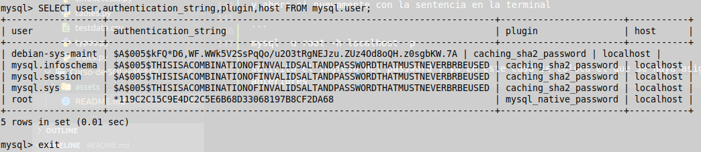

# curso-de-SQL-y-MySQL


**Contenido**

[Clase 1 Bienvenida al curso](#Clase-1-Bienvenida-al-curso)

[Clase 2 Instalacion de MySQL](#Clase-2-Instalacion-de-MySQL)

[Clase 3 La Consola de MySQL](#Clase-3-La-Consola-de-MySQL)

[]()
[]()
[]()
[]()
[]()
[]()
[]()
[]()
[]()
[]()
[]()
[]()
[]()
[]()
[]()
[]()
[]()
[]()
[]()
[]()
[]()
[]()
[]()

## Clase 1 Bienvenida al curso

El curso se basara sobre un proyecto directamente con la base de datos, se tratara de una libreria donde se pueda comprar o rentar un libro y se ira creando paso a paso, es importante investigar con la documentacion que ofrecen los programas SQL y MySQL. No es un proyecto de programacion y se va a realizar el curso desde la consola

## Clase 2 Instalacion de MySQL

Para realizar la instalación de MySQL en tu pc lo primero que debes tener en cuenta es que debes hacer la verificación de la versión que quieres instalar y la distribución para tu sistema operativo. En este enlace encuentras el listado de las plataformas soportadas. https://www.mysql.com/support/supportedplatforms/database.html

**Instalación en Windows**

Si estas trabajando con Windows puedes hacer la descarga ingresando en el siguiente enlace: https://dev.mysql.com/downloads/installer/. Este es el sitio oficial de MySQL por lo que puedes confiar en la descarga.

El instalador para Windows es muy similar a los que ya conocemos, nos pide algunas verificaciones y nos permite navegar a través de diferentes ventanas.

Inicialmente el instalador nos va a solicitar que aceptemos la los términos y acuerdos de la licencia. Revisalos y si estas de acuerdo continua.

En seguida te va a solicitar información relacionada con el tipo de instalación que vas a realizar, puedes elegir entre Developer Default, Client Only y Full. Cualquiera que sea la opción que elijas esto no implica que luego puedas actualizarla.

Si instalas la versión Full vas a tener acceso a todas las características y productos que MySQL ofrece.

Verifica que tengas disponibles todos los requerimientos que el instalador te presenta. En caso de no contar con ellos debes descargar e instalar el software solicitado.

Continua con la instalación de acuerdo a lo que te indica el ayudante.

**Instalación en Mac**

En nuestro caso vamos a estar trabajando con MySQL en Mac por lo que haremos la instalación en este sistema operativo.

Para instalar MySQL usando el instalador del paquete:

Descarga el archivo de imagen del disco ( .dmg ) ( Link de descarga ) que contiene el instalador del paquete MySQL. No es necesario tener una cuenta en Oracle para realizar la instalación pero es recomendable hacerlo.

Haz doble clic sobre el archivo para montar la imagen y ver su contenido.

Esto te va a mostrar el asistente de instalación de MySQL. El SO puede preguntarte si confías en el origen de este programa, puedes darle continuar hasta que llegues al installation type puedes hacer clic en Instalar para ejecutar el asistente de instalación utilizando todos los valores predeterminados, o puedes hacer clic en Personalizar para modificar qué componentes instalar (servidor MySQL, Prueba de MySQL, Panel de preferencias, Soporte inicializado; todas las pruebas excepto MySQL están habilitadas por defecto). En este caso esta bien que instalemos con los valores por defecto.

Selecciona el tipo de cifrado de contraseñas que vas a usar para tu base de datos.

Ingresa una contraseña que no se te vaya a perder u olvidar, porque es la contraseña de tu usuario root para la base de datos.

En este punto ya tienes instalado tu servidor de MySQL y puedes continuar con el curso.

**Instalaciones en Linux Mint, basados en Ubuntu o Debian**

Seguir instrucciones del repositorio

https://www.digitalocean.com/community/tutorials/como-instalar-mysql-en-ubuntu-18-04-es#:~:text=y

## Clase 3 La Consola de MySQL

Para quienes depronto omitieron el paso 3 en Sistemas Operativos Linux lo que primero se hace en la clase es ingresar a la terminal y a MySQL mediante el siguiente comando

```
mysql -u root -h localhost -p
```

En mi caso que uso Linux Mint pero que por debajo corre Ubuntu 20.04 este es el error que salio

```
Enter password: 
ERROR 1698 (28000): Access denied for user 'root'@'localhost'
```
El paso siguiente al salir este error es configurar mysql con el comando

```
sudo mysql
```
inmediatamente se va abrir MySQL y saldra mas o menos una ventana parecida a esta


donde aparece mysql> colocar la siguiente instruccion

```
SELECT user,authentication_string,plugin,host FROM mysql.user;
```
posteriormente va a salir un cuadro y se deben fijar en la fila donde esta root, esta puede aparecer al principio o al final de la tabla y verificar que la columna donde dice authentication_string este vacia y la columna donde dice plugin esta como **auth_socket** , esto se usa para autenticarse usando la contraseña


la siguiente sentencia que se debe ejecutar en mysql es la siguiente, y donde dice **password**, se cambia por la contraseña que se quiera elegir

```
mysql>ALTER USER 'root'@'localhost' IDENTIFIED WITH mysql_native_password BY 'password';
```

despues de presionar la tecla ENTER saldra una sentencia parecida a esta

```
Query OK, 0 rows affected (0.25 sec)
```

si no aparece se puede ejecutar el comando

```
mysql> FLUSH PRIVILEGES;
```

despues nuevamente colocar la sentencia

```
mysql>ALTER USER 'root'@'localhost' IDENTIFIED WITH mysql_native_password BY 'password';
```
En esta va aparecer nuevamente el cuadro pero ya van aparecer los campos de  authentication_string y plugin diferentes



despues de esto podemos salir de mysql mediante la sentencia 

```
mysql>exit
```

y ahora si nuevamente se ingresa la sentencia en la terminal 

```
mysql -u root -h localhost -p
```

solicita el ingreso del password y ya en este caso se coloca el que se haya asignado en los pasos anteriores y ya queda configurado para continuar con las clases del curso.

Mas adelante la recomendacion es que todas las sentencias que se colocan en mysql a exepcion de 2 finalizan con un **;**

Mediante la sentencia

```
mysql>show databases;
```
tenemos una vista de las bases de datos con las que cuenta en ese momento el computador


para poder acceder a la base datos se hace mediante el comando

```
mysql>use mysql;
```


para limpiar la terminal con Ctrl + l, en estos casos ya hay que conocer un poco de los comandos que se manejan en la terminal

con la sentencia

```
mysql>show tables;
```

muestra las tablas que existen en esa base de datos


En el caso de haber limpiado la pantalla con ctrl + l por ejemplo y no saber en que base de datos se encuentra usar la sentencia

```
mysql>select database();
```

y ya para salir de mysql con la sentencia

```
mysql>exit;
```